# Ages 6–9
## Foundation & Playful Discovery

---
layout: course-page
title: Ages 6–9 | Developmental Reality
---

# Developmental Reality

At ages 6 to 9, the primary objective is ensuring players fall in love with moving their bodies and kicking a ball—not winning Saturday morning scorelines. This is the foundation every future goalkeeper is built on.

::left::

### Physical Growth

<TakeawayBox title="Multi-Sport Agility" type="info">
  <b>Gross Motor Foundations:</b> Repeated play in running, jumping, hopping, throwing, and catching builds the athletic base every goalkeeper will later rely on. A size 3 ball with plenty of touches keeps hands and feet busy.
</TakeawayBox>

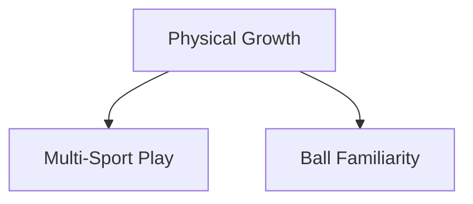

::center::

### Cognitive Growth

<TakeawayBox title="Egocentric to Aware" type="info">
  <b>Reading Slowly Emerges:</b> Ages 6–7 chase the ball in a tight "beehive" cluster focused entirely on the ball. Ages 8–9 begin recognizing teammates, opponents, and space—the first building blocks of tactical vision.
</TakeawayBox>

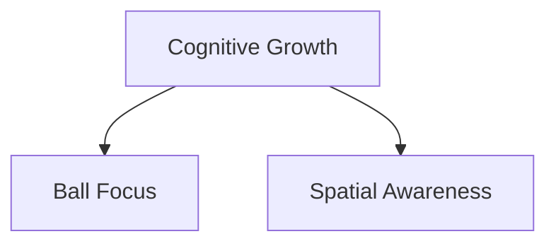

::right::

### Psychological Growth

<TakeawayBox title="Love of Movement" type="info">
  <b>Joy Over Outcome:</b> The only non-negotiable outcome is that kids leave every session wanting to come back. Pressure and results at this age actively work against long-term retention.
</TakeawayBox>

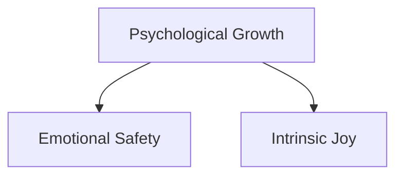

---
layout: course-page
title: Ages 6–9 | Coaching Approach & Emotional Safety
---

# Coaching Approach & Emotional Safety

Play is children's native language. They learn best when allowed to experiment freely, fail safely, and solve problems without adult pressure or fear of judgment.

::left::

<TakeawayBox title="Emotional Safety First" type="important">
  <b>Our #1 Job:</b> Establishing emotional safety is the single most important responsibility at this age. A child who feels safe to miss a catch will try again; a child who feels judged will stop reaching for the ball entirely.
</TakeawayBox>

<TakeawayBox title="Small-Sided Games" type="success">
  <b>Fewer Players, More Touches:</b> 3v3 and 4v4 formats strip away complex rules so children experiment, fail, and discover solutions naturally.
</TakeawayBox>

<TakeawayBox title="Short & Sweet Sessions" type="info">
  <b>Attention Span Reality:</b> Keep activities to 10–15 minutes and rotate stations frequently to sustain energy, curiosity, and joy.
</TakeawayBox>

::right::

### The Play-Based Learning Loop

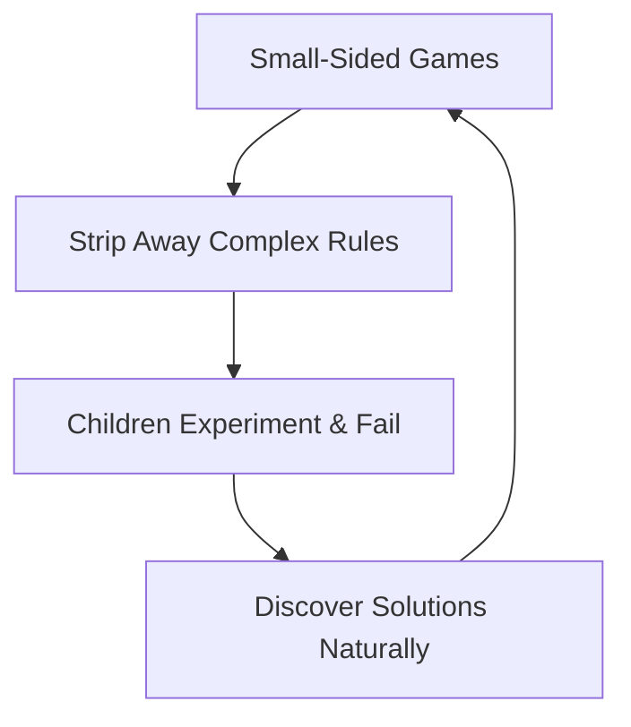

---
layout: course-page
title: Ages 6–9 | Ground Handling Foundations
---

# Ground Handling Foundations

For young keepers, safe catching technique on the ground and at the waist is the entire technical curriculum. High-impact diving is deliberately deferred to protect developing joints.

::left::

<TakeawayBox title="Basket Catch" type="info">
  <b>Waist-to-Chest Shots:</b> Bend slightly at the waist, extend forearms forward with palms up, and cushion the ball into the belly. Cue <i>"cradle the baby"</i> and <i>"huddle over the ball."</i>
</TakeawayBox>

<TakeawayBox title="Scoop Catch" type="success">
  <b>Rolling Ground Balls:</b> Lower into a squat or trailing-knee position behind the ball, pinkies together with palms up, and funnel the ball up into a chest lock. Cue <i>"body behind the ball."</i>
</TakeawayBox>

<TakeawayBox title="Safe Ground Saves" type="important">
  <b>Low Saves from Squat/Knees:</b> Teach controlled ground drops and sliding saves rather than airborne dives. Land on the side—never on elbows or knees—to protect fragile joints and build confidence.
</TakeawayBox>

::right::

### Catching Progression Flow

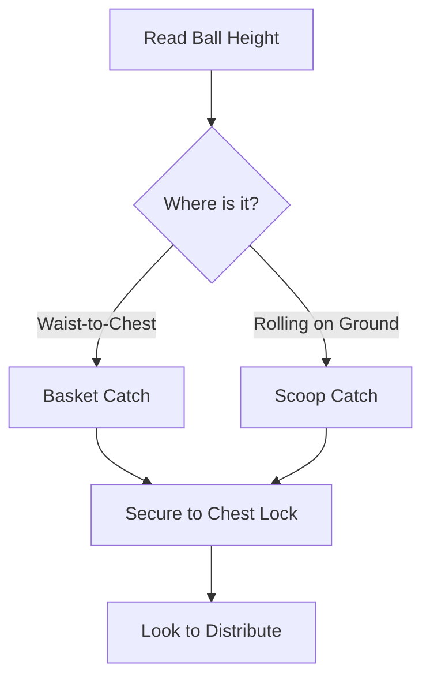

---
layout: course-page
title: Ages 6–9 | Distribution Basics
---

# Distribution & Build-Up Basics

Young goalkeepers are the first attacker. Simple, safe distribution builds comfort on the ball and starts teaching how keepers spark the attack.

::left::

<TakeawayBox title="Underhand Roll" type="info">
  <b>Bowl It Low:</b> Cup the ball in one hand, step forward with the opposite foot, and roll the ball smoothly along the turf into a teammate's feet. Cue <i>"low and smooth."</i>
</TakeawayBox>

<TakeawayBox title="Short Inside-Foot Pass" type="success">
  <b>Keep It Simple:</b> After a catch, a quick short pass to a defender beside or behind the goal starts the build-up without needing a big kick.
</TakeawayBox>

<TakeawayBox title="Defer Big Kicks" type="important">
  <b>No Punts or Sling Throws Yet:</b> Young arms and legs lack the strength for punting and overhand throws. Force-feeding them builds bad mechanics—rolls and short passes are plenty.
</TakeawayBox>

::right::

### Build-Up Distribution Flow

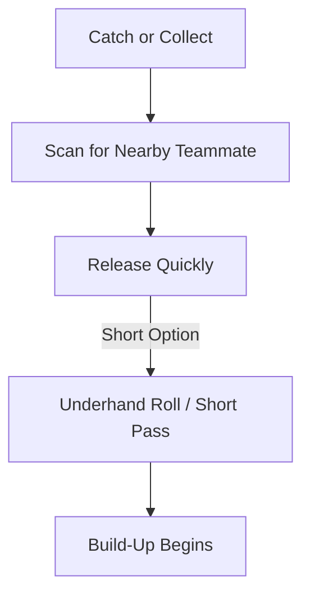

---
layout: course-page
title: Ages 6–9 | Nurturing Keeper Interest
---

# Nurturing Goalkeeper Interest: The "Taste-Test"

Some kids fall in love with goal immediately. Team coaches can fan that spark into a lifelong flame without ever creating a specialist.

::left::

<TakeawayBox title="Rotate, Don't Specialize" type="important">
  <b>Everyone Gets a Taste:</b> Give every player regular turns in goal across practices and matches. A curious child gets opportunities; nobody gets trapped between the posts.
</TakeawayBox>

<TakeawayBox title="Keeper's Corner Stations" type="success">
  <b>Fun, Social Games:</b> Run keeper-focused stations like "Keeper Wars," reaction circles, and save-and-sprint relays that celebrate effort over result.
</TakeawayBox>

<TakeawayBox title="Reward the Attempt" type="info">
  <b>Bravery First:</b> Praise the dive, the hands-up ready stance, and the getting-up. Kids repeat what gets celebrated.
</TakeawayBox>

::right::

### From Interest to Engagement

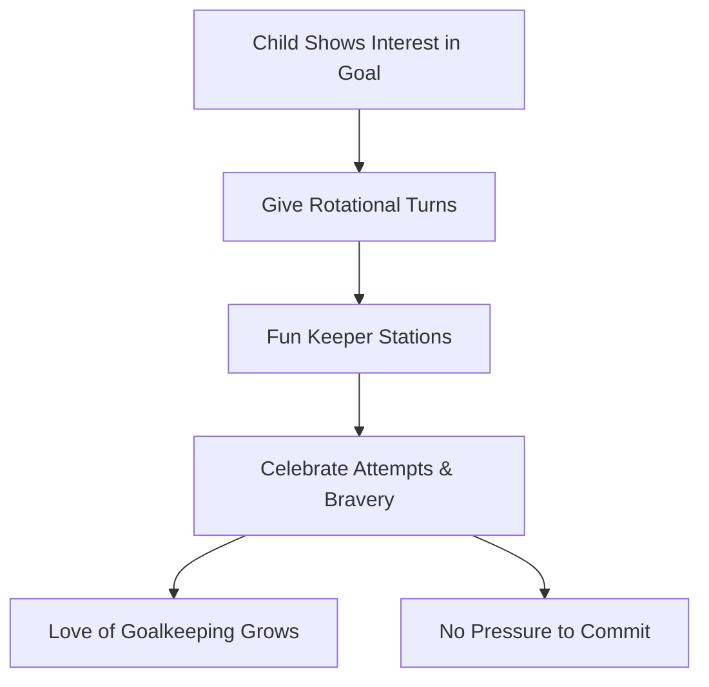

---
layout: course-page
title: Ages 6–9 | Communication & Bravery
---

# Communication, Bravery & First Steps

The earliest leadership habits and the confidence to throw a body at the ball are planted here—one simple call and one soft landing at a time.

::left::

<TakeawayBox title="Single-Word Calls" type="success">
  <b>"Keeper!" & "Mine!":</b> Teach one clear, loud call when coming for the ball. Early, decisive communication is the seed of future backline command.
</TakeawayBox>

<TakeawayBox title="Step Up With the Line" type="info">
  <b>Follow the Defense Out:</b> Learn to move up as the team advances and recover when possession turns over—a simple habit that builds positional sense.
</TakeawayBox>

<TakeawayBox title="Learn to Fall Before Diving" type="important">
  <b>Safe Falling Groundwork:</b> Practice rolling and tumbling on soft surfaces with foam balls so children learn to land safely before any real dive is ever attempted.
</TakeawayBox>

::right::

### Bravery & Communication Loop

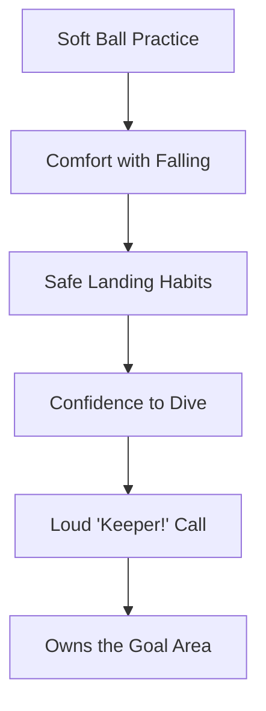

---
layout: course-page
title: Ages 6–9 | No Early Specialization
---

# The Case Against Early Specialization

At ages 6 to 9, **no player should be a full-time goalkeeper**. Every child should be running around the field every game.

<TakeawayBox title="Burnout Fast Track" type="warning">
  <b>Boxed In:</b> Pinning a seven-year-old between the posts every week is a direct fast track to burnout. Kids need to run, chase, and score.
</TakeawayBox>

::left::

### Practice Environment

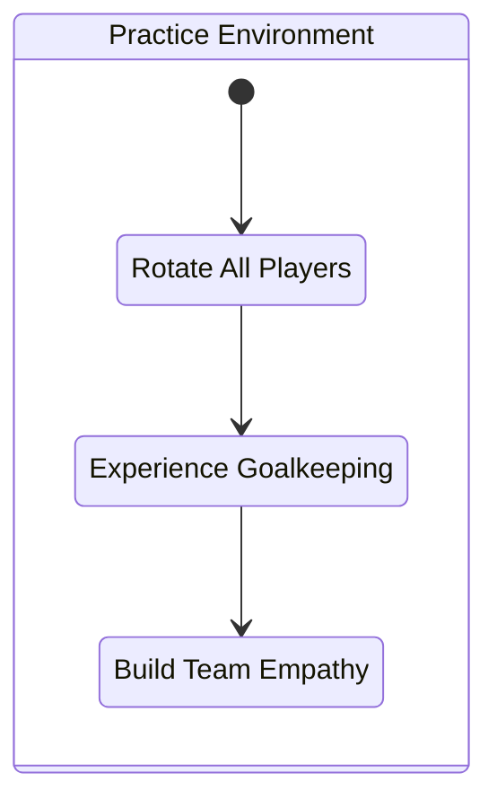

::right::

### Match Environment

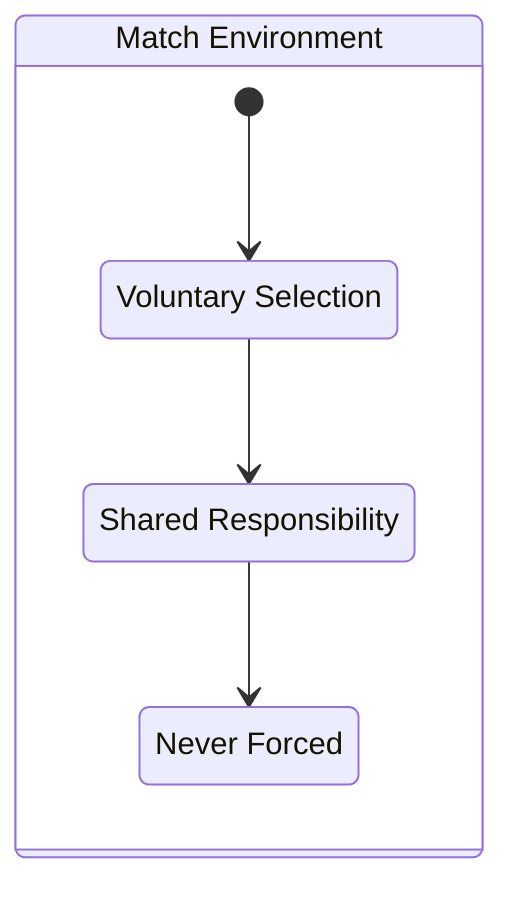

---
layout: course-page
title: Ages 6–9 | The Goalie Parent
---

# The Goalie Parent: Coaching the Car Ride Home

At this age the scoreboard is meaningless, but the car ride home is everything. Parents need coaching too.

::left::

<TakeawayBox title="Emotional Safety on the Drive Home" type="important">
  <b>No Tactical Breakdowns:</b> Young keepers shouldn't face post-match analysis. Parents should offer hugs, snacks, and questions about what was fun.
</TakeawayBox>

<TakeawayBox title="Celebrate Effort Over Result" type="success">
  <b>Reframe the Conceded Goal:</b> A goal conceded at this age is a learning moment and a chance to try again next time—not a failure to be unpacked on the drive home.
</TakeawayBox>

<TakeawayBox title="Champion Multi-Sport Play" type="info">
  <b>Keep It Fun:</b> Encourage pickup games, other sports, and plenty of unstructured play. Long-term love beats early specialization.
</TakeawayBox>

::right::

### The Support Loop

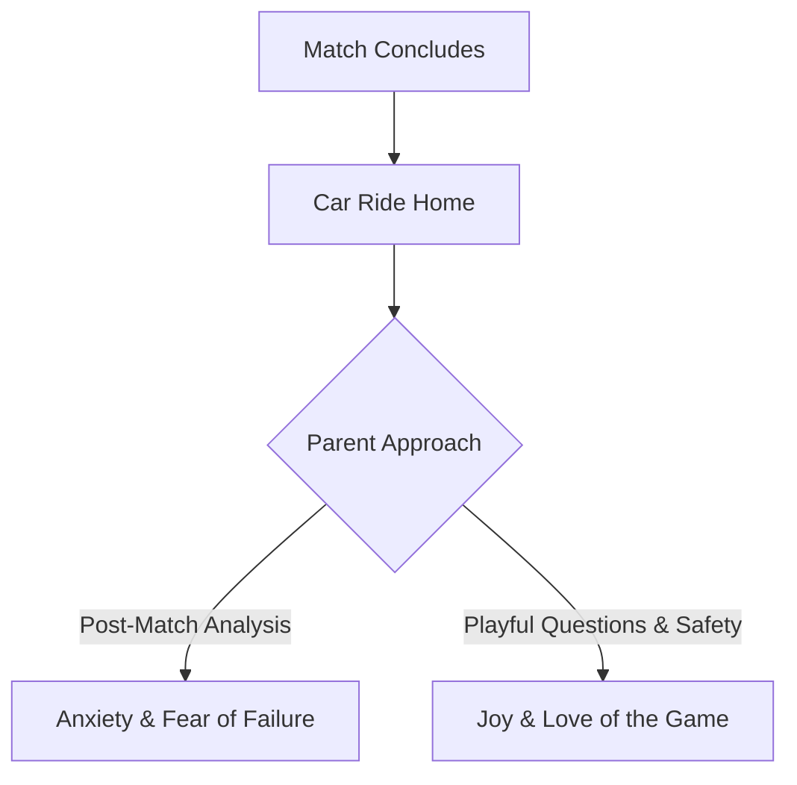

