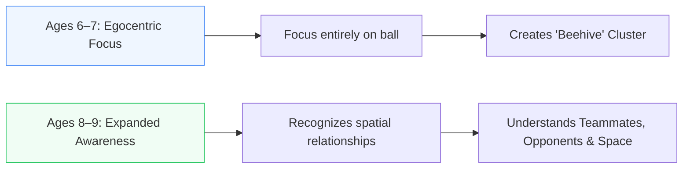
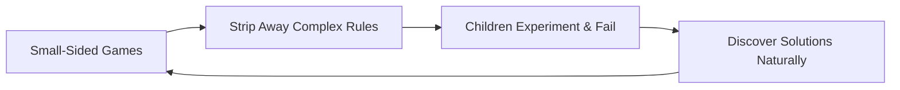
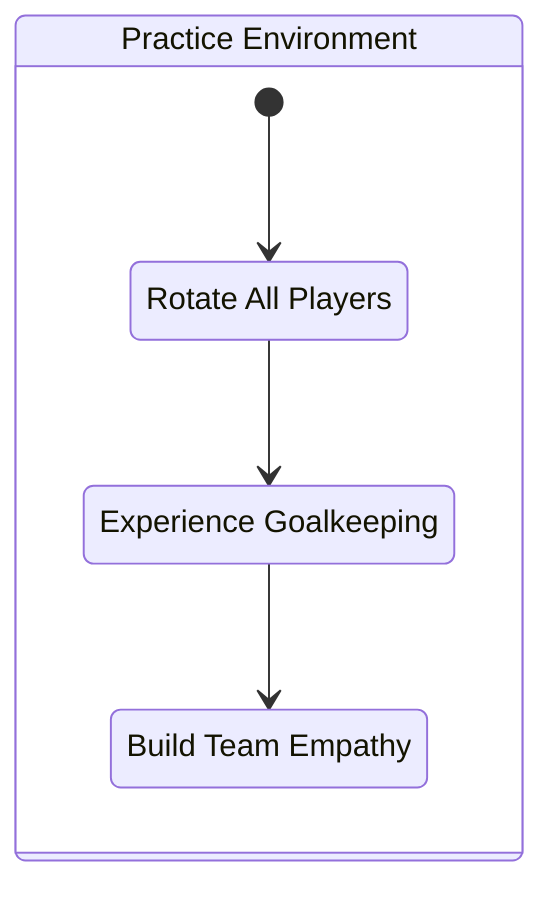
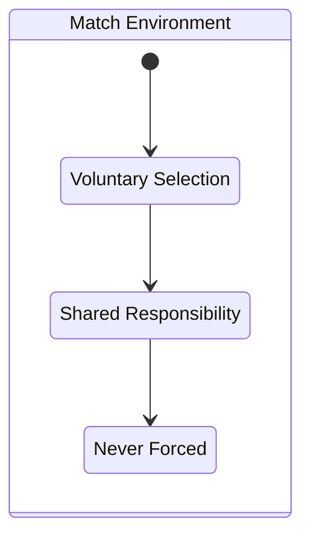

# Ages 6–9
## Developmental Reality

---
layout: course-page
title: Ages 6–9 | Developmental Reality
---

# Developmental Reality

At ages 6 to 9, the primary objective is ensuring players fall in love with moving their bodies and kicking a ball—not winning Saturday morning scorelines.

### Spatial & Cognitive Progression

---
layout: course-page
title: Ages 6–9 | Play-Based Learning
---

# Coaching Approach & Emotional Safety

Our single most important responsibility at this age is establishing **emotional safety**. Play is children's native language they learn best when allowed to experiment without adult pressure.

---
layout: course-page
title: Ages 6–9 | Non-Specialization
---

# The Case Against Early Specialization

At ages 6 to 9, **no player should be a full-time goalkeeper**. 
- Boxing a seven-year-old between the posts every week is a direct fast track to burnout.
- Every kid should be running around the field every game.

::left::

::right::

