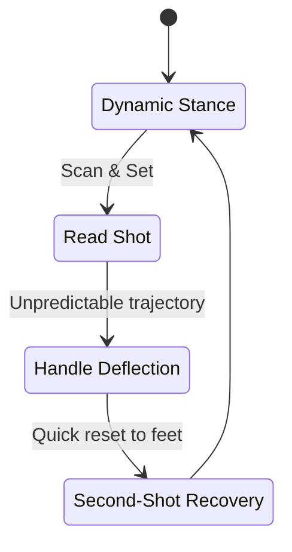
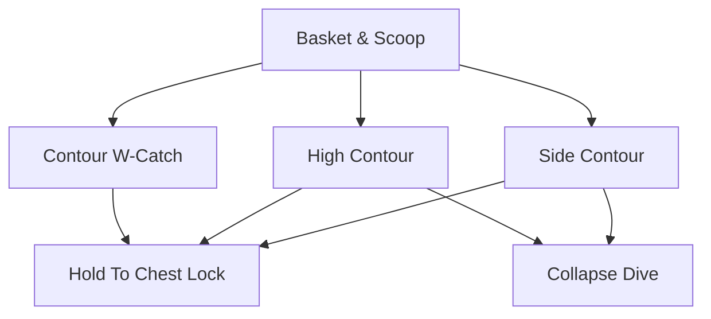
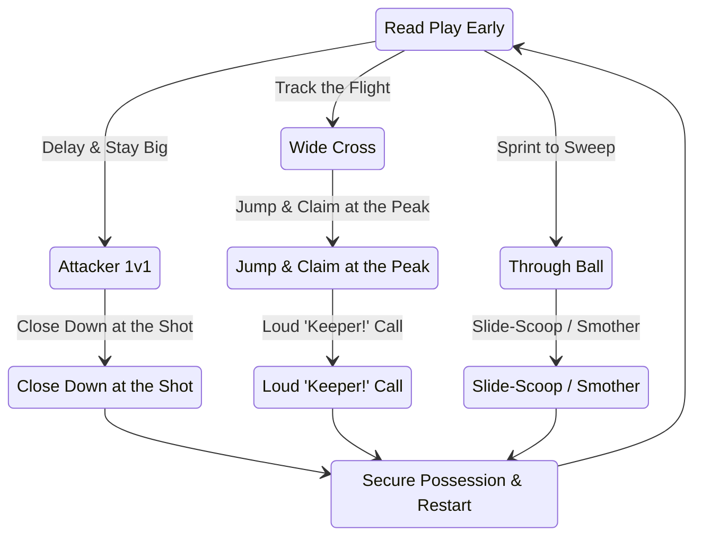
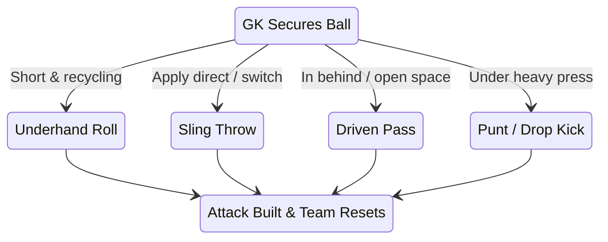
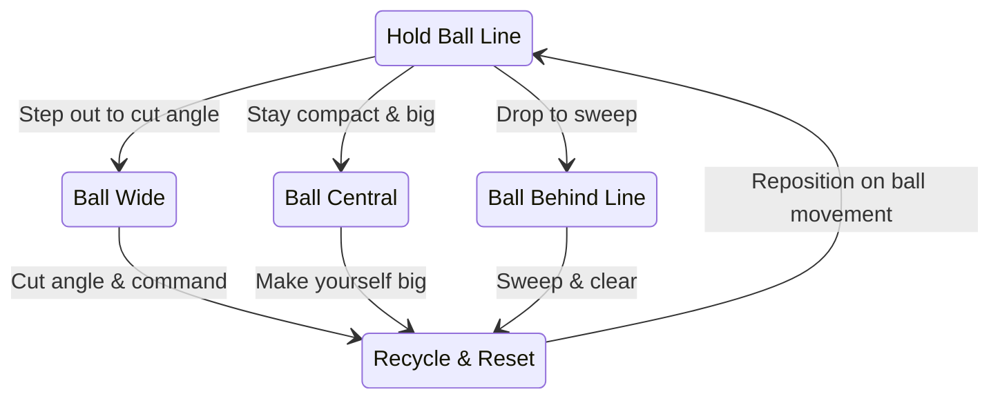
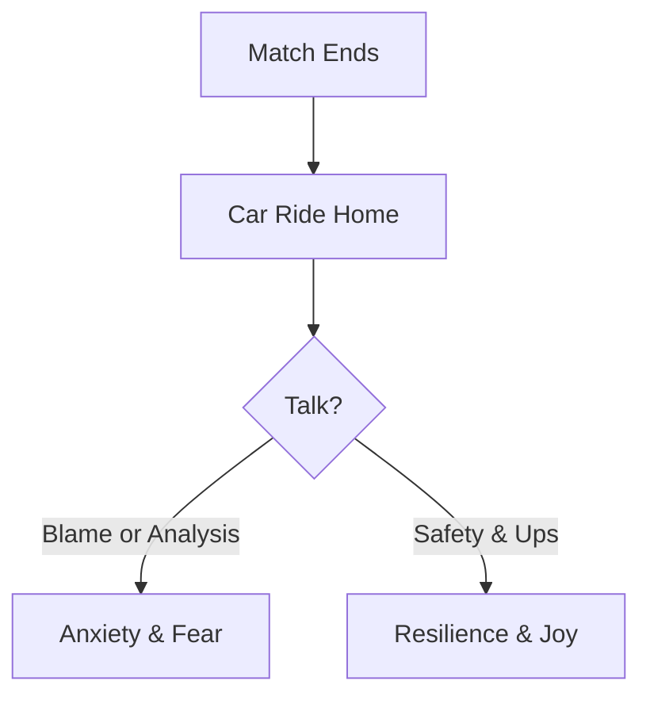

# Ages 9–12
## Developmental Sweet Spot

---
layout: course-page
title: Ages 9–12 | Developmental Sweet Spot
---

# The Developmental Sweet Spot

At ages 9 to 12, players enter a critical window of rapid athletic, cognitive, and psychological growth as they transition into 9v9 play.

::left::

### Physical Growth

<TakeawayBox title="Physical Growth" type="info">
  <b>Coordinating Growth & Safety:</b> Players manage rapid growth spurts. Focus on refining footwork agility and teaching mechanics to safely absorb ground impacts and master diving without fear or injury.
</TakeawayBox>

::center::

### Cognitive Expansion

<TakeawayBox title="Tactical Vision" type="info">
  <b>Reading the Game:</b> Players shift from pure ball-watching to grasping the bigger picture—understanding angle positioning, supporting the defensive line, and scanning the field before receiving.
</TakeawayBox>

::right::

### Psychological Growth

<TakeawayBox title="Leadership Roots" type="info">
  <b>Building Resilience:</b> Personal accountability and early leadership habits begin to take root. Setbacks must be framed as learning milestones rather than defining judgments.
</TakeawayBox>

---
layout: course-page
title: Ages 9–12 | Coaching Approach & IGCC
---

# The IGCC Coaching Methodology

Coaching at this stage aligns with guidelines set by the **International Goalkeepers Conference (IGCC)**, replacing static line drills with **game-realistic, scenario-based training** to develop active playmakers rather than isolated shot-stoppers.

::left::

<TakeawayBox title="International Standards (IGCC)" type="info">
  <b>International Goalkeepers Conference:</b> Establishes global guidelines embedding technical mechanics directly into tactical play, training proactive playmakers instead of static target practice.
</TakeawayBox>

<TakeawayBox title="Constraint-Based Variability" type="important">
  Introduces match-like chaos (deflections, restricted vision, press) so players learn to read game cues and make independent decisions under pressure.
</TakeawayBox>

<TakeawayBox title="Reaction & Recovery Focus" type="success">
  Prioritizes resetting to a dynamic stance immediately after a save, making fast second-shot recoveries an automatic physical habit.
</TakeawayBox>

::right::

### The Dynamic Vision

---
layout: course-page
title: Ages 9–12 | Technical: Hand Shape & Catching
---

# Technical Building Blocks: Hand Shape & Catching

Before a keeper can react to match pace, they must own a correct, repeatable catching shape. This is the bridge between the baseline catches of the 6–9 ages and the reaction saves of the 9–12 window.

::left::

<TakeawayBox title="Contour Catch (W-Catch)" type="info">
  <b>Make the W:</b> Thumbs and index fingers nearly touch, fingers spread wide behind the ball at chest-to-head height. Cue <i>"make the W."</i> This becomes the default catch shape.
</TakeawayBox>

<TakeawayBox title="High & Side Contour" type="success">
  <b>Extend the Shape:</b> High contour catches balls above head height; side contour catches balls driven wide of the body. In both, hands stay ahead of the torso and fold into a chest lock.
</TakeawayBox>

<TakeawayBox title="Collapse Dives" type="important">
  <b>First Ground Dives:</b> Coach controlled collapse dives to reach low shots, landing on the outer thigh, hip, and torso—never the elbows or knees.
</TakeawayBox>

::right::

### Catch Progression

---
layout: course-page
title: Ages 9–12 | 1v1, Crosses & Aerial
---

# 1v1, Crosses & Aerial Claiming

At this age the keeper leaves the line more often—closing down breakaways, crossing, and attacking loose through-balls. These are the moments young keepers remember most.

::left::

<TakeawayBox title="1v1 Closing" type="important">
  <b>Stay Big, Stay Late:</b> In a one-v-one, delay the approach and stay as big and as late as possible, making the attacker commit before closing down and spreading your frame.
</TakeawayBox>

<TakeawayBox title="Cross Claiming" type="success">
  <b>Own the Center:</b> Attack crosses at the highest point, driving off one leg and catching with high, committed hands. Claim or punch with a loud "Keeper!" call.
</TakeawayBox>

<TakeawayBox title="Sweeping Through-Balls" type="info">
  <b>First to the Ball:</b> Read through-balls early and sprint off the line to slide-scoop or smother the loose ball before the attacker arrives.
</TakeawayBox>

::right::

### Reading the Play: Assertive Goalkeeping

---
layout: course-page
title: Ages 9–12 | Distribution & Build-Up
---

# Distribution & Build-Up: First Attacker

After every save the keeper restarts play. The young keeper learns to pick the right tool—roll, throw, drive, or punt—to turn defense into attack.

::left::

<TakeawayBox title="Underhand Roll & Sling Throw" type="info">
  <b>Short Restart Tools:</b> Use an underhand roll for accuracy and tempo; use the sling throw to launch the ball, skipping the midfield and catching the opposition out of shape.
</TakeawayBox>

<TakeawayBox title="Driven Pass" type="success">
  <b>Find the Open Player:</b> A low driven distribution finds a spare attacker in stride and beats the press, at the same time you open the pitch.
</TakeawayBox>

<TakeawayBox title="Punt & Drop-Kick Clearance" type="important">
  <b>Clear the Danger:</b> When a press leaves no short option, the punt clears the immediate danger zone and buys the team time to reset its shape.
</TakeawayBox>

::right::

### Distribution Decision Flow

---
layout: course-page
title: Ages 9–12 | Communication & Positioning
---

# Communication, Positioning & the Back Line

A great 9–12 keeper organizes their defense and holds a strong angle. Communication is the keeper's superpower at this stage.

::left::

<TakeawayBox title="Angle & Ball-Line Play" type="important">
  <b>On the Angle, Stay Compact:</b> Hold the "ball line"—the line from the center of goal to the ball—stepping out to cut the angle and adjusting as the ball moves.
</TakeawayBox>

<TakeawayBox title="Leading the Defensive Line" type="success">
  <b>Call the Shape:</b> Push and drop the back line with short calls like "up" and "drop" so the team moves as one. Set walls and mark for set pieces.
</TakeawayBox>

<TakeawayBox title="Control the Line" type="info">
  <b>Cover the Last Line:</b> Read runs behind the defense and own the space between the box and the defensive line—sweep up through-balls before attackers can finish.
</TakeawayBox>

::right::

### Positioning Loop

---
layout: course-page
title: Ages 9–12 | The Goalie Parent
---

# The Goalie Parent: Coaching the Car Ride Home

Conceding a goal sits squarely on one pair of shoulders, and a young keeper carries that weight long after the final whistle.

::left::

<TakeawayBox title="Unconditional Emotional Safety" type="important">
  The post-match role is to provide an anchor, not analysis. Frame conceding a goal as a milestone to learn from, not a judgment on the child.
</TakeawayBox>

<TakeawayBox title="Coaching the Parents" type="success">
  When we coach parents alongside players, we help families celebrate the high points and process the lows without losing love for the game.
</TakeawayBox>

::right::

### The Post-Match Loop

