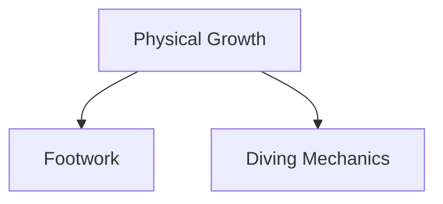
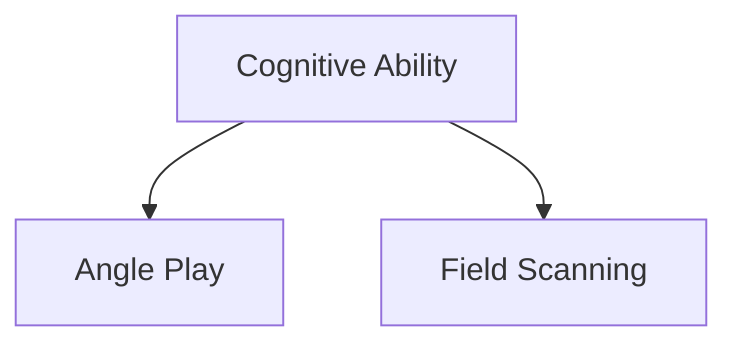
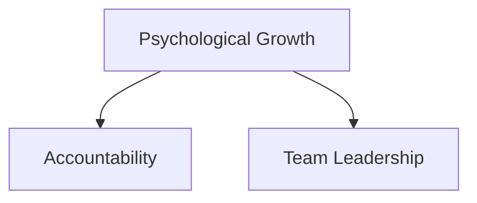
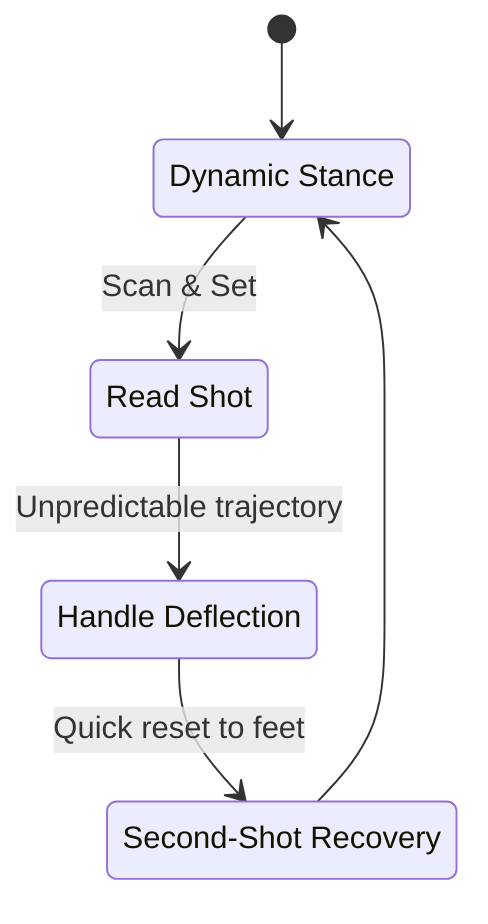
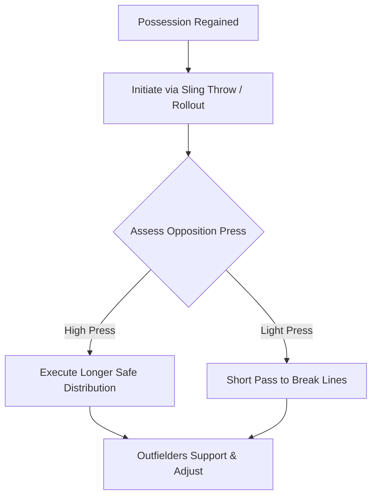
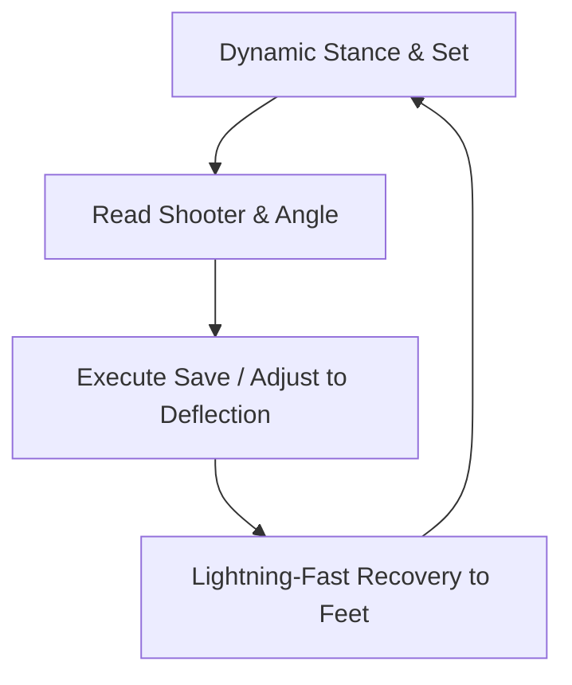
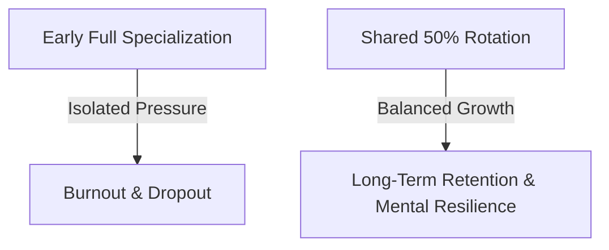
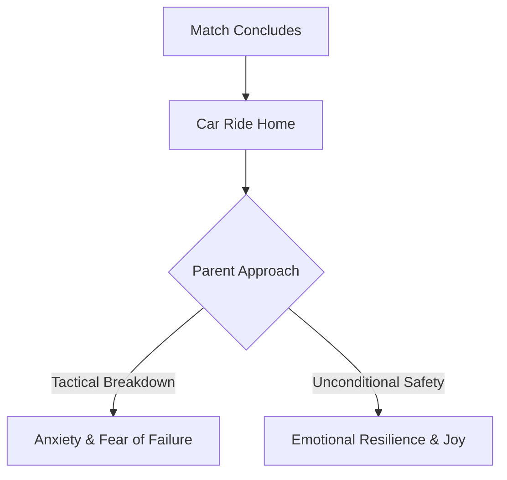

# Ages 12–14
## Developmental Sweet Spot

---
layout: course-page
title: Ages 9–12 | Developmental Sweet Spot
---

# The Developmental Sweet Spot

At ages 9 to 12, players enter a critical window of rapid athletic, cognitive, and psychological growth as they transition into 9v9 play.

::left::

### Physical Growth

<TakeawayBox title="Physical Growth" type="info">
  <b>Coordinating Growth & Safety:</b> Players manage rapid growth spurts. Focus on refining footwork agility and teaching mechanics to safely absorb ground impacts and master diving without fear or injury.
</TakeawayBox>

::center::

### Cognitive Expansion

<TakeawayBox title="Tactical Vision" type="info">
  <b>Reading the Game:</b> Players shift from pure ball-watching to grasping the bigger picture—understanding angle positioning, supporting the defensive line, and scanning the field before receiving.
</TakeawayBox>

::right::

### Psychological Growth

<TakeawayBox title="Leadership Roots" type="info">
  <b>Building Resilience:</b> Personal accountability and early leadership habits begin to take root. Setbacks must be framed as learning milestones rather than defining judgments.
</TakeawayBox>

---
layout: course-page
title: Ages 9–12 | Coaching Approach & IGCC
---

# The IGCC Coaching Methodology

Coaching at this stage aligns with guidelines set by the **International Goalkeepers Conference (IGCC)**, replacing static line drills with **game-realistic, scenario-based training** to develop active playmakers rather than isolated shot-stoppers.

::left::

<TakeawayBox title="International Standards (IGCC)" type="info">
  <b>International Goalkeepers Conference:</b> Establishes global guidelines embedding technical mechanics directly into tactical play, training proactive playmakers instead of static target practice.
</TakeawayBox>

<TakeawayBox title="Constraint-Based Variability" type="important">
  Introduces match-like chaos (deflections, restricted vision, press) so players learn to read game cues and make independent decisions under pressure.
</TakeawayBox>

<TakeawayBox title="Reaction & Recovery Focus" type="success">
  Prioritizes resetting to a dynamic stance immediately after a save, making fast second-shot recoveries an automatic physical habit.
</TakeawayBox>

::right::

### The Dynamic Reaction Loop

---
layout: course-page
title: Ages 9–12 | Build-Up Integration
---

# Integrating the Goalkeeper: More Than Just a Target

Too often in team training, goalkeepers are treated as static shooting targets. In alignment with **IGCC's pragmatic build-up approach**, we integrate goalkeepers as active playmakers.

::left::

<TakeawayBox title="Eliminate Dead-Ball Restarts" type="important">
  Drills traditionally starting from a dead ball should instead be initiated via a <b>sling throw or defensive rollout</b> from the goalkeeper, creating immediate realistic movement.
</TakeawayBox>

<TakeawayBox title="Decision-Making Under Pressure" type="success">
  Through constraint-based setups, the goalkeeper learns to assess when to play short to break a press versus when to execute a longer, safe distribution.
</TakeawayBox>

<TakeawayBox title="Outfield Synergy" type="info">
  Outfield players simultaneously learn to offer supporting passing angles and adjust on the fly to sudden possession changes during build-up.
</TakeawayBox>

::right::

### Build-Up Distribution Flow

---
layout: course-page
title: Ages 9–12 | Core Focus & Shot-Stopping
---

# Core Focus & Shot-Stopping Mechanics

At the 9–12 developmental stage, training methodology is anchored in practical field scenarios that prepare goalkeepers to handle realistic match chaos.

::left::

<TakeawayBox title="Primary Core Focus" type="important">
  Move beyond sterile, isolated drills to shape core technical mastery through dynamic, practical field sessions filled with constraint-based variability.
</TakeawayBox>

<TakeawayBox title="Deflection Management" type="info">
  Train goalkeepers to handle unpredictable trajectories and maintain focus when sightlines or ball paths are disrupted.
</TakeawayBox>

<TakeawayBox title="Second-Shot Recovery" type="success">
  Execute lightning-fast recoveries to reset into a set stance and secure loose balls or follow-up attempts.
</TakeawayBox>

::right::

### Shot-Stopping Reaction Cycle

---
layout: course-page
title: Ages 9–12 | Premature Specialization
---

# The Danger of Premature Specialization

As kids approach 9v9 and look ahead to 11v11, resist the temptation to crown a single player "the goalie." No player at this age should feel trapped between the posts.

::left::

<TakeawayBox title="Mental & Emotional Load" type="warning">
  The immense emotional pressure of being the last line of defense can drive sensitive, hardworking players away from soccer entirely.
</TakeawayBox>

<TakeawayBox title="The 50% Max Cap Rule" type="important">
  <b>Cap time in goal at 50% maximum.</b> Keep encouraging outfield development and rotate willing players so nobody bears the mental weight alone.
</TakeawayBox>

::right::

### Shared Responsibility Model

---
layout: course-page
title: Ages 9–12 | The Goalie Parent
---

# The Goalie Parent aka "The Armchair Therapist"

Goalkeeper parents face a uniquely isolated experience on the sideline. Conceding a goal sits squarely on one pair of shoulders, and kids carry that weight into the car ride home.

::left::

<TakeawayBox title="Unconditional Emotional Safety" type="important">
  Coaches must guide parents to understand that their post-match role is providing emotional safety—not giving lectures or tactical breakdowns in the car.
</TakeawayBox>

<TakeawayBox title="Coaching the Parents" type="success">
  By coaching parents alongside players, we help families celebrate the highs, process the lows, and keep the game fun and sustainable.
</TakeawayBox>

::right::

### Post-Match Parent Support Loop

  <h3 class="text-sm font-bold text-blue-900 m-0 mb-1">📝 Check Your Understanding</h3>
  <ol class="text-xs text-gray-700 m-0 pl-4 space-y-1">
    <li>How does initiating build-up via sling throws/rollouts improve both goalkeeper and outfield tactical development?</li>
    <li>Why is a max cap of 50% goal time recommended during the 9–12 developmental window?</li>
    <li>What specific advice should coaches guide goalkeeper parents on regarding the car ride home?</li>
  </ol>

