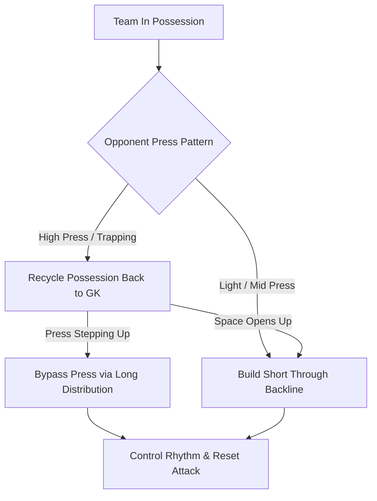
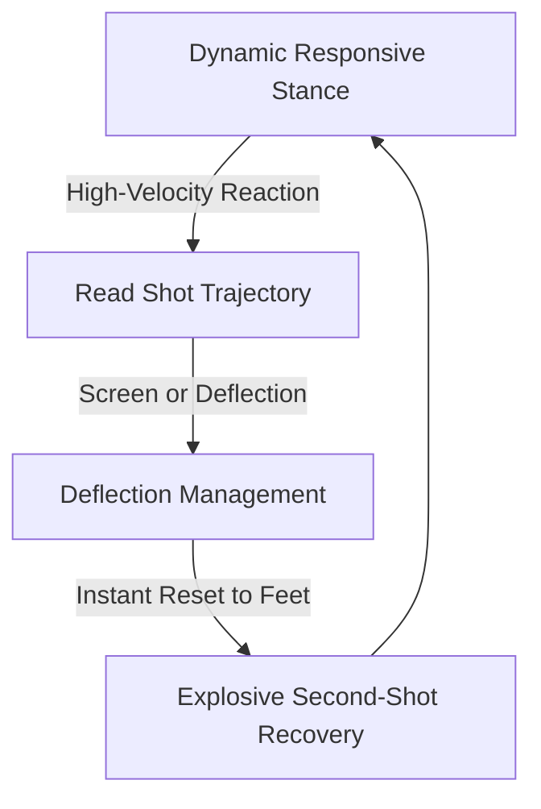
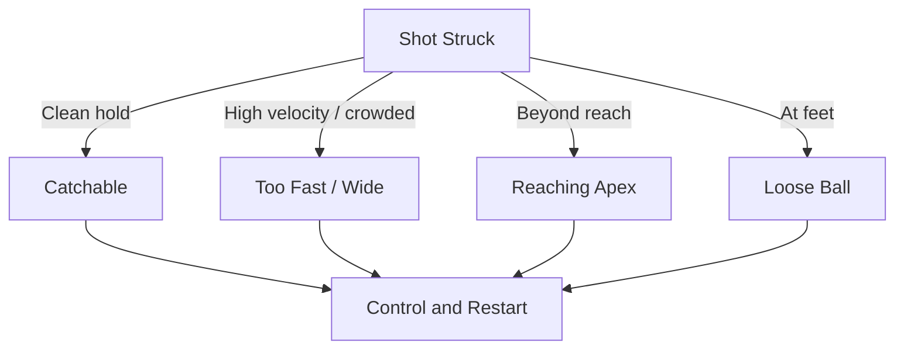
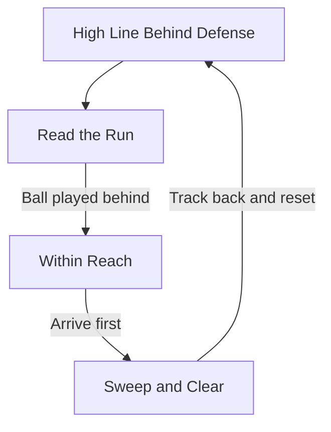
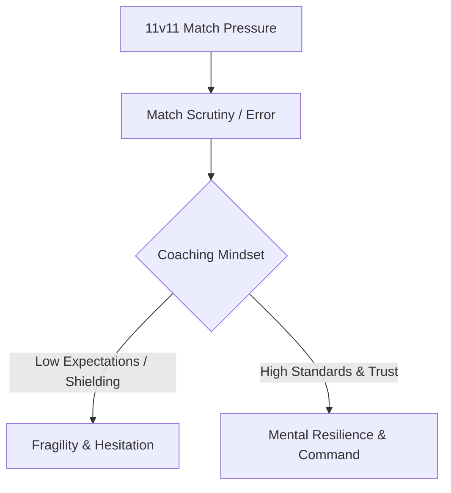
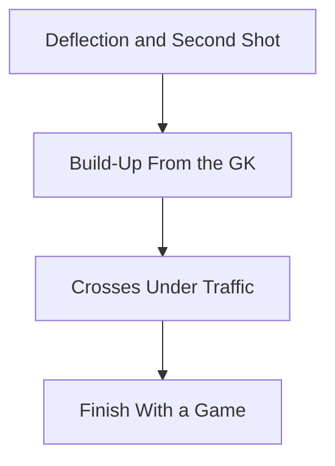

# Ages 12–14

Advancement and Specialization

---
layout: top-title
title: Ages 12–14 | The Growth Spurt & Mental Leap
---

::title::

# Navigating Physical & Tactical Shifts

::content::

In the 12–14 age bracket, goalkeepers experience rapid physical growth alongside a sharp rise in tactical understanding as they fully transition into the demands of 11v11 play.

  <TakeawayBox title="Physical Development" type="warning">
    <b>Managing Growth Spurts:</b> Rapid growth spurts cause temporary coordination loss and joint pain. Precise load management protects athlete health and prevents overuse injuries. Expect mechanics that regress during a growth spurt; re-teach them patiently rather than punishing.
  </TakeawayBox>

  <TakeawayBox title="Tactical Command" type="success">
    <b>The Tactical Leap:</b> Players shift from reactive play to reading the game 2–3 steps ahead, scanning, mastering spatial awareness, and organizing the backline like field generals.
  </TakeawayBox>

  <TakeawayBox title="Cognitive Expansion" type="info">
    <b>Full-Game Understanding:</b> Keepers grasp the bigger picture, anticipate space and transitions rather than merely reacting, and solve problems faster in the flow of 11v11 play.
  </TakeawayBox>

  <TakeawayBox title="Psychological Growth" type="important">
    <b>Building Resilience:</b> An error now often leads straight to a goal. Scrutiny is part of the role, so setbacks are framed as learning steps, not defining moments.
  </TakeawayBox>

---
layout: top-title-two-cols
title: Ages 12–14 | Active Across Every Phase
---

::title::

# IGCC Standards: Full Build-Up Integration

::default::

In accordance with **International Goalkeepers Conference (IGCC)** guidelines, goalkeepers are never treated as static shooting targets. They act as core playmakers running the game across every phase.

::left::

<TakeawayBox title="Eliminate Dead-Ball Restarts" type="important">
  <b>Game-Realistic Restarts:</b> All team build-up drills initiate from the goalkeeper via sling throws, rollouts, or driven passes to embed authentic match dynamics immediately.
</TakeawayBox>

<TakeawayBox title="Decision-Making Under Pressure" type="info">
  <b>Reading the Press:</b> Goalkeepers solve real-time tactical puzzles, deciding whether to play short through crisp passes or bypass a high press with pinpoint long distribution.
</TakeawayBox>

<TakeawayBox title="Recycling Possession" type="success">
  <b>Controlling Match Rhythm:</b> Outfield players learn to use the goalkeeper as a relief valve to reset and recycle possession rather than forcing panicked passes into traffic.
</TakeawayBox>

::right::

### Build-Up Phase Decision Tree

---
layout: top-title-two-cols
title: Ages 12–14 | Coaching Approach & Methodology
---

::title::

# Advanced IGCC Coaching Methodology

::default::

At this advanced specialization stage, coaching aligns with guidelines set by the **International Goalkeepers Conference (IGCC)** challenging goalkeepers with high-intensity, constraint-based sessions that push them past their comfort zone.

::left::

<TakeawayBox title="International Standards (IGCC)" type="info">
  <b>International Goalkeepers Conference:</b> Recommends stepping back from constant direct instruction to implement high-intensity constraints that force players to make independent, split-second decisions.
</TakeawayBox>

<TakeawayBox title="Match Chaos & Accountability" type="important">
  <b>Dynamic Field Sessions:</b> Replace sterile, straight-line drills with realistic match chaos, training keepers to operate calmly under pressure and take full ownership of their penalty area.
</TakeawayBox>

<TakeawayBox title="Shot-Stopping & Recoveries" type="success">
  <b>Deflection & Reset Mechanics:</b> Combine elite reaction training with a responsive dynamic stance, mastering deflection management and explosive second-shot recoveries.
</TakeawayBox>

::right::

### Advanced Reaction & Recovery Loop

---
layout: top-title-two-cols
title: Ages 12–14 | Power Diving & Shot-Stopping
---

::title::

# Power Diving & Shot-Stopping at the Next Level

::default::

At 12–14 the keeper can finally train full flight. Physical maturity enables airborne saves, controlled parrying, and contact actions that were unsafe only a year ago.

::left::

<TakeawayBox title="Extension / Flying Dives" type="important">
  <b>Full Flight:</b> Drive off the near leg, extend fully to reach high and wide shots. Land sequentially on the outer leg, hip, then side of the torso, never on elbows or stomach.
</TakeawayBox>

<TakeawayBox title="Parrying to Safe Zones" type="success">
  <b>Redirect, Don't Fumble:</b> When a shot has too much pace to hold, palm it up and away from danger, high over the bar or wide, never back into the attacking channel.
</TakeawayBox>

<TakeawayBox title="Sliding Smother & Punching" type="info">
  <b>Contact Control:</b> Forward smothers to beat attackers to loose balls and clean punching to relieve aerial pressure become safe options with mature coordination.
</TakeawayBox>

::right::

### Power Save Decision

---
layout: top-title-two-cols
title: Ages 12–14 | Sweeper-Keeper & Defensive Command
---

::title::

# The Sweeper-Keeper & Full Backline Command

::default::

The modern 12–14 keeper is a field organizer who reads danger early, supports the high line, and sweeps confidently behind it.

::left::

<TakeawayBox title="Sweeper-Keeper Depth" type="success">
  <b>Position Behind the Line:</b> Step up to act as an extra defender, sweeping through-balls and long balls away before attackers take control behind a high backline.
</TakeawayBox>

<TakeawayBox title="Directing the Block" type="important">
  <b>Command the Shape:</b> Coordinate the 11v11 defensive block, managing wall placement, marking stacks, and communicating the line as the field general of the backline.
</TakeawayBox>

<TakeawayBox title="Command Early & Loud" type="success">
  <b>Predict & Direct:</b> Issue commands before the outcome, not after. Read the threat early and organize teammates' reaction before the decision is made.
</TakeawayBox>

::right::

### Sweeper-Keeper Flow

---
layout: top-title-two-cols
title: Ages 12–14 | Pressure & Resilience
---

::title::

# Pressure, Scrutiny & The Specialized Pathway

::default::

In 11v11 soccer, full-time specialization places an intense spotlight on the goalkeeper. When a goalkeeper makes an error, it directly leads to a goal, creating unique psychological demands.

::left::

<TakeawayBox title="Forging Mental Armor" type="warning">
  <b>Scrutiny in 11v11:</b> Coaches must not shield players from pressure, but teach them how to handle scrutiny, remain steady after errors, and build true mental resilience.
</TakeawayBox>

<TakeawayBox title="Raising Expectations" type="success">
  <b>High Standards Drive Growth:</b> Youth athletes rise to the standards set for them. Treat them as elite problem solvers, demand sharp communication, and give their capabilities room to expand.
</TakeawayBox>

::right::

### Resilience & Mindset Loop

---
layout: top-title-two-cols
title: Ages 12–14 | From Theory to Session
---

::title::

# From Theory to Session: The 20-Minute Keeper Block

::default::

A game-realistic block that keeps the keeper connected to the team: every drill starts from a restart and ends in a save or a distribution, under realistic pressure.

::left::

<TakeawayBox title="Deflection & Second Shot" type="success">
  <b>Reset to Feet:</b> A striker shoots, a coach deflects it with a rebound board, the keeper must parry to a safe zone and explode back to feet for the follow-up shot. 6 minutes.
</TakeawayBox>

<TakeawayBox title="Build-Up From the GK" type="info">
  <b>Short or Long:</b> 5v4 plus keepers. Every restart starts from the GK, who chooses short to the backline or long to the forward based on the press. A back pass to the GK counts double. 7 minutes.
</TakeawayBox>

::right::

<TakeawayBox title="Crosses Under Traffic" type="warning">
  <b>Claim or Punch:</b> Serve corners and wide crosses with two attackers challenging the near post. The keeper decides claim vs punch, calls <i>"Keeper!"</i> early, and resets to organize the line after each save. 7 minutes.
</TakeawayBox>

