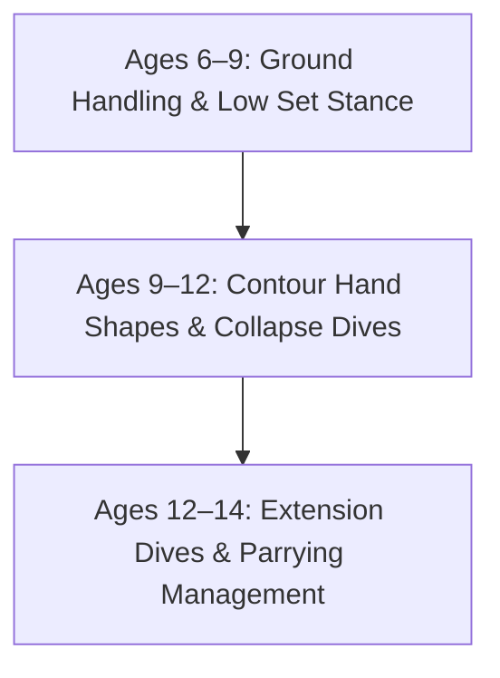
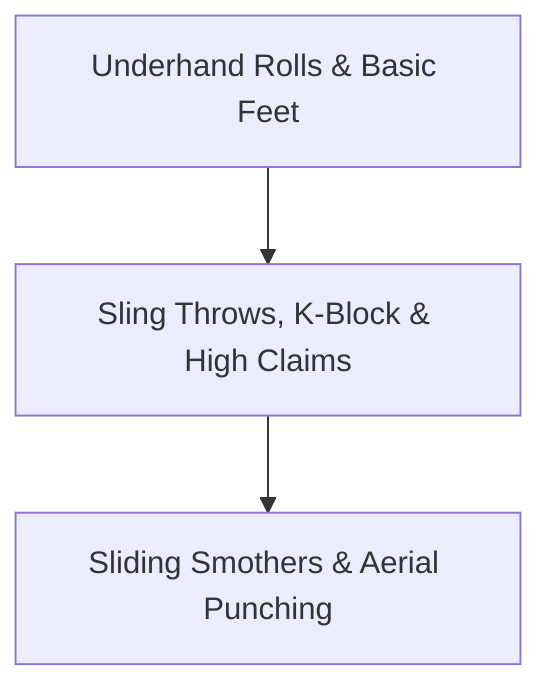
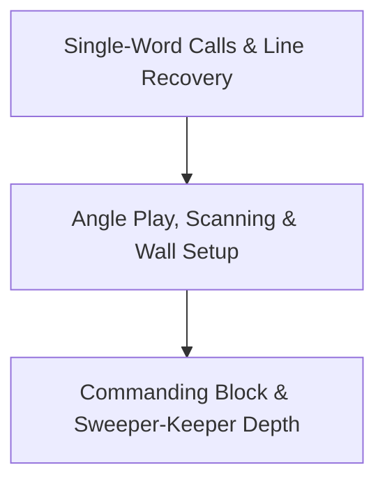

# Expectations Matrix 
## International Goalkeeper Benchmarks (Ages 6–14)

---
layout: course-page
title: Expectations Matrix | Catches & Diving Mechanics
---

# Technical Progression: Catches & Diving

Skill benchmarks prioritize safe joint impact and hand shape development before advancing to high-velocity diving mechanics.

::left::

| Skill | 6–9 Yrs | 9–12 Yrs | 12–14 Yrs |
| :--- | :---: | :---: | :---: |
| **Basket Catch** | ✅ | ✅ | ✅ |
| **Scoop Catch (Ground Ball)** | ✅ | ✅ | ✅ |
| **Ground Saves (from Squat/Knees)** | ✅ | ✅ | ✅ |
| **Contour Catch (W-Catch)** | | ✅ | ✅ |
| **High Contour Catch** | | ✅ | ✅ |
| **Side Contour Catch** | | ✅ | ✅ |
| **Collapse Dives** | | ✅ | ✅ |
| **Reaction Saves** | | ✅ | ✅ |
| **Extension / Flying Dives** | | | ✅ |
| **Parrying to Safe Zones** | | | ✅ |

::right::

<TakeawayBox title="Ground Handling Foundation (6–9)" type="info">
  <b>Safe Mechanics:</b> Focus on basket catches, ground scoops, and low body positioning. Avoid high-impact collapse diving to protect developing joints.
</TakeawayBox>

<TakeawayBox title="Diving & Reaction Expansion (9–12)" type="success">
  <b>9v9 Transition:</b> Introduce contour hand shapes (W-catch) and structured collapse diving once players learn proper ground absorption.
</TakeawayBox>

<TakeawayBox title="Specialization & Power (12–14)" type="important">
  <b>11v11 Mastery:</b> Reserve airborne extension dives and high-velocity parrying control for physical maturity at ages 12–14.
</TakeawayBox>

---
layout: course-page
title: Expectations Matrix | 1v1, Aerial & Distribution
---

# Tactical Actions: 1v1, Aerial & Distribution

Distribution and box control progress from simple rolls and short passes to complex 1v1 block shapes and full-field playmaking.

::left::

| Skill | 6–9 Yrs | 9–12 Yrs | 12–14 Yrs |
| :--- | :---: | :---: | :---: |
| **Bowl / Underhand Roll** | ✅ | ✅ | ✅ |
| **Short Passing (Inside Foot)** | ✅ | ✅ | ✅ |
| **Closing Down Space (Basic)** | | ✅ | ✅ |
| **K-Block / Star Block** | | ✅ | ✅ |
| **Cross-Tracking & Judgment** | | ✅ | ✅ |
| **Apex / High Ball Claim** | | ✅ | ✅ |
| **Sling Throw** | | ✅ | ✅ |
| **Baseball Throw Release** | | ✅ | ✅ |
| **Punt & Drop Kick** | | ✅ | ✅ |
| **Sliding Smother** | | | ✅ |
| **Punching to Safety** | | | ✅ |

::right::

<TakeawayBox title="Short Distribution (6–9)" type="info">
  <b>Building Confidence:</b> Emphasize underhand rolls and short foot passes to build initial comfort on the ball.
</TakeawayBox>

<TakeawayBox title="Box Control & Throwing (9–12)" type="success">
  <b>Dynamic Playmaking:</b> Introduce sling/baseball throws, punting, K-Block shapes, and apex claims as the pitch expands.
</TakeawayBox>

<TakeawayBox title="Physical Contact Actions (12–14)" type="important">
  <b>High-Impact Control:</b> Reserve sliding smothers and aerial punching for 11v11 play where physical collision risks require high athletic coordination.
</TakeawayBox>

---
layout: course-page
title: Expectations Matrix | Tactical & Communication
---

# Game Intelligence: Tactical & Communication

Goalkeepers evolve from vocal starters using simple single-word calls into field generals who command the entire defensive shape.

::left::

| Skill | 6–9 Yrs | 9–12 Yrs | 12–14 Yrs |
| :--- | :---: | :---: | :---: |
| **Basic Verbal Calls ("Keeper!")** | ✅ | ✅ | ✅ |
| **Follow Defense Out / Recovery** | ✅ | ✅ | ✅ |
| **Receiving & Opening Hips** | | ✅ | ✅ |
| **Pre-Reception Scanning** | | ✅ | ✅ |
| **Ball-Line Maintenance** | | ✅ | ✅ |
| **Angle Play / Cutting Down** | | ✅ | ✅ |
| **Organizing Walls & Set Pieces** | | ✅ | ✅ |
| **Directing Defensive Line / Block** | | | ✅ |
| **Sweeping & Sweeper-Keeper Depth** | | | ✅ |

::right::

<TakeawayBox title="Early Habits (6–9)" type="info">
  <b>Basic Presence:</b> Teach single-word calls ("Keeper!", "Mine!") and stepping up with the backline as possession moves forward.
</TakeawayBox>

<TakeawayBox title="Tactical Positioning (9–12)" type="success">
  <b>Game Intelligence:</b> Introduce angle play, ball-line positioning, wall setup, and scanning before receiving passes back from defenders.
</TakeawayBox>

<TakeawayBox title="Field Command (12–14)" type="important">
  <b>Full-Field General:</b> Command the full 11v11 defensive block and manage sweeper-keeper depth behind a high defensive line.
</TakeawayBox>

