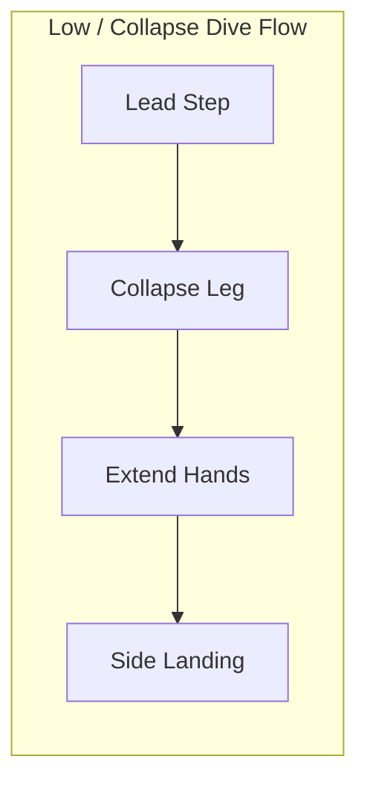

# Basics of Goalkeeping
## Complete Coaching Reference Library

---
layout: course-page
title: Skill Breakdown | Ready/Set Position
---

# Ready / Set Position

The foundational stance taken right before an opponent strikes the ball, allowing explosive reaction in any direction.

::left::

<TakeawayBox title="What It Is & How It's Performed" type="info">
  <b>What It Is:</b> The pre-shot stance that prepares the body to jump, dive, or move laterally.  
  <b>How It's Performed:</b>
  <ul>
    <li><b>Base:</b> Feet slightly wider than shoulder-width, weight balanced on the balls of the feet (heels lightly off turf).</li>
    <li><b>Posture:</b> Knees flexed, chest leaning slightly forward over toes.</li>
    <li><b>Hands:</b> Positioned at mid-chest height, palms facing forward, thumbs up, elbows tucked near ribs.</li>
    <li><b>Head:</b> Level and quiet, keeping eyes locked on the ball line.</li>
  </ul>
</TakeawayBox>

::right::

<TakeawayBox title="How to Coach It" type="success">
  <b>Verbal Cues:</b> <i>"Nose over toes"</i> | <i>"Soft knees"</i> | <i>"Show your palms"</i>  
  <b>Common Mistakes to Correct:</b>
  <ul>
    <li><b>Flat Feet / Back on Heels:</b> Causes delayed reaction times. Have them bounce lightly on their toes.</li>
    <li><b>Hands Behind Hips:</b> Lengthens reaction time to high/low shots. Remind them to keep hands forward.</li>
    <li><b>Standing Too Tall:</b> Prevents explosive lateral pushes. Force a lower center of gravity.</li>
  </ul>
</TakeawayBox>

---
layout: course-page
title: Skill Breakdown | Contour Catch (W-Catch)
---

# Contour Catch (W-Catch)

The primary hand shape used for catching shots arriving between chest and head height.

::left::

<TakeawayBox title="What It Is & How It's Performed" type="info">
  <b>What It Is:</b> A hand configuration designed to stop high-velocity balls from slipping through to the face or body.  
  <b>How It's Performed:</b>
  <ul>
    <li><b>Reach:</b> Extend arms forward to meet the ball in front of the body line.</li>
    <li><b>Hand Shape:</b> Thumbs and index fingers nearly touch to form a clear "W" shape behind the ball.</li>
    <li><b>Spread:</b> Fingers spread wide across the back contour of the ball.</li>
    <li><b>Absorption:</b> Give slightly with the elbows to cushion impact, bringing the ball safely into chest lock.</li>
  </ul>
</TakeawayBox>

::right::

<TakeawayBox title="How to Coach It" type="success">
  <b>Verbal Cues:</b> <i>"Attack the ball"</i> | <i>"Make the W"</i> | <i>"Soft hands, strong wrists"</i>  
  <b>Common Mistakes to Correct:</b>
  <ul>
    <li><b>Thumbs Too Far Apart:</b> The ball slips through the hands into the face/chest. Ensure thumbs nearly touch.</li>
    <li><b>Catching on Chest First:</b> Ball bounces off hard chest bone. Force hand contact <i>in front</i> of the body line.</li>
    <li><b>Rigid Arms:</b> Hard hands cause rebounds. Coach the player to absorb speed into flexing elbows.</li>
  </ul>
</TakeawayBox>

---
layout: course-page
title: Skill Breakdown | Ground Handling (Scoop & Basket)
---

# Ground Handling: Scoop & Basket Catches

Securing rolling ground balls and waist-height shots safely using body-barrier techniques.

::left::

<TakeawayBox title="Scoop Catch (Ground Balls)" type="info">
  <b>What It Is:</b> Technique for low rolling or bouncing shots.  
  <b>How It's Performed:</b> Lower body into a squat or drop trailing knee to turf behind the ball. Spread hands low with pinkies touching, palms facing up, and funnel the ball up into chest lock.  
  <b>How to Coach It:</b> Cue <i>"Pinkies together"</i> and <i>"Body behind the ball."</i> Ensure feet/legs act as a secondary wall if hands miss.
</TakeawayBox>

::right::

<TakeawayBox title="Basket Catch (Waist-Chest Shots)" type="success">
  <b>What It Is:</b> Securing hard waist-to-chest height shots directly into the midsection.  
  <b>How It's Performed:</b> Bend slightly at the waist, extend forearms forward parallel with palms up. Cushion the ball into the soft stomach, folding shoulders over top to lock it.  
  <b>How to Coach It:</b> Cue <i>"Cradle the baby"</i> and <i>"Huddle over the ball."</i> Watch for elbows flaring out wide, which lets shots pop free.
</TakeawayBox>

---
layout: course-page
title: Skill Breakdown | Low / Collapse Dives
---

# Low / Collapse Dives

A controlled lateral drop save to reach low ground shots without leaving the turf in an airborne jump.

::left::

<TakeawayBox title="What It Is & How to Coach It" type="info">
  <b>What It Is:</b> Rapidly dropping the body to ground level to stop wide shots.  
  <b>How It's Performed:</b>
  <ol>
    <li>Step diagonally toward the ball line with the near foot.</li>
    <li>Collapse the near knee and hip to drop the lower body quickly.</li>
    <li>Lead with both hands behind the ball trajectory.</li>
    <li>Land on outer thigh, hip, and upper torso—never on elbows or knees.</li>
  </ol> 
  <b>Verbal Cues:</b> <i>"Step, collapse, slide"</i> | <i>"Hands lead the way"</i>
</TakeawayBox>

::right::

---
layout: course-page
title: Skill Breakdown | Additional Course Structure
---

# Additional Course Structure

### Static Techniques (Single Reference Slide)

- Ready Position (done)
- W Catch (done)
- Scoop Catch (done)
- Basket Catch (done)
- Hand Position
- Foot Position
- Ball Security

### Dynamic Techniques (Dedicated Slide + Sequence Diagram)

- Collapse Dive (done)
- Extension Dive
- High Dive
- Forward Smother
- Cross Collection
- Breakaways
- Bowling Distribution
- Overhand Throw
- Punt
- Side Volley
