# Basics of Goalkeeping
## Complete Coaching Reference Library

---
layout: course-page
title: Skill Breakdown | Foot Position
---

# Foot Position & Base

Optimizing body balance, weight distribution, and footwork mechanics for immediate lateral mobility.

::left::

<TakeawayBox title="What It Is & How It's Performed" type="info">
  <b>What It Is:</b> The stance and footwork alignment that provides dynamic balance for explosive movement.  
  <b>How It's Performed:</b>
  <ul>
    <li><b>Base Width:</b> Feet shoulder-width to slightly wider; balanced foundation without locking hips.</li>
    <li><b>Weight Distribution:</b> Metatarsals (balls of feet) loaded; heels hovering lightly off the turf.</li>
    <li><b>Set Timing (Split Step):</b> Micro-bounce timing as shooter strikes the ball to load kinetic energy.</li>
    <li><b>Toe Alignment:</b> Toes pointed forward toward ball line to enable instant forward/diagonal steps.</li>
  </ul>
</TakeawayBox>

::right::

<TakeawayBox title="How to Coach It" type="success">
  <b>Verbal Cues:</b> <i>"Light on toes"</i> | <i>"Set on the strike"</i> | <i>"Push off the back foot"</i>  
  <b>Common Mistakes to Correct:</b>
  <ul>
    <li><b>Flat-Footed / Heel Heavy:</b> Causes backward falling and delayed lateral response to low corner shots.</li>
    <li><b>Stance Too Wide:</b> Traps goalkeeper in place, making quick adjustment steps impossible.</li>
    <li><b>Moving Mid-Strike:</b> Being caught mid-stride during shot release prevents proper spring.</li>
  </ul>
</TakeawayBox>

---
layout: course-page
title: Skill Breakdown | Ready/Set Position
---

# Ready / Set Position

The foundational stance taken right before an opponent strikes the ball, allowing explosive reaction in any direction.

::left::

<TakeawayBox title="What It Is & How It's Performed" type="info">
  <b>What It Is:</b> The pre-shot stance that prepares the body to jump, dive, or move laterally.  
  <b>How It's Performed:</b>
  <ul>
    <li><b>Base:</b> Feet slightly wider than shoulder-width, weight balanced on the balls of the feet (heels lightly off turf).</li>
    <li><b>Posture:</b> Knees flexed, chest leaning slightly forward over toes.</li>
    <li><b>Hands:</b> Positioned at mid-chest height, palms facing forward, thumbs up, elbows tucked near ribs.</li>
    <li><b>Head:</b> Level and quiet, keeping eyes locked on the ball line.</li>
  </ul>
</TakeawayBox>

::right::

<TakeawayBox title="How to Coach It" type="success">
  <b>Verbal Cues:</b> <i>"Nose over toes"</i> | <i>"Soft knees"</i> | <i>"Show your palms"</i>  
  <b>Common Mistakes to Correct:</b>
  <ul>
    <li><b>Flat Feet / Back on Heels:</b> Causes delayed reaction times. Have them bounce lightly on their toes.</li>
    <li><b>Hands Behind Hips:</b> Lengthens reaction time to high/low shots. Remind them to keep hands forward.</li>
    <li><b>Standing Too Tall:</b> Prevents explosive lateral pushes. Force a lower center of gravity.</li>
  </ul>
</TakeawayBox>

---
layout: course-page
title: Skill Breakdown | Hand Position
---

# Hand Position & Shape

The mechanical foundation for securing shots, absorbing ball speed, and preventing soft rebounds.

::left::

<TakeawayBox title="What It Is & How It's Performed" type="info">
  <b>What It Is:</b> Precise hand configurations adapted to ball height to maximize surface coverage.  
  <b>How It's Performed:</b>
  <ul>
    <li><b>W-Shape (High Balls):</b> Thumbs nearly touching, index fingers angled up, forming a "W" behind the ball.</li>
    <li><b>Cup / Scoop (Low Balls):</b> Palms facing forward/up, pinkies touching, hands funneled in front of feet.</li>
    <li><b>Attacking Reach:</b> Extend hands forward to meet the ball ahead of the torso line.</li>
    <li><b>Absorption:</b> Flexible wrists and yielding elbows absorb shock and pull the ball into chest lock.</li>
  </ul>
</TakeawayBox>

::right::

<TakeawayBox title="How to Coach It" type="success">
  <b>Verbal Cues:</b> <i>"Catch in front"</i> | <i>"Soft hands, strong wrists"</i> | <i>"Pads, not palms"</i>  
  <b>Common Mistakes to Correct:</b>
  <ul>
    <li><b>Palms Stiff / Flat Hands:</b> Causes high-velocity shots to bounce off hard hands into oncoming attackers.</li>
    <li><b>Thumbs Flared Out Wide:</b> Ball slips between hands into face or chest. Ensure thumbs stay close.</li>
    <li><b>Catching Behind Body Line:</b> Reduces reaction distance and leads to muffed catches near the goal line.</li>
  </ul>
</TakeawayBox>

---
layout: course-page
title: Skill Breakdown | Contour Catch (W-Catch)
---

# Contour Catch (W-Catch)

The primary hand shape used for catching shots arriving between chest and head height.

::left::

<TakeawayBox title="What It Is & How It's Performed" type="info">
  <b>What It Is:</b> A hand configuration designed to stop high-velocity balls from slipping through to the face or body.  
  <b>How It's Performed:</b>
  <ul>
    <li><b>Reach:</b> Extend arms forward to meet the ball in front of the body line.</li>
    <li><b>Hand Shape:</b> Thumbs and index fingers nearly touch to form a clear "W" shape behind the ball.</li>
    <li><b>Spread:</b> Fingers spread wide across the back contour of the ball.</li>
    <li><b>Absorption:</b> Give slightly with the elbows to cushion impact, bringing the ball safely into chest lock.</li>
  </ul>
</TakeawayBox>

::right::

<TakeawayBox title="How to Coach It" type="success">
  <b>Verbal Cues:</b> <i>"Attack the ball"</i> | <i>"Make the W"</i> | <i>"Soft hands, strong wrists"</i>  
  <b>Common Mistakes to Correct:</b>
  <ul>
    <li><b>Thumbs Too Far Apart:</b> The ball slips through the hands into the face/chest. Ensure thumbs nearly touch.</li>
    <li><b>Catching on Chest First:</b> Ball bounces off hard chest bone. Force hand contact <i>in front</i> of the body line.</li>
    <li><b>Rigid Arms:</b> Hard hands cause rebounds. Coach the player to absorb speed into flexing elbows.</li>
  </ul>
</TakeawayBox>

---
layout: course-page
title: Skill Breakdown | Side Contour Catch
---

# Side Contour Catch

Used for mid-height shots (waist to chest) that are driven slightly wide of the body, requiring lateral extension without a full dive.

::left::

<TakeawayBox title="What It Is & How It's Performed" type="info">
  <b>What It Is:</b> An extended contour catch used when there isn't enough time to get the entire body squarely behind the ball.  
  <b>How It's Performed:</b>
  <ul>
    <li><b>Weight Shift:</b> Take a quick lateral step, shifting body weight toward the side the ball is traveling.</li>
    <li><b>Extension:</b> Shoot both hands out aggressively to intercept the ball away from the body.</li>
    <li><b>Hand Shape:</b> Maintain the "W" contour shape, with the hands angled to meet the trajectory of the ball.</li>
    <li><b>Recovery:</b> Immediately upon catching, bend the elbows to absorb the pace and pull the ball tightly into a chest lock.</li>
  </ul>
</TakeawayBox>

::right::

<TakeawayBox title="How to Coach It" type="success">
  <b>Verbal Cues:</b> <i>"Shift and reach"</i> | <i>"Two hands to the ball"</i> | <i>"Bring it home"</i>  
  <b>Common Mistakes to Correct:</b>
  <ul>
    <li><b>Reaching with One Hand:</b> Leads to dropped balls and weak deflections. Demand both hands attack the ball together.</li>
    <li><b>Leaving the Body Behind:</b> Reaching without stepping leaves the keeper off-balance. Enforce the lateral step.</li>
    <li><b>Catching with Stiff Arms:</b> Causes the ball to bounce off the hands. Cue them to act like shock absorbers and pull the ball into the chest.</li>
  </ul>
</TakeawayBox>

---
layout: course-page
title: Skill Breakdown | High Contour Catch
---

# High Contour Catch

The technique used to secure balls arriving above head height, such as crosses, corners, or high looping shots, at the maximum point of extension.

::left::

<TakeawayBox title="What It Is & How It's Performed" type="info">
  <b>What It Is:</b> Securing the ball out of the air at the highest possible point to prevent attackers from heading it.  
  <b>How It's Performed:</b>
  <ul>
    <li><b>Timing:</b> Track the flight path and time the jump off a single leg.</li>
    <li><b>Extension:</b> Extend arms straight up and slightly forward, meeting the ball at the absolute apex of the jump.</li>
    <li><b>Hand Shape:</b> Hands form a tight "W" slightly underneath and behind the ball to stop its downward/forward momentum.</li>
    <li><b>Protection:</b> Drive the non-jumping knee upward to generate vertical lift and protect the midsection from incoming attackers.</li>
  </ul>
</TakeawayBox>

::right::

<TakeawayBox title="How to Coach It" type="success">
  <b>Verbal Cues:</b> <i>"Catch at the apex"</i> | <i>"High hands"</i> | <i>"Attack it in the air"</i>  
  <b>Common Mistakes to Correct:</b>
  <ul>
    <li><b>Catching on the Way Down:</b> Waiting for the ball to drop allows attackers to win the header. Force keepers to attack the ball at the highest point.</li>
    <li><b>Bent Elbows at Contact:</b> Loses crucial inches of reach. Arms must be fully extended straight up upon catching.</li>
    <li><b>"Clapping" the Ball:</b> Trying to catch by slapping the sides of the ball causes it to slip through. Reinforce getting hands <i>behind</i> the ball.</li>
  </ul>
</TakeawayBox>

---
layout: course-page
title: Skill Breakdown | Ground Handling (Scoop & Basket)
---

# Ground Handling: Scoop & Basket Catches

Securing rolling ground balls and waist-height shots safely using body-barrier techniques.

::left::

<TakeawayBox title="Scoop Catch (Ground Balls)" type="info">
  <b>What It Is:</b> Technique for low rolling or bouncing shots.  
  <b>How It's Performed:</b> Lower body into a squat or drop trailing knee to turf behind the ball. Spread hands low with pinkies touching, palms facing up, and funnel the ball up into chest lock.  
  <b>How to Coach It:</b> Cue <i>"Pinkies together"</i> and <i>"Body behind the ball."</i> Ensure feet/legs act as a secondary wall if hands miss.
</TakeawayBox>

::right::

<TakeawayBox title="Basket Catch (Waist-Chest Shots)" type="success">
  <b>What It Is:</b> Securing hard waist-to-chest height shots directly into the midsection.  
  <b>How It's Performed:</b> Bend slightly at the waist, extend forearms forward parallel with palms up. Cushion the ball into the soft stomach, folding shoulders over top to lock it.  
  <b>How to Coach It:</b> Cue <i>"Cradle the baby"</i> and <i>"Huddle over the ball."</i> Watch for elbows flaring out wide, which lets shots pop free.
</TakeawayBox>

---
layout: course-page
title: Skill Breakdown | Ball Security
---

# Ball Security & Protection

Safely cradling and shielding the ball post-catch to eliminate second-chance rebounds and physical dispossessions.

::left::

<TakeawayBox title="What It Is & How It's Performed" type="info">
  <b>What It Is:</b> The immediate transition from catching to securing the ball against body and opponents.  
  <b>How It's Performed:</b>
  <ul>
    <li><b>The Chest Lock:</b> Pull secured balls tightly into mid-chest immediately after contact.</li>
    <li><b>Forearm Shield:</b> Forearms wrap vertically around ball sides with elbows tucked securely against ribs.</li>
    <li><b>Ground Securing:</b> On ground saves, pin ball with top hand while bottom hand forms a base cushion underneath.</li>
    <li><b>Body Shielding:</b> Turn shoulders away from approaching attackers to shield ball with back frame.</li>
  </ul>
</TakeawayBox>

::right::

<TakeawayBox title="How to Coach It" type="success">
  <b>Verbal Cues:</b> <i>"Hug the ball"</i> | <i>"Lock it in"</i> | <i>"Cover and shield"</i>  
  <b>Common Mistakes to Correct:</b>
  <ul>
    <li><b>Holding Ball Outward:</b> Leaving ball exposed away from chest allows trailing attackers to kick it free.</li>
    <li><b>Flared Elbows:</b> Creates open gaps where collisions pop the ball loose. Keep elbows tucked.</li>
    <li><b>Early Relaxation:</b> Dropping guard before complete control is established leads to loose balls.</li>
  </ul>
</TakeawayBox>

---
layout: course-page
title: Skill Breakdown | Low / Collapse Dives
---

# Low / Collapse Dives

A controlled lateral drop save to reach low ground shots without leaving the turf in an airborne jump.

::left::

<TakeawayBox title="What It Is & How to Coach It" type="info">
  <b>What It Is:</b> Rapidly dropping the body to ground level to stop wide shots.  
  <b>How It's Performed:</b>
  <ol>
    <li>Step diagonally toward the ball line with the near foot.</li>
    <li>Collapse the near knee and hip to drop the lower body quickly.</li>
    <li>Lead with both hands behind the ball trajectory.</li>
    <li>Land on outer thigh, hip, and upper torso—never on elbows or knees.</li>
  </ol> 
  <b>Verbal Cues:</b> <i>"Step, collapse, slide"</i> | <i>"Hands lead the way"</i>
</TakeawayBox>

::right::

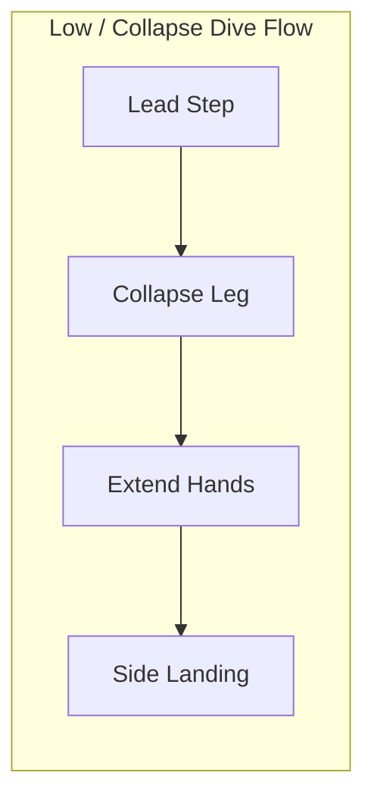

---
layout: course-page
title: Skill Breakdown | Extension Dive
---

# Extension Dive

Explosive lateral power push to reach mid-height and wide shots beyond simple collapse-dive range.

::left::

<TakeawayBox title="What It Is & How to Coach It" type="info">
  <b>What It Is:</b> An airborne push off the near leg to extend body length toward wide mid-height shots.  
  <b>How It's Performed:</b>
  <ol>
    <li>Step diagonally toward the ball trajectory with the near foot.</li>
    <li>Drive forcefully off the near leg, extending hip, knee, and ankle.</li>
    <li>Extend both hands together along the ball flight path.</li>
    <li>Absorb landing sequentially across lateral leg, hip, and lat muscle—never on elbows or stomach.</li>
  </ol> 
  <b>Verbal Cues:</b> <i>"Power step"</i> | <i>"Drive the hip"</i> | <i>"Land on your side"</i>
</TakeawayBox>

::right::

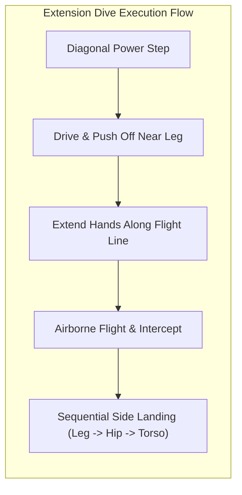

---
layout: course-page
title: Skill Breakdown | High Dive
---

# High Dive (Upper-Corner Saves)

Explosive vertical and diagonal airborne launch designed to parry or catch upper-90 shots.

::left::

<TakeawayBox title="What It Is & How to Coach It" type="info">
  <b>What It Is:</b> Maximizing vertical reach off single-leg takeoff to reach high corner shots.  
  <b>How It's Performed:</b>
  <ol>
    <li>Execute quick crossover/drop steps to position under the ball path.</li>
    <li>Plant and drive explosively off the jumping leg, while driving the non-takeoff knee forcefully upward to generate vertical lift.</li>
    <li>Reach with top hand (for deflection over bar) or both hands (W-shape for catch).</li>
    <li>Cushion descent onto lateral torso with arms folded safely across body.</li>
  </ol> 
  <b>Verbal Cues:</b> <i>"Explode off the jumping leg"</i> | <i>"Drive the knee"</i> | <i>"Top hand to the sky"</i>
</TakeawayBox>

::right::

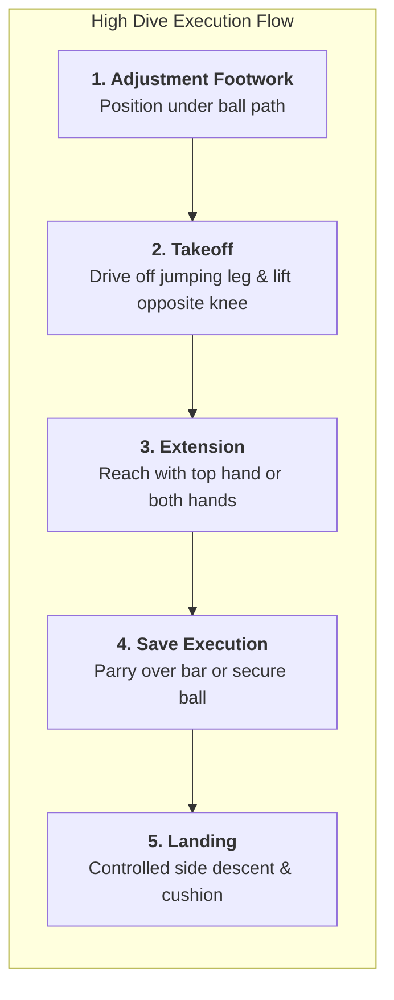

---
layout: course-page
title: Skill Breakdown | Parrying to Safe Zones
---

# Parrying to Safe Zones

Redirecting high-velocity or hard-to-hold shots with the palms to a safe area, rather than attempting an unsafe catch or presenting a rebound to attackers.

::left::

<TakeawayBox title="What It Is & How to Coach It" type="info">
  <b>What It Is:</b> An open-palm save used when a shot is too powerful or moving too quickly to be caught cleanly.  
  <b>How It's Performed:</b>
  <ol>
    <li>Judge early whether the ball can be caught; decide to parry when the hold is unlikely.</li>
    <li>Meet the ball with open palms, fingers spread, wrists firm.</li>
    <li>Redirect up and over the bar for high balls, or wide and forward toward the flank.</li>
    <li>Never parry back into the center of the box toward arriving attackers.</li>
  </ol> 
  <b>Verbal Cues:</b> <i>"Make it wide"</i> | <i>"Over the bar"</i> | <i>"Hands up, palms open"</i>
</TakeawayBox>

::right::

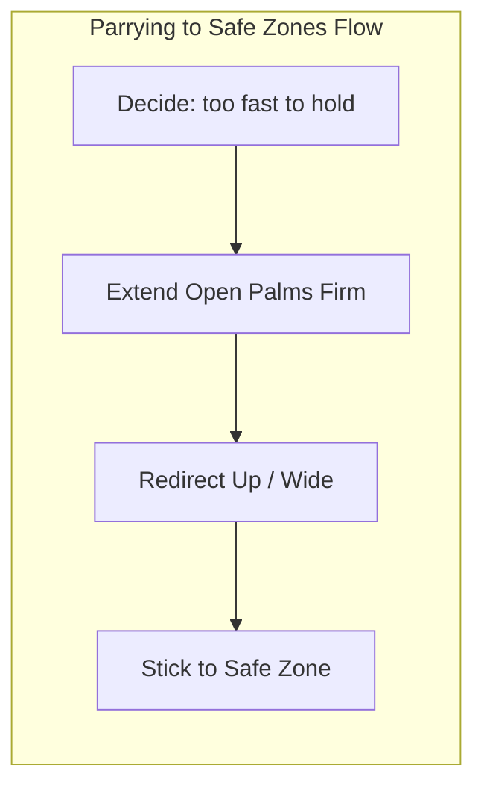

---
layout: course-page
title: Skill Breakdown | Cross Collection
---

# High Cross Collection

Dominating the penalty area by claiming aerial deliveries at the highest reachable point.

::left::

<TakeawayBox title="What It Is & How to Coach It" type="info">
  <b>What It Is:</b> Intercepting lofted crosses and corners in congested aerial space.  
  <b>How It's Performed:</b>
  <ol>
    <li>Assess ball trajectory, flight path, and physical traffic early.</li>
    <li>Shout loud, authoritative call (<i>"KEEPER!"</i>) to signal defenders.</li>
    <li>Launch off single foot while driving target-side knee up for protection and vertical power.</li>
    <li>Catch ball at peak elevation with high W-hands and bring straight to chest lock upon landing.</li>
  </ol> 
  <b>Verbal Cues:</b> <i>"Early call"</i> | <i>"Catch at peak"</i> | <i>"Knee up for safety"</i>
</TakeawayBox>

::right::

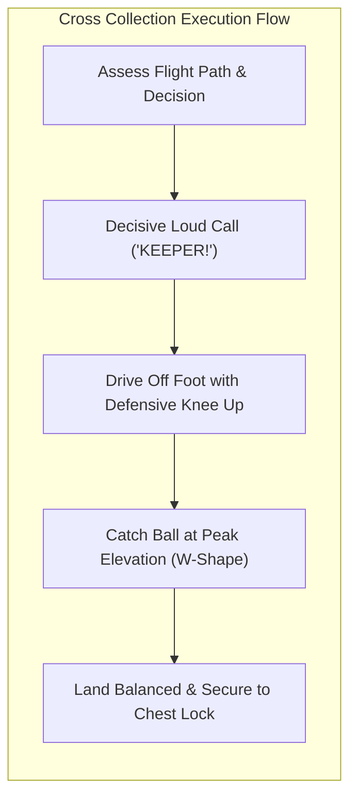

---
layout: course-page
title: Skill Breakdown | Punching & High Clearance
---

# Punching High Balls & Aerial Clearance

Aggressively clearing lofted balls, crosses, and aerial duels by punching the ball out rather than claiming it, used when a catch is contested or risky.

::left::

<TakeawayBox title="What It Is & How to Coach It" type="info">
  <b>What It Is:</b> A deliberate one- or two-fisted punch to defuse an aerial delivery when catching is unsafe or traffic is heavy.  
  <b>How It's Performed:</b>
  <ol>
    <li>Read the flight, pace, and surrounding traffic before committing.</li>
    <li>Drive off one foot, extending the punching arm to meet the ball at its apex.</li>
    <li>Strike the underside-center of the ball with clenched fist pads.</li>
    <li>Punch high and distant, toward the flanks—away from the danger area in front of goal.</li>
  </ol> 
  <b>Verbal Cues:</b> <i>"Punch it away"</i> | <i>"Fists together"</i> | <i>"Clear to the flank"</i>
</TakeawayBox>

::right::

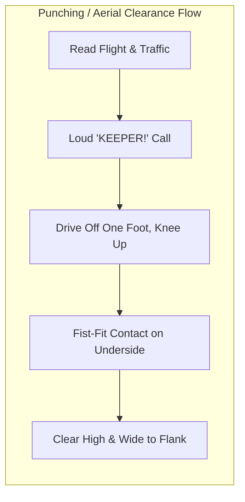

---
layout: course-page
title: Skill Breakdown | Breakaways (1v1)
---

# 1v1 Breakaway Management

Closing down space, setting position, and executing block or spread saves against lone attackers.

::left::

<TakeawayBox title="What It Is & How to Coach It" type="info">
  <b>What It Is:</b> Managing 1v1 duels when an attacker penetrates the defensive line.  
  <b>How It's Performed:</b>
  <ol>
    <li>Close distance rapidly while attacker's head is down or touch is heavy.</li>
    <li>Shorten stride and SET balanced as attacker prepares to strike.</li>
    <li>Drop into K-block or star spread to maximize barrier coverage.</li>
    <li>Maintain patience—stay on feet as long as possible to force attacker's decision.</li>
  </ol> 
  <b>Verbal Cues:</b> <i>"Attack heavy touches"</i> | <i>"Set on the strike"</i> | <i>"Make yourself big"</i>
</TakeawayBox>

::right::

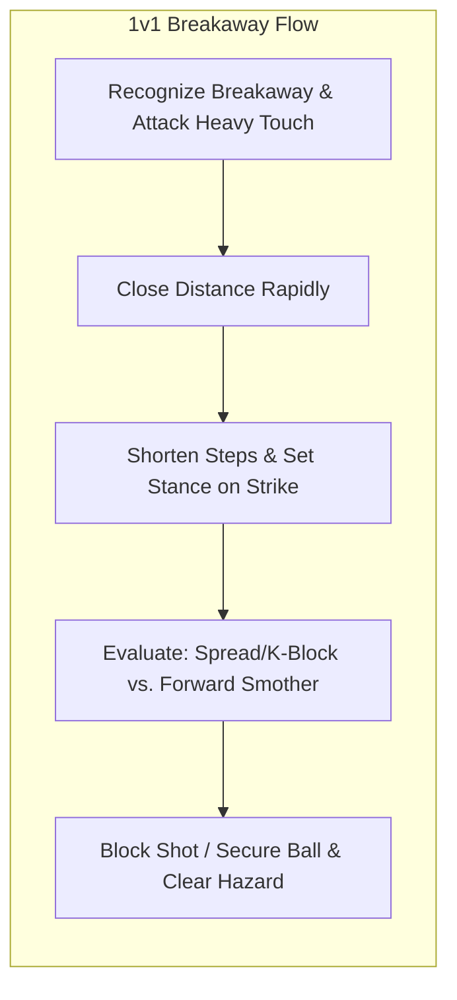

---
layout: course-page
title: Skill Breakdown | K-Block
---

# K-Block (Close-Range Barrier)

A specialized, close-distance blocking shape used to seal off the space between the legs and maximize lower-body surface area during tight 1v1s.

::left::

<TakeawayBox title="What It Is & How to Coach It" type="info">
  <b>What It Is:</b> A reactionary barrier shape where the goalkeeper drops one knee behind the opposite heel to eliminate the "nutmeg" and cover the lower corners.  
  <b>How It's Performed:</b>
  <ol>
    <li>Maintain a low, balanced set stance as the attacker approaches within 2–5 yards.</li>
    <li>As the shot is struck, drop the trailing knee to the turf directly behind the lead heel.</li>
    <li>Keep the chest tall, puffed out, and square to the ball line (do not lean back).</li>
    <li>Extend both hands diagonally downward and wide to cover the space outside the legs.</li>
  </ol> 
  <b>Verbal Cues:</b> <i>"Knee to heel"</i> | <i>"Chest tall"</i> | <i>"Hands low and wide"</i>
</TakeawayBox>

::right::

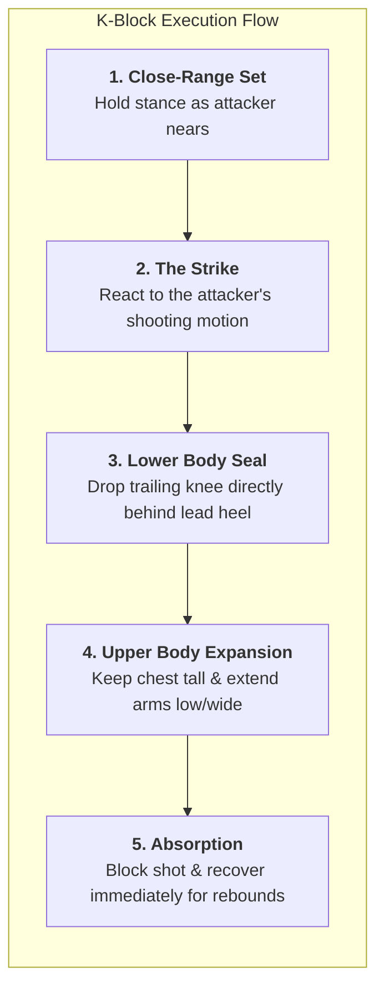

---
layout: course-page
title: Skill Breakdown | Forward Smother
---

# Forward Smother

Diving forward into the feet of oncoming attackers to smother loose balls and through-passes.

::left::

<TakeawayBox title="What It Is & How to Coach It" type="info">
  <b>What It Is:</b> Aggressive forward ground slide to secure loose balls before attackers can strike.  
  <b>How It's Performed:</b>
  <ol>
    <li>Sprint aggressively toward ball, evaluating attacker proximity.</li>
    <li>Lower body center of gravity and launch hands-first along turf line.</li>
    <li>Form wide hand barrier (W or scoop) directly behind ball path.</li>
    <li>Slide through ball on lateral thigh/torso, pulling ball immediately into chest lock.</li>
  </ol> 
  <b>Verbal Cues:</b> <i>"Attack the ball"</i> | <i>"Hands lead head"</i> | <i>"Slide and smother"</i>
</TakeawayBox>

::right::

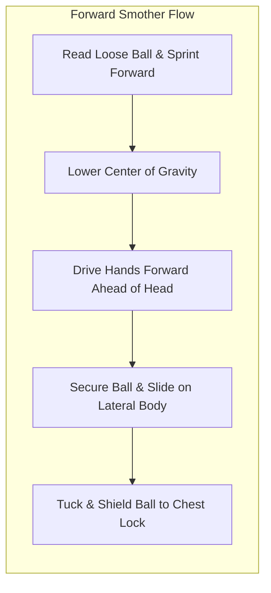

---
layout: course-page
title: Skill Breakdown | Angle Play & Ball-Line
---

# Angle Play & Ball-Line Resonance

Positioning that keeps the goalkeeper between the ball and the goal, cutting the shooter's effective target and making the keeper's frame cover the goal.

::left::

<TakeawayBox title="What It Is & How to Coach It" type="info">
  <b>What It Is:</b> Continual repositioning along the line from the ball to the center of goal so the keeper stays in line and cuts the shooter's angle.  
  <b>How It's Performed:</b>
  <ol>
    <li>Track the ball and step off the line to reduce the angle of a central shooter.</li>
    <li>Stay on the imaginary ball-to-goal line; adjust as the ball moves or a teammate deflects it.</li>
    <li>Maintain a ready stance and reset after each shift into a clean, reactive set.</li>
  </ol> 
  <b>Verbal Cues:</b> <i>"Stay on the line"</i> | <i>"Cut the angle"</i> | <i>"Step out"</i>
</TakeawayBox>

::right::

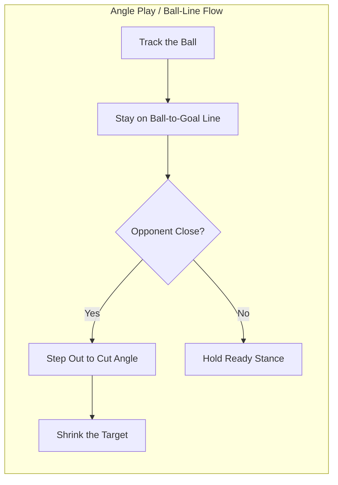

---
layout: course-page
title: Skill Breakdown | Sweeping & Sweeper-Keeper
---

# Sweeping & Sweeper-Keeper Depth

Acting as a second defender behind the line to read and intercept through-balls, protecting the space a high defensive line leaves behind it.

::left::

<TakeawayBox title="What It Is & How to Coach It" type="info">
  <b>What It Is:</b> Using the keeper's depth and footwork as an extra defender to clear balls played into the space behind the back line.  
  <b>How It's Performed:</b>
  <ol>
    <li>Stay at a depth that lets you beat the attacker to a ball played behind the line.</li>
    <li>Read the pass early and spring off the line to meet it.</li>
    <li>Clear with a slide smother, low scoop, or clean outside-foot clearance.</li>
    <li>Recover quickly to your goal-side position once the danger is cleared.</li>
  </ol> 
  <b>Verbal Cues:</b> <i>"Read it early"</i> | <i>"Beat the attacker"</i> | <i>"Sweep and recover"</i>
</TakeawayBox>

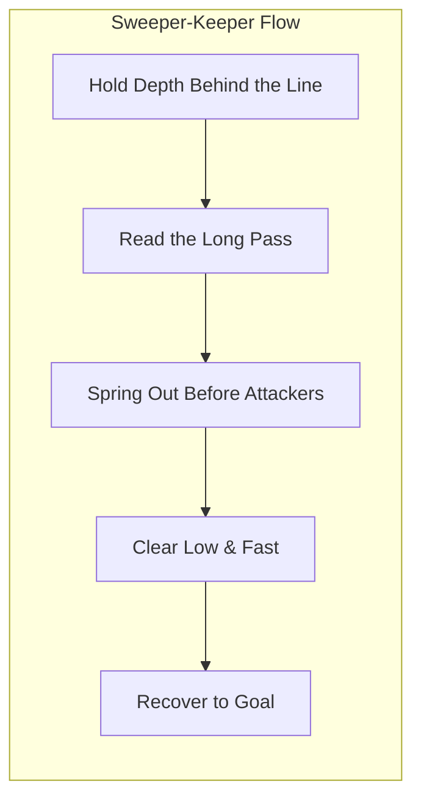

---
layout: course-page
title: Skill Breakdown | Bowling Distribution
---

# Underhand Roll / Bowling Distribution

Precision low-trajectory rolling pass to initiate short build-up play to nearby defenders.

::left::

<TakeawayBox title="What It Is & How to Coach It" type="info">
  <b>What It Is:</b> Underhand rolling restart to distribute smoothly along turf without bounce.  
  <b>How It's Performed:</b>
  <ol>
    <li>Cup ball securely in dominant palm with fingers spread underneath.</li>
    <li>Step forward with opposite foot toward target, lowering hips.</li>
    <li>Swing arm backward in smooth pendulum arc.</li>
    <li>Release ball at turf level so it glides smoothly into teammate's feet.</li>
  </ol> 
  <b>Verbal Cues:</b> <i>"Low and smooth"</i> | <i>"Step with opposite foot"</i> | <i>"Follow through"</i>
</TakeawayBox>

::right::

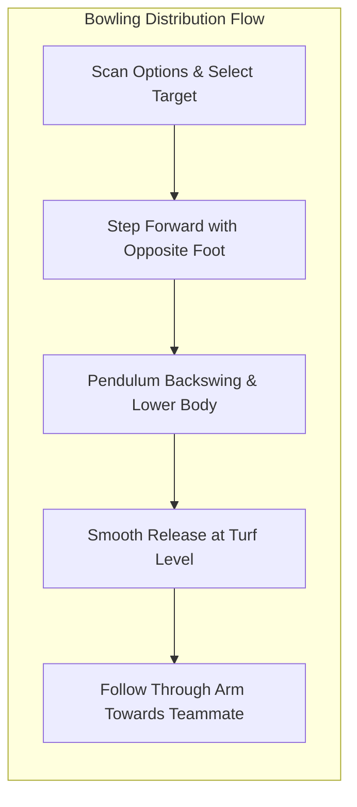

---
layout: course-page
title: Skill Breakdown | Overhand Throw
---

# Overhand Sling Throw

Powerful medium-to-long distance distribution to bypass pressing attackers and spark counter-attacks.

::left::

<TakeawayBox title="What It Is & How to Coach It" type="info">
  <b>What It Is:</b> Baseball/javelin-style overhand throwing action for driven distance.  
  <b>How It's Performed:</b>
  <ol>
    <li>Cup ball in dominant hand; turn non-throwing shoulder toward target.</li>
    <li>Wind ball back behind head with elbow flexed ~90 degrees.</li>
    <li>Step forcefully onto lead foot, uncoiling hips and torso.</li>
    <li>Whip throwing arm over shoulder with wrist snap to drive ball on flat trajectory.</li>
  </ol> 
  <b>Verbal Cues:</b> <i>"Point, step, whip"</i> | <i>"Driven, not lofted"</i> | <i>"Rotate hips"</i>
</TakeawayBox>

::right::

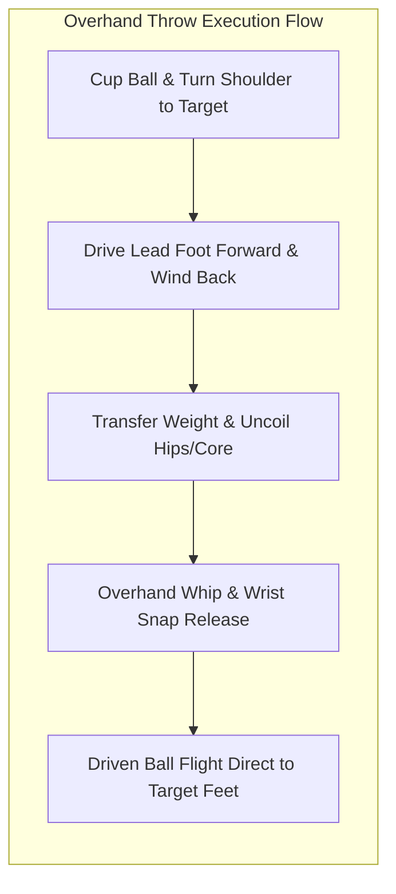

---
layout: course-page
title: Skill Breakdown | Out-of-Hands Punt
---

# Traditional High Punt

High-clearing kicking restart out of hands to achieve maximum distance upfield into opponent half.

::left::

<TakeawayBox title="What It Is & How to Coach It" type="info">
  <b>What It Is:</b> Kicking ball directly as it drops from hands to clear defensive zone.  
  <b>How It's Performed:</b>
  <ol>
    <li>Hold ball waist-high with guiding hand; plant non-kicking foot.</li>
    <li>Drop ball straight down toward kicking foot (do NOT toss upward).</li>
    <li>Swing kicking leg with locked ankle, striking ball on laces below waist.</li>
    <li>Follow through smoothly, landing forward on kicking foot.</li>
  </ol> 
  <b>Verbal Cues:</b> <i>"Drop, don't toss"</i> | <i>"Lock the ankle"</i> | <i>"Laces through ball center"</i>
</TakeawayBox>

::right::

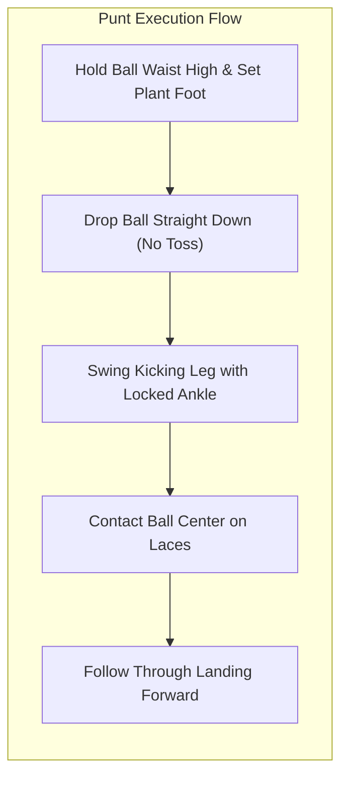

---
layout: course-page
title: Skill Breakdown | Side Volley
---

# Side Volley Distribution

Low-trajectory, high-velocity side-kick distribution for rapid, pinpoint counter-attacks.

::left::

<TakeawayBox title="What It Is & How to Coach It" type="info">
  <b>What It Is:</b> Sideways sweeping volley pass delivering flat, fast distribution across lines.  
  <b>How It's Performed:</b>
  <ol>
    <li>Orient body at ~45-degree angle to target line.</li>
    <li>Release ball slightly out to kicking side at hip level.</li>
    <li>Sweep kicking leg horizontally across body with hip open.</li>
    <li>Strike ball on instep with lateral leg swing to keep trajectory low and fast.</li>
  </ol> 
  <b>Verbal Cues:</b> <i>"Body sideways"</i> | <i>"Sweep the hip"</i> | <i>"Flat and fast"</i>
</TakeawayBox>

::right::

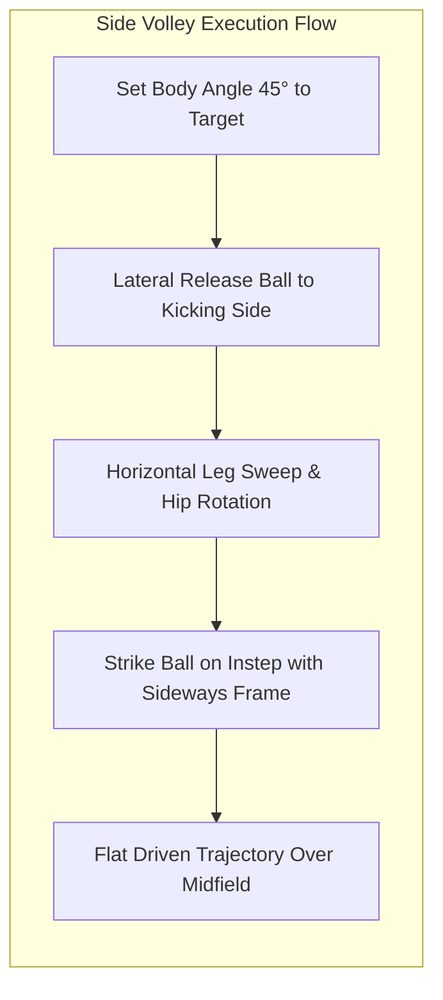
