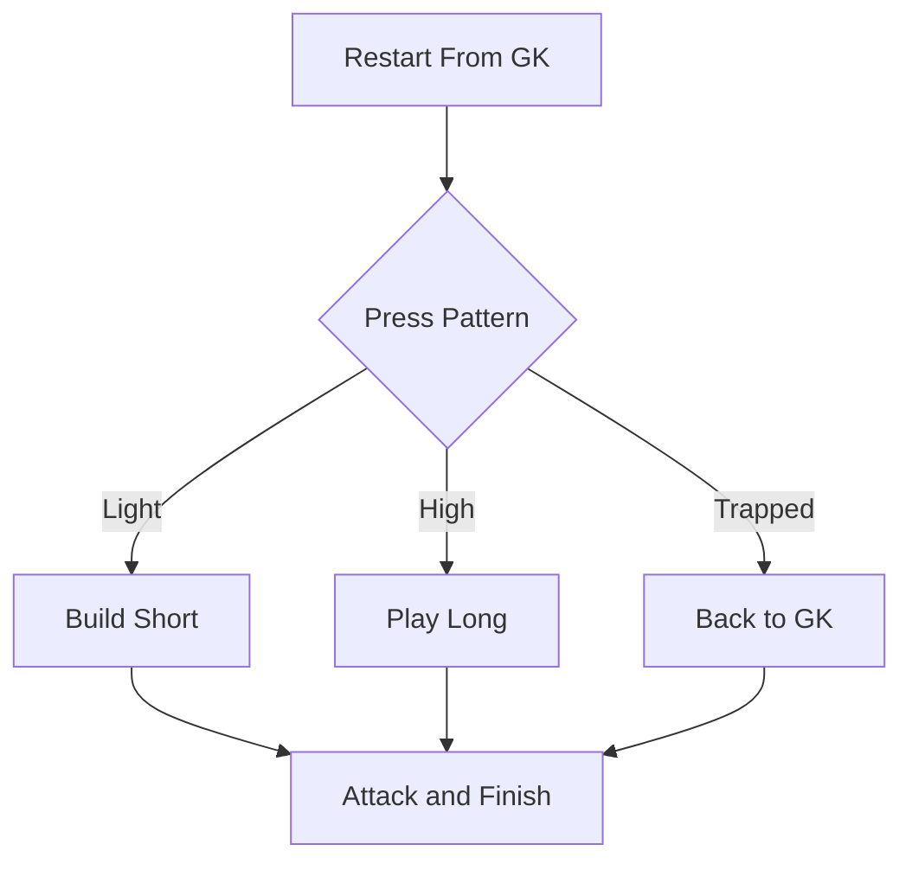
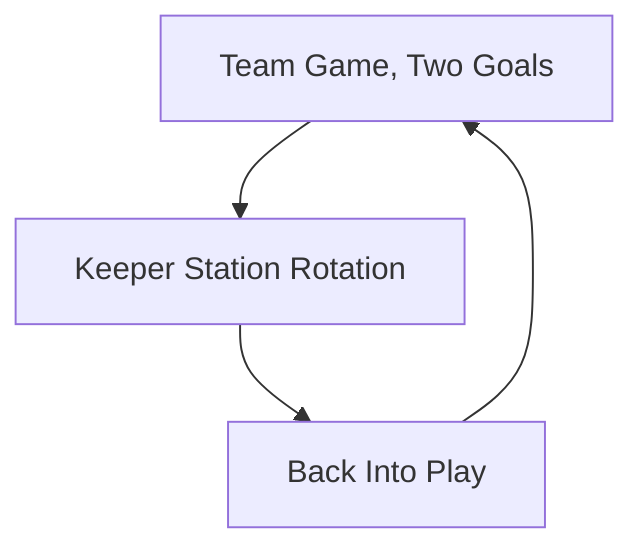
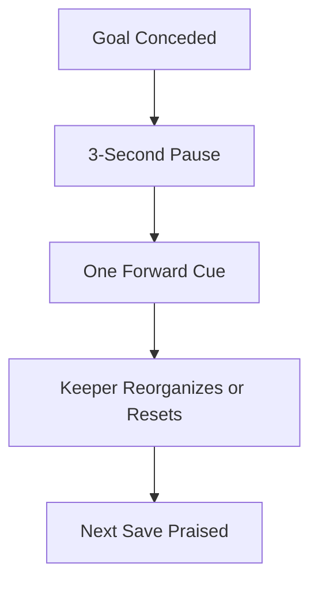
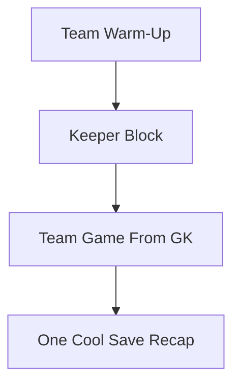

# Coaches' Toolbox

Practical Session Resources

---
layout: top-title
title: Coaches' Toolbox | Right-Sized Goals, Balls & Formats
---

::title::

# Right-Sized Goals, Balls & Formats

::content::

A keeper's frame should roughly fill the goal, never be swallowed by it. Match the environment to the child's body and the game teaches itself. Exact sizes vary by league; use these as your planning baseline.

  <TakeawayBox title="Formats & Goal Sizes" type="info">
    <b>4v4 (U6–U7):</b> 4 x 6 ft goals, size 3 ball. No real keeper role; everyone rotates.  
    <b>7v7 (U8–U10):</b> 7 x 21 ft goals, size 4 ball. First keeper turns; goal small enough to feel safe.  
    <b>9v9 (U11–U12):</b> 7 x 21 ft goals, size 4 ball. Full technical base; angles and 1v1 begin.  
    <b>11v11 (U13+):</b> 8 x 24 ft goals, size 5 ball. Specialization, aerial command and power.
  </TakeawayBox>

  <TakeawayBox title="Why It Matters" type="warning">
    <b>Right-Sized Keeps Courage:</b> A 7-year-old in a full-size goal cannot cover the frame and learns helplessness. A keeper who can actually reach the corners stays brave and keeps trying.
  </TakeawayBox>

---
layout: top-title-two-cols
title: Coaches' Toolbox | GK in Team Practice: Build-Up Restart Game
---

::title::

# The Build-Up Restart Game

::default::

The single best way to integrate a goalkeeper into team practice: make every restart start from the gloves. The keeper becomes a real playmaker, not a target.

::left::

<TakeawayBox title="Setup" type="info">
  <b>8v8, Two Goals:</b> Half a pitch, two full goals with keepers. All goal kicks, back passes, and catches restart from the GK.
</TakeawayBox>

<TakeawayBox title="The Rule" type="success">
  <b>Every Attack Starts With the GK:</b> The keeper chooses short to a center back or fullback, or long to a forward. Outfield players must create width and depth to give two clear options.
</TakeawayBox>

<TakeawayBox title="Use the GK as the Relief Valve" type="important">
  <b>Recycle Back:</b> If the press traps the build-up, players play back to the GK, who resets the attack. Under pressure the keeper stays a safe option, never a liability.
</TakeawayBox>

::right::

<TakeawayBox title="Add Conditions" type="success">
  <b>Progress It:</b> Start unrestricted. Then add: 6 passes before a shot scores double, or a two-touch limit for the backline. Raise the press gradually so decisions get harder, not easier.
</TakeawayBox>

---
layout: top-title-two-cols
title: Coaches' Toolbox | GK Stations Inside Team Sessions
---

::title::

# Stations Inside Team Sessions

::default::

Goalkeepers train twice as hard when they never stop playing. Weave keeper stations into the team rotation so the goalkeeper stays part of the squad, not parked at a goal.

::left::

<TakeawayBox title="Two Goals, Two Keepers" type="success">
  <b>No Idle Gloves:</b> Always run games with two goals so both keepers work. If you only have one goal, rotate the spare keeper into outfield play.
</TakeawayBox>

<TakeawayBox title="Keeper Station Rotation" type="info">
  <b>10 Minutes of Stations:</b> Set up a keeper circuit (scoop, W-catch, footwork) beside the main game. Players rotate through so outfielders get a taste and keepers stay in the warm-up.
</TakeawayBox>

<TakeawayBox title="Serve From the GK" type="important">
  <b>Finishing Starts With the Keeper:</b> In every shooting and crossing game, the ball starts from the goalkeeper's hands. Distribution reps happen automatically.
</TakeawayBox>

::right::

<TakeawayBox title="Rule of Thumb" type="warning">
  <b>Time in Goal ≠ Training:</b> Standing in goal during a team drill is not practice. If the keeper gets fewer touches than the worst outfield player, the session is a failure, not the keeper.
</TakeawayBox>

---
layout: top-title-two-cols
title: Coaches' Toolbox | The After-Goal Reset
---

::title::

# The After-Goal Reset

::default::

The minutes after conceding decide whether a keeper grows or shuts down. A short, predictable ritual turns every goal into the same calm restart.

::left::

<TakeawayBox title="The 3-Second Coach Rule" type="important">
  <b>Breathe Before You Speak:</b> No tactical talk in the first moments after a goal. Let the keeper pull the ball out, stand, and breathe. Composure is caught, not taught.
</TakeawayBox>

<TakeawayBox title="One Cue, Forward" type="success">
  <b>"Good shape. Next one. Set."</b> Deliver one short, forward-looking cue, then move on. If a correction is needed, save it for a private moment at the next break.
</TakeawayBox>

<TakeawayBox title="Track the Next Save" type="info">
  <b>Reward the Response:</b> Deliberately praise the next good handling moment after a mistake. The keeper learns the story ends with a save, not a goal.
</TakeawayBox>

::right::

<TakeawayBox title="Make the Keeper Reorganize" type="warning">
  <b>Turn Fear Into Command:</b> At 12–14, have the keeper reorganize the wall or the line after conceding. Focus shifts outward and the keeper walks back into the game as the leader, not the scapegoat.
</TakeawayBox>

---
layout: top-title-two-cols
title: Coaches' Toolbox | Session Template & Equipment
---

::title::

# Session Template & Equipment List

::default::

A repeatable session skeleton so a grassroots coach can plan a keeper-friendly practice in minutes, no goalkeeper coach required.

::left::

<TakeawayBox title="The Session Skeleton" type="info">
  <b>60 Minutes for 9–14, 45 for 6–9:</b> Team warm-up with the keeper in the group (10 min) → keeper station or block (10–15 min) → team game where every restart starts from the GK (25–30 min) → wrap-up with one "cool save" highlight (5 min).
</TakeawayBox>

<TakeawayBox title="Equipment" type="success">
  <b>Packed Bag:</b> Correct-size balls (3 / 4 / 5 by age), foam balls for 6–9, cones, child-sized or pop-up goals, bibs, and water. Gloves are optional before age 10.
</TakeawayBox>

::right::

<TakeawayBox title="The One-Page Cue Sheet" type="important">
  <b>Coaching Cheat Sheet:</b> Print the reference library's "How to Coach It" cues and keep them in your bag: <i>"make the W"</i>, <i>"pinkies together"</i>, <i>"stay big"</i>, <i>"set on the strike"</i>, <i>"knee to heel"</i>. The right cue beats the longest lecture.
</TakeawayBox>

