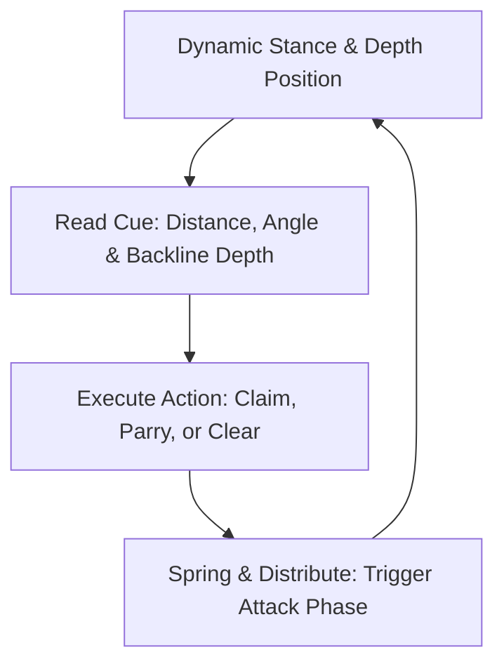

import { Card, CardGrid, Aside, Steps } from '@astrojs/starlight/components';

Coaching goalkeepers ages 12 to 14 (U13–U15) centers on managing the transition into **full-sided 11v11 play**. Based on guidelines from the International Goalkeepers Conference (IGCC), this methodology replaces static line drills with **game-realistic, constraint-based scenarios**. 

Keepers are trained as proactive outfield playmakers and defensive organizers rather than isolated shot-stoppers.

<Aside type="note" title="11v11 Grassroots Shift">
Eliminate isolated shot-stopping reps. Every session must present a dynamic picture: scanning defender depth, reading ball speed over large distances, and making immediate distribution decisions under pressing friction.
</Aside>

---

## Core Pillars of the IGCC Method (12–14 Age Group)

<CardGrid>
  <Card title="1. Constraint-Based Design" icon="random">
    **"Manage the Space"**
    
    Introduce high-press friction, screened vision through congested boxes, and deep through-balls that force keepers to judge distance and timing off their line.
  </Card>

  <Card title="2. Dynamic Stance & Set Timing" icon="time">
    **"Set Before the Strike"**
    
    Train keepers to execute a balanced set position the instant the attacker strikes the ball, adjusting set depth based on the location of the defensive line.
  </Card>

  <Card title="3. Immediate Recovery Habits" icon="refresh">
    **"Spring & Reset"**
    
    Ground contact is only phase one. Keepers must drive explosively off the non-landing knee to recover feet and cover secondary rebounds across a large 18-yard box.
  </Card>

  <Card title="4. Outfield Build-Up Role" icon="puzzle">
    **"The Deep Central Pivot"**
    
    Integrate keepers as the 11th outfield player in build-up play, developing confidence to receive backpasses under pressure and ping driven re-distribution passes.
  </Card>
</CardGrid>

---

## Action-Decision Cycle in 11v11

In match play, goalkeepers process information through a continuous perceptual loop across larger field dimensions:

---

## Translating Methodology into Field Cues

Replace academic terms with actionable, single-word coaching triggers during training sessions:

| Sports Science Concept | Grassroots Coaching Cue | Field Execution Target |
| :--- | :--- | :--- |
| Constraint Manipulation | **"Read the Line!"** | Track defender depth to anticipate through-balls into the box. |
| Perceptual Affordance | **"Hold or Parry Out!"** | Assess shot power relative to traffic inside the 18-yard box. |
| Recovery Biomechanics | **"Spring to Base!"** | Drive off the lower leg to recover set stance immediately. |
| Tactical Communication | **"STEP!" / "AWAY!" / "KEEPER'S!"** | Issue authoritative commands to direct the back four before contact. |

---

## Physiological & Biomechanical Reality: Ages 12–14

<Aside type="caution" title="Peak Height Velocity (PHV) & Coordination">
* **Limb Length Changes:** Rapid growth spurts temporarily disrupt body awareness and balance. Expect mechanics to occasionally regress, re-teach footwork patiently rather than punishing errors.
* **Depth & Velocity Perception:** Judging high floating shots or long-range strikes across larger spaces is still maturing. Focus feedback on positioning angles and set timing rather than flight-path misjudgments.
</Aside>

---

## Field-Ready Session: Constraint-Based 11v11 Integration

Execute this 20-minute phase-of-play block during team training to embed realistic sweeper-keeper and build-up habits.

<Steps>
1. **Setup & Spatial Constraints**
   Set up a 60 × 40 yard grid using the main penalty area expanding to midfield. Position 6 Attackers vs. 5 Defenders + Goalkeeper.

2. **Phase 1: Through-Ball & Space Management (7 Mins)**
   Attackers look to play weighted through-balls into the space behind the defensive line. The goalkeeper must start at an advanced depth to sweep or claim loose balls.

3. **Phase 2: Screened Shots & Rebound Recovery (8 Mins)**
   If attackers shoot from distance through defender traffic, the keeper must hold or parry wide, springing up immediately to organize the second ball.

4. **Phase 3: Deep Build-Up under Press (5 Mins)**
   When the keeper claims the ball, defenders immediately open wide. The keeper must act as a deep pivot to distribute past pressing attackers to wide midfield targets.
</Steps>

<Aside type="tip" title="Coaching Focus">
Prioritize **decision quality, communication clarity, and set-position timing** over simple save outcomes.
</Aside>