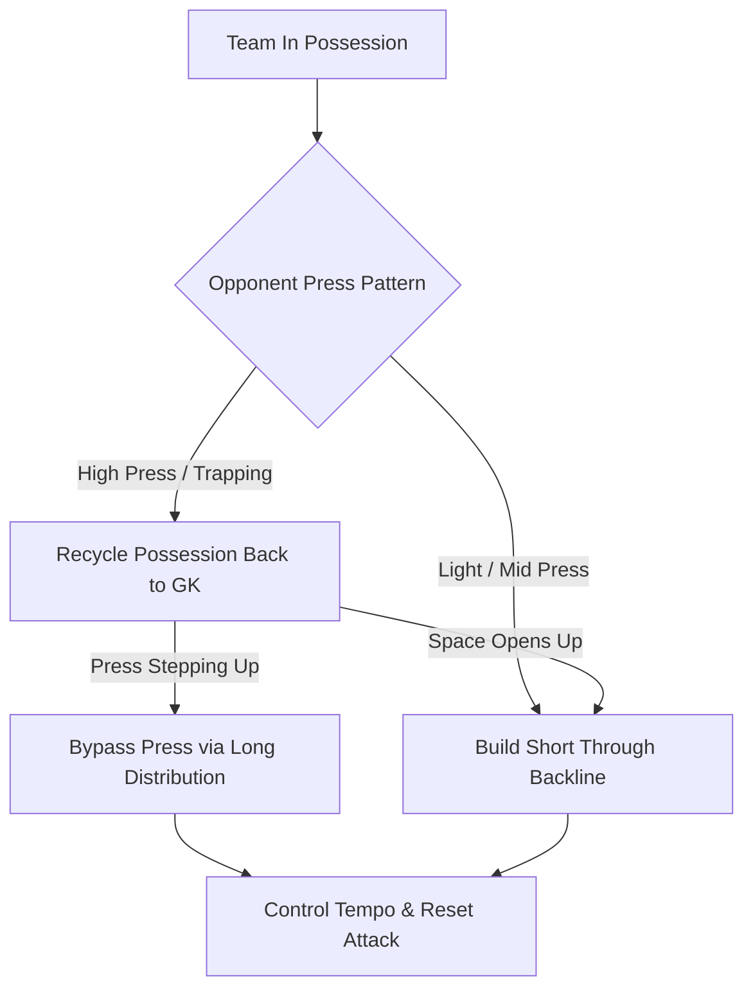

In accordance with **International Goalkeepers Conference (IGCC)** guidelines, goalkeepers are never treated as static shooting targets. They act as core playmakers running the game across every phase.

## Eliminate Dead-Ball Restarts

**Game-Realistic Restarts:** All team build-up drills initiate from the goalkeeper via sling throws, rollouts, series-driven passes, and restarts.

## Decision-Making Under Pressure

**Reading the Press:** Goalkeepers solve real-time tactical puzzles, deciding whether to play short through crisp passes or bypass a high press with pinpoint long distribution.

## Recycling Possession

**Controlling Match Tempo:** Outfield players learn to use the goalkeeper as a release valve to reset and recycle possession rather than forcing panicked passes into traffic.

## Build-Up Phase Decision Tree

