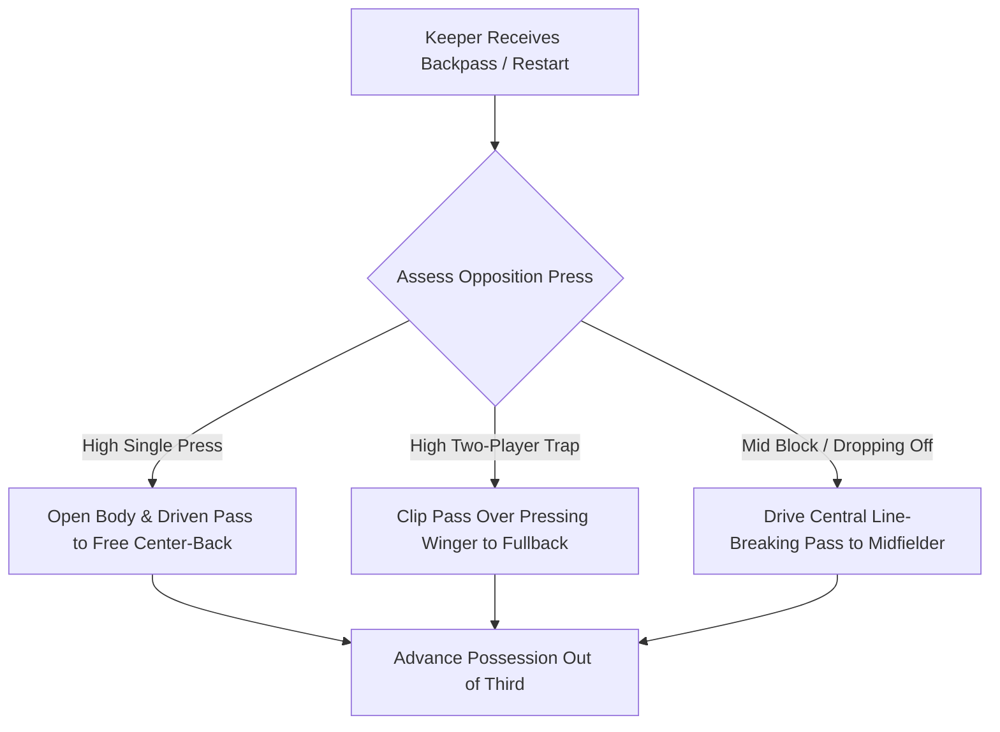

import { Card, CardGrid, Aside, Steps } from '@astrojs/starlight/components';

In accordance with **International Goalkeepers Conference (IGCC)** guidelines, goalkeepers in the 12–14 age bracket (U13–U15) are never treated as isolated shot-stoppers. 

As teams transition to full 11v11 play, the keeper functions as the **deepest central pivot**, dictating the tempo of build-up play, breaking high presses, and resetting possession under pressure.

<Aside type="note" title="11v11 Tactical Mandate">
Eliminate static dead-ball restarts in training. Every team build-up exercise must originate from the goalkeeper via short distributions, clipped passes, or backpass resets under active pressure.
</Aside>

---

## Core Pillars of Goalkeeper Build-Up (Ages 12–14)

<CardGrid>
  <Card title="1. Stepping Off the Goal Frame" icon="right-arrow">
    **"Clear the Net"**
    
    Never support a backpass directly on the goal line or in front of the net. Move 2–3 yards outside the goalpost angle so an missed touch results in a corner, not an own goal.
  </Card>

  <Card title="2. Open Body Orientation" icon="magnifier">
    **"See Both Touchlines"**
    
    Receive backpasses with an open hip profile facing the field. A half-turn posture allows the keeper to process the entire opponent press before making first contact.
  </Card>

  <Card title="3. Technical Variance" icon="setting">
    **"Drive vs. Clip"**
    
    Master two primary technical distributions under pressure: a **driven side-foot pass** to penetrate central lines, and a **lofted clip** over advancing wingers to fullbacks.
  </Card>

  <Card title="4. Press Trigger Recognition" icon="random">
    **"Read the First Defender"**
    
    If the opponent's forward curved-runs to cut off one side, immediately use a single-touch reset to switch play through the opposite center-back.
  </Card>
</CardGrid>

---

## Build-Up Phase Decision Tree

In match scenarios, the goalkeeper must process the opponent's defensive block within 1–2 seconds:

---

## Field Cues for Build-Up Action

Replace complex tactical jargon with clear, single-word field cues during team possession reps:

| Sports Science Concept | Grassroots Coaching Cue | Field Execution Target |
| :--- | :--- | :--- |
| Support Angle | **"Step Off the Post!"** | Create a passing angle clear of the goal frame. |
| Body Orientation | **"Open Up!"** | Open hips to see the press and weak-side teammates. |
| Pressing Bypass | **"Clip the Winger!"** | Loft the ball over pressing wide midfielders into open grass. |
| Possessional Recycling | **"RESET!"** | Demand the ball back from CBs to switch the direction of attack. |

---

## Physiological Reality: Distribution During Growth Spurts

<Aside type="caution" title="Managing Leverage & Kicking Distance">
* **Limb Length Changes:** Rapid growth spurts temporarily disrupt kicking mechanics and balance. Keepers may misjudge distance or hit flat passes during Peak Height Velocity (PHV).
* **Avoid Over-Striking:** Discourage maximum-distance long balls if technique breaks down. Prioritize crisp 15–25 yard ground passes and controlled clipped balls over raw distance.
</Aside>

---

## Integrated Field Drill: 6v5 Build-Up Under High Press

Execute this 20-minute functional block during team practice to integrate the goalkeeper directly into build-up patterns.

<Steps>
1. **Grid Setup & Roles:**
   Utilize the defensive half up to the midfield line. Position the Goalkeeper + 4 Defenders + 1 Central Midfielder (6 Players) vs. 5 High-Pressing Attackers.

2. **Phase 1: Backpass & Press Trigger (7 Mins):**
   Play begins with a pass from midfield back to the goalkeeper. Two pressing attackers immediately sprint to force a decision within 2 seconds.

3. **Phase 2: Target Scoring Options (8 Mins):**
   The goalkeeper and defenders score 1 point by successfully passing through two mini-goals placed at midfield, or 2 points by hitting the central midfielder on a line-breaking drive.

4. **Phase 3: High-Press Trap Reset (5 Mins):**
   If attackers lock down one side, the keeper must call **"RESET!"**, receive the ball off the post angle, and switch play to the opposite fullback in 2 touches or fewer.
</Steps>

<Aside type="tip" title="Coaching Tip">
Evaluate the goalkeeper on **decision speed, body shape before receiving, and voice clarity**, rather than whether every pass is executed flawlessly.
</Aside>