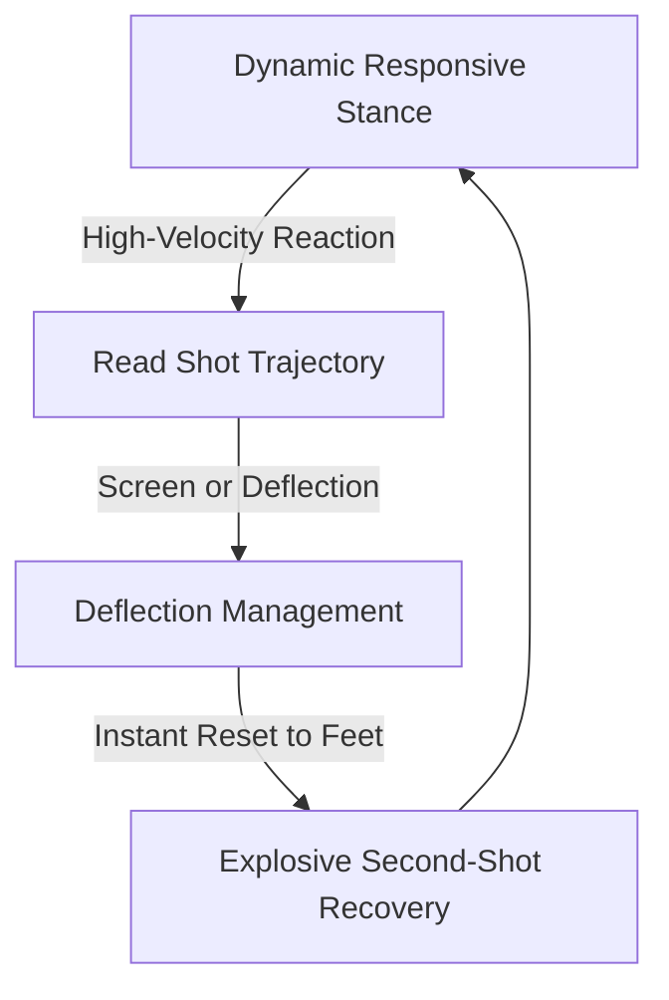

At this advanced model coaching aligns with guidelines set by the **International Goalkeepers Conference (IGCC)**, challenging goalkeepers with high-intensity, constraint-based sessions that push them past their comfort zone.

## International Standards (IGCC)

**International Goalkeepers Conference:** Recommends stepping back from constant direct instruction to implement high-intensity constraints that force players to make independent, split-second decisions.

## Match Chaos & Accountability

**Dynamic Field Sessions:** Replace sterile line drills with realistic match chaos, training keepers to operate calmly under pressure and take full ownership of their penalty area.

## Shot-Stopping & Recoveries

**Deflection & Reset Mechanics:** Combine elite reaction training with a responsive dynamic stance, mastering deflection management and extra second-shot recoveries.

## Advanced Reaction & Recovery Loop

