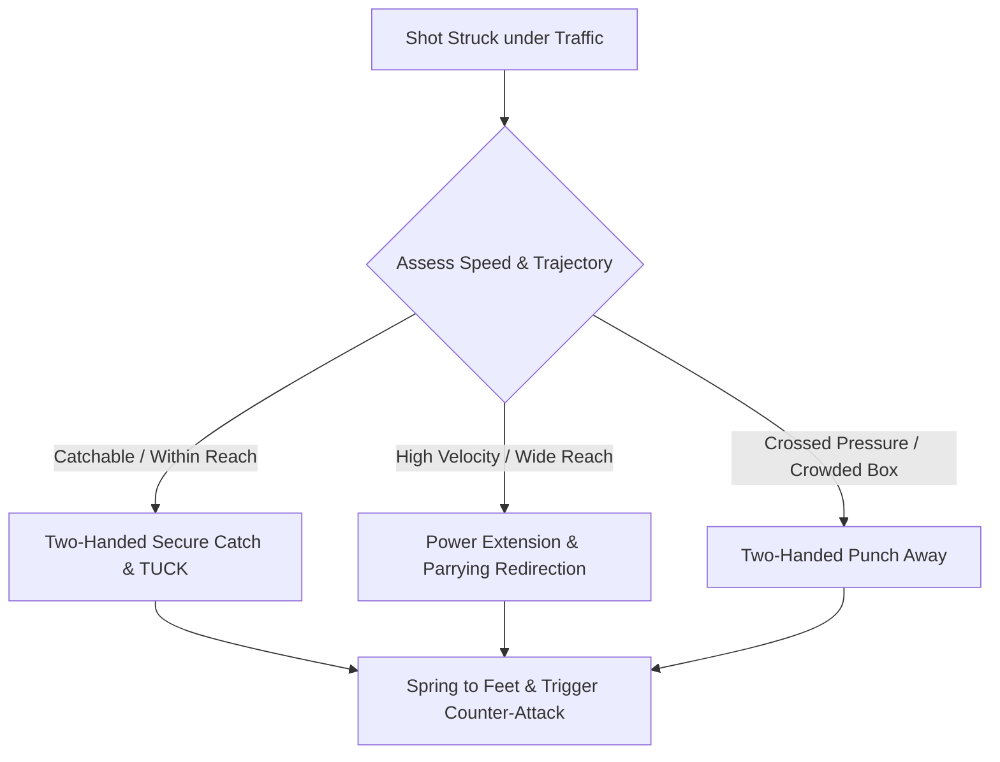

import { Card, CardGrid, Aside, Steps } from '@astrojs/starlight/components';

In the 12–14 age bracket (U13–U15), goalkeepers gain the physical strength needed for power diving, airborne parrying, and high-velocity shot-stopping. 

Because players are going through **Peak Height Velocity (PHV)**, coaches must emphasize biomechanically safe landing techniques to protect developing joints and growth plates.

<Aside type="caution" title="Landing Safety During Growth Spurts">
  During growth spurts, bone lengthening outpaces muscle-tendon flexibility. **Never allow keepers to land on an outstretched arm, elbow, or directly on the hip joint point.** Impact must be distributed sequentially across soft lateral tissue.
</Aside>

---

## Technical Pillars of Shot-Stopping (Ages 12–14)

<CardGrid>
  <Card title="1. Power Step & Drive" icon="right-arrow">
    **"Step & Spring"**
    
    Take an aggressive power step toward the ball's angle to cut distance, driving off the lead leg to launch the body into extension.
  </Card>

  <Card title="2. Safe Landing Kinetics" icon="shield">
    **"Roll the Side"**
    
    Dissipate ground impact along a continuous surface: outer calf → thigh → hip muscle → lateral torso. Keep elbows tucked in.
  </Card>

  <Card title="3. Parrying Directional Control" icon="forward">
    **"Steer to the Channel"**
    
    When shots are too fast to catch, open a firm palm to deflect the ball wide toward the corner flag or high over the crossbar. Never palm balls into the central 6-yard box.
  </Card>

  <Card title="4. Aerial Punching Mechanics" icon="star">
    **"Peak & Drive"**
    
    Meet high crosses at the apex of the jump. Drive two locked fists directly through the bottom half of the ball to clear past the penalty spot.
  </Card>
</CardGrid>

---

## Shot-Stopping Action-Decision Tree

In match play, goalkeepers process shot speed and line of sight within milliseconds to execute the correct save:

---

## Translating Mechanics into Field Cues

Replace complex biomechanical terms with direct, single-word field cues during coaching reps:

| Sports Science Concept | Grassroots Coaching Cue | Field Execution Target |
| :--- | :--- | :--- |
| Explosive Takeoff | **"POWER STEP!"** | Drive lead foot hard into the grass toward the shot path. |
| Kinetic Impact Dissipation | **"SLIDE THE SIDE!"** | Land sequentially on muscle mass, avoiding wrist or elbow collision. |
| Deflective Target Zone | **"WIDE OR OVER!"** | Direct parries to side touchlines or over the crossbar. |
| Second-Shot Recovery | **"SPRING & RESET!"** | Drive off the non-landing knee to regain feet immediately. |

---

## Safe Diving & Landing Progression

Train diving mechanics using a progressive floor-to-standing sequence during warm-ups to build safe landing habits.

<Steps>
1. **Seated / Kneeling Collapse Dives:**
   Start on knees. Roll laterally onto the calf, hip, and side torso to catch a low rolling ball. Focus on landing without elbow impact.

2. **Low Power-Step Dives:**
   Begin in a set position. Take a 45-degree forward power step to attack a driven ball low, absorbing ground force along the lateral body chain.

3. **Full Extension Flying Dives:**
   Service shots 2–3 yards wide. Focus on driving off the near foot, reaching with both hands leading, and parrying wide before rolling through the landing.

4. **Rebound Spring & Recovery:**
   Immediately following landing, push off the ground with top hand, drive the upper knee up, and recover to a balanced set stance within 1.5 seconds.
</Steps>

---

## Integrated Field Drill: Dynamic Shot-Stopping & Parrying Reset

Execute this 20-minute functional drill to build real-match shot-stopping and rebound control under traffic.

<Steps>
1. **Setup & Roles:**
   Position 4 Attackers vs. 3 Defenders outside the penalty box. Place two server stations 20 yards out in central and wide channels.

2. **Phase 1: Central Screened Shot (7 Mins):**
   Server 1 fires a driven shot through defender traffic. The keeper must read sightlines, set early, and either catch or parry wide into safe channels.

3. **Phase 2: Wide Angle Power Save (8 Mins):**
   Server 2 immediately receives a layoff and strikes a curling shot toward the far post, forcing an extension dive or parry over the bar.

4. **Phase 3: Rebound Defense & Command (5 Mins):**
   If a parry falls loose, attackers can score. The keeper must spring to their feet, issue an authoritative **"AWAY!"** or **"KEEPER'S!"** call, and make the secondary recovery save.
</Steps>

<Aside type="tip" title="Coaching Tip">
Evaluate the keeper on **landing safety, parrying direction, and recovery speed**, rather than just whether a high-velocity shot was stopped.
</Aside>