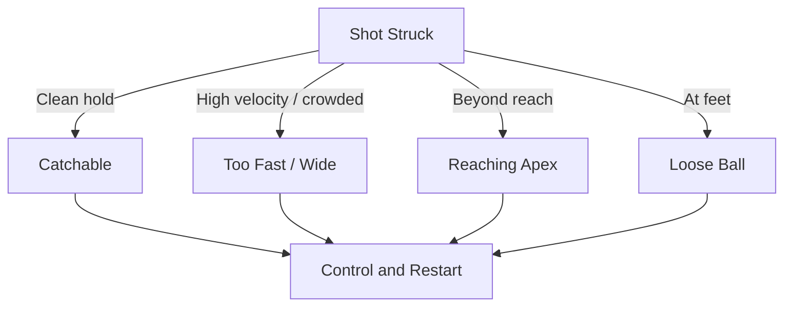

At 12–14 the keeper can finally train full flight. Physical maturity enables airborne saves, controlled parrying, and physical actions that were unsafe only a year ago.

## [Extension / Flying Dives](/reference-library/11-extension-dive/)

**Full Flight:** Drive off the near leg, extend fully to reach high and wide shots. Land sequentially on the outer leg, hip, then side of the torso, never on elbows or stomach.

## [Parrying to Safe Zones](/reference-library/13-parrying/)

**Redirect, Don't Fumble:** When a shot has too much pace to hold, palm it up and away from danger, high over the bar or wide, never back into the flow.

## Sliding Smother & Punching

**Contact Control:** [Forward smothers](/reference-library/18-forward-smother/) and clean [punching](/reference-library/15-punching/) to relieve aerial pressure become safe options with mature coordination.

## Power Save Decision

