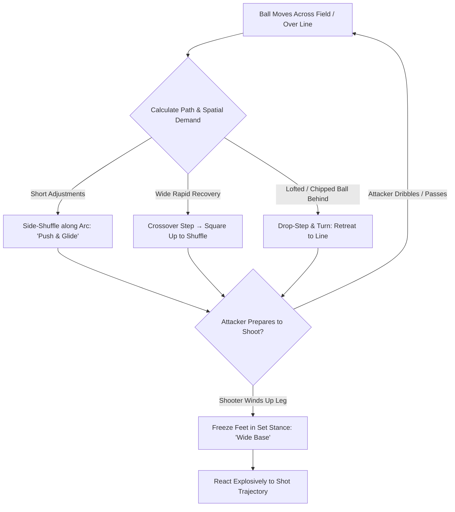

import { Card, CardGrid, Aside, Steps } from '@astrojs/starlight/components';

Transitioning to **full-sided 11v11 play** expands spatial demands, shooting angles, and distances. At ages 12 to 14 (U13–U15), positioning is no longer just about standing on the ball line, it requires managing depth behind a high backline and executing dynamic footwork to cover large spaces.

Arriving on the ball line and setting your stance *before* the strike turns high-velocity shots into controlled saves.

<Aside title="11v11 Tactical Focus" type="note">
Footwork positions the body; timing establishes balance. Teach 12–14 keepers to adjust positioning **while the ball travels** and **freeze in a set stance** the instant the attacker prepares to strike.
</Aside>

---

## The 4 Pillars of 11v11 Positioning

<CardGrid>
  <Card icon="compass" title="1. The Ball Line (Angle Bisecting)">
    **"Bisect the Angle"**
    
    Visualize an imaginary rope running from the center of the goal line directly to the ball. Always bisect this angle to equalize coverage on both goalposts.
  </Card>

  <Card icon="up-arrow" title="2. Sweeper Depth & Tethering">
    **"Tether to the Line"**
    
    When your back four pushes to midfield, step up toward the penalty spot or edge of the 18-yard box. Adjust depth dynamically as the defensive line drops or steps.
  </Card>

  <Card icon="right-arrow" title="3. Drop-Step Retreat Mechanics">
    **"Drop & Turn"**
    
    When facing lofted passes or chipped shots over a high line, open your hips 45° and execute explosive drop-steps to retreat toward the goal line without tripping.
  </Card>

  <Card icon="approve-check" title="4. Set Stance Wind-Up Freeze">
    **"Freeze on the Strike"**
    
    Stop all foot movement the moment the shooter raises their kicking leg. A static, balanced goalkeeper reacts instantly, whereas a keeper caught mid-stride is helpless.
  </Card>
</CardGrid>

---

## 11v11 Footwork Mechanics Breakdown

Choose the correct footwork pattern based on distance, ball speed, and tactical context:

### 1. The Side-Shuffle (Short Adjustments: 1 to 4 Yards)
* **When to Use:** Micro-adjusting along the shooting arc inside the penalty box.
* **Key Mechanics:** Stay low with flexed knees. Push off the trailing foot and glide with the lead foot. **Never cross feet or touch heels.** Keep shoulders square to the ball.

### 2. The Crossover Step (Rapid Lateral Distance: 5+ Yards)
* **When to Use:** Switching play cross-field or recovering across the goal face.
* **Key Mechanics:** Turn hips laterally and cross the back leg over the front leg for 1 to 2 explosive strides. Decelerate into a side-shuffle to square up before setting.

### 3. The Drop-Step & Crossover (Retreating for Chipped Shots)
* **When to Use:** Ball lofted over a high defensive line or catching a keeper off their line.
* **Key Mechanics:** Drop the post-side foot back, open hips 45°, and cross over while tracking the ball over your shoulder. Square hips to the ball as you reach the goal line.

### 4. The PHV Adjusted Set Stance (Shot Readiness)
* **When to Use:** Executed immediately as the shooter prepares to strike.
* **Key Mechanics:** Feet slightly wider than shoulder-width (compensating for growth spurt shifts in center of gravity), knees flexed, weight loaded on the balls of the feet, and hands relaxed at waist height.

---

## Pre-Shot Footwork & Positioning Sequence

Goalkeepers process ball movement and adjust depth through a continuous footwork loop:

---

## Field Landmark Positioning Guide

Use field markings to calibrate depth and angle without turning your head away from play:

| Ball Location | Recommended Keeper Position | Target Footwork & Stance |
| :--- | :--- | :--- |
| **Possession in Opponent Half** | Top of 18-yard box / Edge of penalty arc | Comfortable standing posture; ready to sweep through-balls. |
| **Central Outside 18-Yard Box** | 3 to 5 yards off goal line | Light side-shuffle; high set stance ready for powered or lofted shots. |
| **Inside Penalty Box (Central)** | 1 to 3 yards off goal line | Micro-shuffles; low wide-base set stance to maximize reaction time. |
| **Wide Channel / Flank Attack** | 1 to 2 yards off near post angle | Angle body 45° to ball; protect near post while holding far post in sight. |
| **Chipped Ball / Counter Attack** | Drop-step retreat toward goal line | Explosive **Drop-Step** → turn hips → square up into **Set Stance**. |

---

## Technical Coaching Warnings

<Aside title="Managing Growth Spurts & Footwork Errors" type="caution">
* **Center of Gravity Shifts:** During Peak Height Velocity (PHV), sudden leg growth alters balance. If a keeper stumbles during shuffles, widen their set-stance base slightly to restore stability.
* **Hopping or Bouncing:** Jumping while shuffling leaves the keeper airborne at the moment of strike, delaying reaction. Keep feet gliding close to the grass.
* **Retreating Backwards:** Never allow keepers to run straight backward facing the goal. Always insist on a **45° Drop-Step** to maintain visual contact with the ball while moving at maximum speed.
</Aside>

---

## Field-Ready Session: 11v11 Sweeper Depth & Set Timing

Execute this 20-minute functional block during team practice to embed 11v11 positioning habits.

<Steps>
1. **Setup & Spatial Constraints:**
   Set up a 60 × 40 yard grid utilizing the main goal expanding to midfield. Position 6 Attackers vs. 5 Defenders + Goalkeeper.

2. **Phase 1: High-Line Sweeper Depth (7 Mins):**
   Attackers move the ball across midfield. The keeper must adjust depth between the penalty spot and the top of the 18-yard box as the defensive line moves, practicing the **"Tether"** concept.

3. **Phase 2: Through-Ball vs. Long Strike (8 Mins):**
   Attackers can either play a through-ball into space or strike from distance. The keeper must read the trigger: sprint out to sweep loose balls, or drop-step and set if an attacker winds up for a shot.

4. **Phase 3: Chipped Restarts & Rebound Recovery (5 Mins):**
   Server 1 fires unpredictable lofted balls over the backline from midfield. The keeper executes a **Drop-Step Retreat**, recovers to the goal line, sets, and secures or parries the shot.
</Steps>

<Aside title="Coaching Tip" type="tip">
Evaluate the goalkeeper on **depth judgment, set-position timing, and drop-step mechanics**, rather than focusing purely on save outcomes.
</Aside>