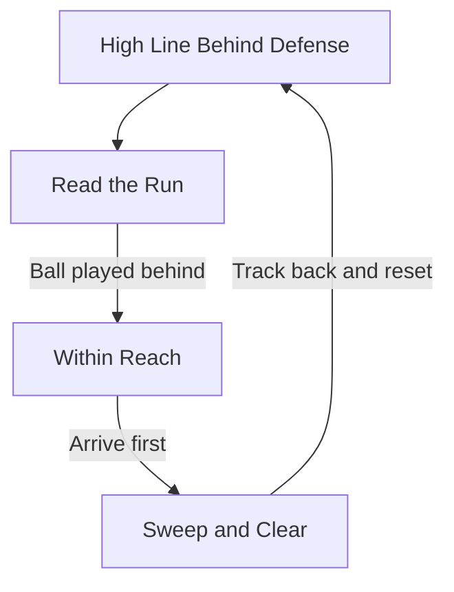

The modern 12–14 keeper is a field organizer who reads danger early, supports the high line, and sweeps confidently behind it.

## [Sweeper-Keeper Depth](/reference-library/20-sweeping/)

**Position Behind the Line:** Step up to act as an extra defender, sweeping through-balls and long balls away before attackers take control behind a high defensive line.

## Directing the Block

**Command the Shape:** Coordinate the 11v11 defensive block, organizing wall placement, marking stacks, and communicating the line as the field general of the backline.

## Command Early & Loud

**Predict & Direct:** Issue commands before the outcome, not after. Read the threat early and organize teammates' reaction before the decision is made.

## Sweeper-Keeper Flow

