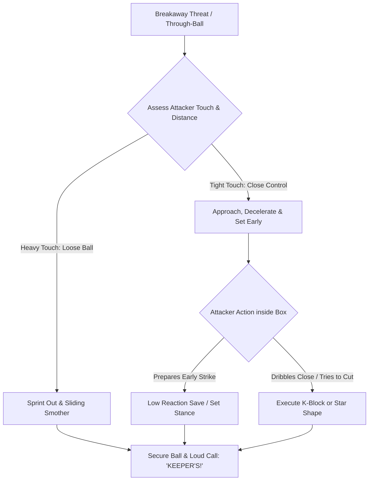

import { Card, CardGrid, Aside, Steps } from '@astrojs/starlight/components';

In full-sided 11v11 play, 1v1 breakaway threats frequently originate from deep through-balls penetrating a high defensive line. At ages 12 to 14 (U13–U15), goalkeepers must balance aggressive spatial sweeping with patient 1v1 angle management. 

Teaching players to **read the attacker's touch length** determines whether to sprint out to clear or decelerate into a defensive block shape.

<Aside title="11v11 Tactical Focus" type="note">
Patience is an active tactic. Remaining on your feet while closing space forces the attacker to make the first move, giving the goalkeeper full control over the shooting angle.
</Aside>

---

## The 4 Pillars of 11v11 Breakaway Execution

<CardGrid>
  <Card icon="magnifier" title="1. Touch-Reading Decisions">
    **"Sprint or Stand"**
    
    If an attacker's touch rolls heavy into open grass, sprint out to sweep or smother the ball. If the touch remains tight, decelerate and shorten your steps to prepare for a strike.
  </Card>

  <Card icon="right-arrow" title="2. The Staggered Approach">
    **"Match & Set"**
    
    Close distance rapidly while the attacker's head is down looking at the ball. The instant their head comes up to shoot, freeze in a balanced, wide set stance.
  </Card>

  <Card icon="shield" title="3. K-Block vs. Star Shape">
    **"Make the Wall"**
    
    Execute a **K-Block** (dropping one knee to the heel) for low ground shots and nutmeg prevention. Deploy a **Star Shape** (arms and legs spread wide) for close-range power strikes.
  </Card>

  <Card icon="warning" title="4. Collision & Body Safety">
    **"Hands & Shoulders First"**
    
    Protect against high-speed collisions by leading with hands and shoulders during sliding smothers. Tuck the chin toward the collarbone and keep the core braced.
  </Card>
</CardGrid>

---

## 1v1 Decision & Action Sequence

Goalkeepers process breakaway scenarios across large 11v11 spaces through a continuous evaluation loop:

---

## Field-Ready Coaching Cues

Translate complex tactical reading into direct verbal triggers on the pitch:

| Technical Concept | Field Coaching Cue | Action Required |
| :--- | :--- | :--- |
| Reading Space | **"HEAVY TOUCH!"** | Explode off the line to win or clear the loose ball. |
| Closing Speed | **"MATCH & SET!"** | Run fast when the attacker looks down; freeze when they look up. |
| Block Execution | **"STAR SHAPE!"** | Expand arms and legs wide while keeping chest upright. |
| Defender Coordination | **"FORCE OUTSIDE!"** | Issue clear commands to trailing recovery defenders. |
| Rebound Recovery | **"SPRING & RESET!"** | Drive off the ground immediately if the shot is parried. |

---

## Safety & Collision Protocols (U13–U15)

<Aside title="Managing High-Velocity Collisions during PHV" type="caution">
* **Increased Momentum:** At U13–U15, players run faster and carry significantly more mass. Never allow keepers to dive blindly headfirst into an oncoming attacker's boots.
* **Sliding Smother Technique:** Slide on the lateral side of the thigh and hip, extending hands past the ball to secure it while using arms as a protective shield for the head.
* **Communication Overrides:** A loud, authoritative **"KEEPER'S!"** call alerts both the attacker and recovery defender, reducing high-speed collision risks.
</Aside>

---

## Field-Ready Session: 11v11 Breakaway & Sweeper Phase (20 Mins)

Integrate this functional phase-of-play block to simulate realistic breakaway pressure behind a defensive line.

<Steps>
1. **Setup & Spatial Grid:**
   Set up a 60 × 40 yard grid utilizing the main penalty box expanding to midfield. Position 6 Attackers vs. 5 Defenders + Goalkeeper.

2. **Phase 1: Midfield Through-Ball Read (7 Mins):**
   An attacking midfielder plays a weighted through-ball behind the defensive line. The keeper reads the touch length: sprint out to sweep past the box, or drop to the 18-yard line and set.

3. **Phase 2: Trailing Defender 1v1 Duel (8 Mins):**
   An attacker receives a pass in stride with a recovery defender chasing on their back shoulder. The keeper approaches, decelerates, and calls **"FORCE LEFT/RIGHT"** to coordinate with the defender before executing a block save.

4. **Phase 3: Smother to Counter Distribution (5 Mins):**
   Upon winning a loose ball or executing a smothering save, the keeper must instantly pop up and launch a counter-attack via a driven side-foot pass or overhand throw to wide midfielders.
</Steps>

<Aside title="Coaching Tip" type="tip">
Reward goalkeepers for recognizing the correct moment to decelerate and set, even if the attacker scores with a world-class finish. Prioritize decision-making quality over raw outcome.
</Aside>