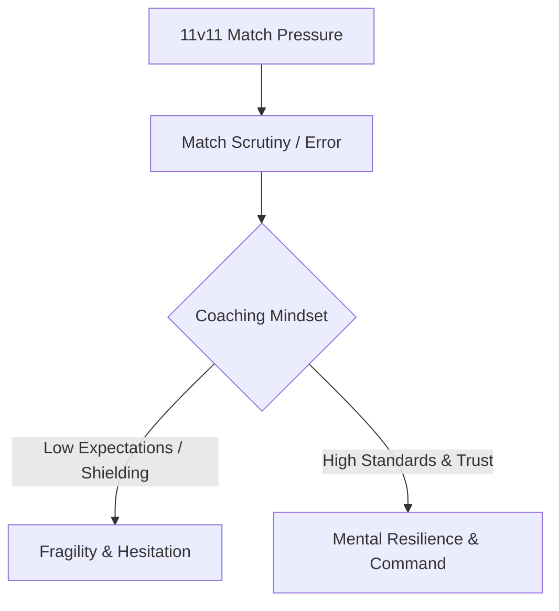

In 11v11 soccer, full-time specialization places a unique spotlight on the goalkeeper. When a goalkeeper makes an error, it often leads straight to a goal.

## Forging Mental Armor

**Scrutiny in 11v11:** Coaches must not shield players from pressure, but teach them how to handle scrutiny and remain steady after errors.

## Raising Expectations

**High Standards Drive Growth:** Youth athletes rise to the standards set for them. Treat them as elite problem solvers, demand sharp communication, and give their capabilities room to expand.

## Resilience & Mindset Loop

