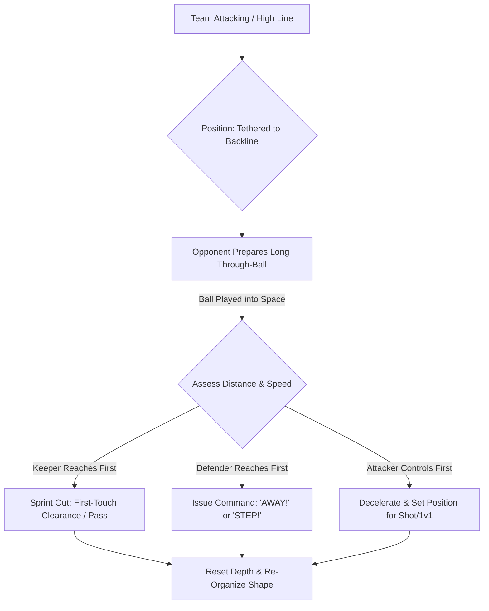

import { Card, CardGrid, Aside, Steps } from '@astrojs/starlight/components';

In full-sided 11v11 play, the goalkeeper functions as a sweeping defender and the field general of the defensive unit. At ages 12 to 14 (U13–U15), goalkeepers must manage the large space behind a high defensive line, eliminating counter-attacking through-balls and actively directing backline positioning.

Reading danger early turning high-risk opponent attacks into routine clearances or resets.

<Aside title="11v11 Tactical Mandate" type="note">
A sweeper-keeper does not wait for danger to reach the box. By positioning high and issuing commands while the ball is traveling, the keeper eliminates threats before a shot can occur.
</Aside>

---

## The 4 Pillars of Sweeper-Keeper Command

<CardGrid>
  <Card icon="right-arrow" title="1. Spatial Tethering">
    **"Tether to the Line"**
    
    Maintain a constant distance (15–20 yards) behind your central defenders. As the backline steps toward midfield, the keeper must step to the penalty spot or edge of the 18-yard box.
  </Card>

  <Card icon="magnifier" title="2. Reading the Trigger Foot">
    **"Watch the Wind-Up"**
    
    Track the opponent midfielder's body shape. When their hips square up and the leg winds up for a deep through-ball, take 2 explosive steps backward to prepare to sprint out or retreat.
  </Card>

  <Card icon="comment" title="3. Pre-Emptive Field Voice">
    **"Call Before the Pass"**
    
    Issue single-word instructions while the ball is traveling. Instruct defenders to **"STEP!"**, **"DROP!"**, or **"HOLD!"** before the opponent makes their next play.
  </Card>

  <Card icon="star" title="4. Clearance Decision-Making">
    **"Clear or Keep"**
    
    If under direct pressure outside the box, execute an immediate single-touch clearance high and wide into touchlines. Only control and pass if no attacker is closing down.
  </Card>
</CardGrid>

---

## Sweeper-Keeper Action & Decision Sequence

Goalkeepers manage space behind the backline through a continuous scanning and depth-adjustment loop:

---

## Non-Negotiable Backline Directives

Replace passive suggestions with clear, single-word field cues that dictate backline behavior:

| Field Command | Tactical Trigger | Required Team Action |
| :--- | :--- | :--- |
| **"STEP!"** | Opponent passes backward or loses control | Entire backline pushes upfield rapidly to compress space. |
| **"DROP!"** | Opponent midfielder has open time & space on ball | Backline retreats to cover space behind against through-balls. |
| **"SHIFT LEFT/RIGHT"**| Ball moves to wide flank channel | Defensive unit slides laterally to maintain compact central spacing. |
| **"KEEPER'S!"** | Ball enters box / Space keeper can claim | Defenders clear a path and allow the keeper absolute authority. |
| **"AWAY!"** | Keeper caught out / High danger in traffic | Nearest defender clears the ball instantly out of danger. |

---

## Physiological Reality: Deceleration During Growth Spurts

<Aside title="Managing Deceleration & Body Control during PHV" type="caution">
* **Sprinting Momentum:** At U13–U15, rapid growth in leg length increases top-end sprint speed but temporarily impairs deceleration balance.
* **Avoiding Red Cards:** Keepers sprinting out of the penalty box must decelerate 2–3 yards before reaching the ball if an attacker is close, avoiding reckless fouls or handballs outside the box.
* **Surface Safety:** Train sprinting clearances on clean turf to prevent knee or ankle twisting during sudden direction changes.
</Aside>

---

## Field-Ready Session: High-Line Sweeper & Backline Phase (20 Mins)

Execute this 20-minute phase-of-play block to integrate the goalkeeper with the back four against active counter-attacks.

<Steps>
1. **Setup & Spatial Grid:**
   Utilize a 60 × 40 yard area expanding from the main goal to midfield. Position 6 Attackers vs. 5 Defenders + Goalkeeper.

2. **Phase 1: High Line & Through-Ball Sweeping (7 Mins):**
   Attackers move possession around midfield and look to play weighted through-balls. The goalkeeper must start at an advanced depth (top of the 18-yard box) and sweep loose balls into touchlines or back to safety.

3. **Phase 2: Vocal Backline Organization (8 Mins):**
   When attackers play wide or recycle backward, the keeper must issue loud, pre-emptive commands (**"STEP!"**, **"SHIFT!"**, **"DROP!"**). Reward points when defenders successfully execute the call.

4. **Phase 3: Transition & Build-Up Reset (5 Mins):**
   When the keeper sweeps or claims a loose ball, defenders immediately open wide. The keeper acts as the deep pivot, playing a driven ground pass to mid-field targets to restart the attack.
</Steps>

<Aside title="Coaching Tip" type="tip">
Focus feedback on **decision timing, depth adjustment speed, and vocal clarity**, rather than whether every clearance is technically flawless.
</Aside>