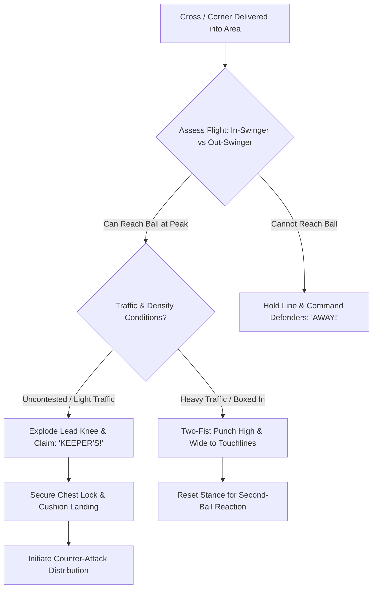

import { Card, CardGrid, Aside, Steps } from '@astrojs/starlight/components';

Transitioning to **full-sided 11v11 play** exposes goalkeepers to higher ball speeds, whipped wide crosses, and congested penalty areas during corner kicks. At ages 12 to 14 (U13–U15), goalkeepers must combine precise trajectory reading with explosive jumping and authoritative communication.

Dominating the box turns dangerous aerial service into controlled catches or clears.

<Aside title="11v11 Tactical Focus" type="note">
Aerial command requires early decision-making. Teach 12–14 keepers to judge the crosser's body angle while the ball is being struck, calling **"KEEPER'S!"** or **"AWAY!"** before the ball reaches its flight apex.
</Aside>

---

## The 4 Pillars of 11v11 Aerial Dominance

<CardGrid>
  <Card icon="up-arrow" title="1. Knee-Drive Take-Off">
    **"Explode the Lead Knee!"**
    
    Plant the launch foot and drive the non-launch knee up to 90 degrees. This maximizes vertical reach while providing a essential physical shield against oncoming attackers.
  </Card>

  <Card icon="star" title="2. High-Point Catching">
    **"Catch at the Peak!"**
    
    Extend arms fully to secure the ball at the highest reachable point before body descent begins. Never wait for the ball to drop into the body.
  </Card>

  <Card icon="random" title="3. Claim vs. Punch Decision">
    **"Clear the Box!"**
    
    Claim cleanly when unimpeded at your peak; deploy a two-fist punch high and wide toward the sidelines when boxed in by dense defender and attacker traffic.
  </Card>

  <Card icon="shield" title="4. Soft Cushion Landing">
    **"Flex & Lock!"**
    
    Absorb ground force by landing on both feet with flexed knees, tucking the ball tightly into the chest lock immediately upon landing to withstand contact.
  </Card>
</CardGrid>

---

## Aerial Decision & Action Sequence

Goalkeepers process incoming crosses across full 11v11 penalty areas through a continuous evaluation loop:

---

## Field-Ready Coaching Cues

Replace theoretical concepts with direct, single-word field triggers:

| Technical Concept | Field Coaching Cue | Action Required |
| :--- | :--- | :--- |
| Reading Trajectory | **"WATCH THE BEND!"** | Identify in-swinging (curling toward goal) vs. out-swinging flight. |
| Take-Off Drive | **"EXPLODE THE KNEE!"** | Lift lead knee aggressively to waist height for elevation and shielding. |
| Catch Timing | **"PEAK CATCH!"** | Reach hands above head height before starting downward descent. |
| Punch Execution | **"HIGH & WIDE!"** | Drive both fists through the lower half of the ball toward touchlines. |
| Vocal Command | **"KEEPER'S!" / "AWAY!"** | Issue authoritative call while the ball is traveling through the air. |

---

## Physiological & Safety Reality: Ages 12–14

<Aside title="Managing PHV Joint Impact & Aerial Collisions" type="caution">
* **Landing Force Absorption:** During Peak Height Velocity (PHV), bone lengthening outpaces muscle flexibility. Emphasize landing softly on both feet with flexed knees to prevent knee and growth-plate stress.
* **Two-Handed Punching Mandate:** Never permit single-arm punching in traffic. Joining both fists creates a wider surface area and protects shoulder joints during mid-air collisions.
* **Mid-Air Posture:** Keep eyes, chest, and hands facing outward toward the ball path. Never turn your back to oncoming attackers while airborne.
</Aside>

---

## Field-Ready Session: 11v11 Cross Defense & Aerial Command (20 Mins)

Execute this 20-minute functional phase-of-play block to integrate aerial claiming into full-sided team defensive patterns.

<Steps>
1. **Setup & Spatial Grid:**
   Set up a 60 × 40 yard area utilizing the main penalty box expanding to midfield. Position 6 Attackers vs. 5 Defenders + Goalkeeper.

2. **Phase 1: Open-Play Wide Crosses (7 Mins):**
   Wingers deliver varied crosses (in-swingers and out-swingers) from wide channels. The keeper reads ball trajectory, adjusts depth off the line, and decides to claim (**"KEEPER'S!"**) or command defenders (**"AWAY!"**).

3. **Phase 2: Corner Kick Traffic Defense (8 Mins):**
   Attackers set up a crowded box during corner kicks. The keeper starts 1–2 yards off the goal line, moves through traffic, and executes a two-handed punch high and wide into touchline channels.

4. **Phase 3: Aerial Claim to Counter Distribution (5 Mins):**
   Upon catching an airborne cross, the keeper instantly moves to the edge of the 18-yard box and launches a counter-attack via a driven side-arm throw or side-volley punt to wide midfielders.
</Steps>

<Aside title="Coaching Tip" type="tip">
When a keeper misjudges an airborne cross, evaluate their **vocal timing and take-off mechanics** rather than focusing solely on the mistake. Reassure decision-making confidence.
</Aside>