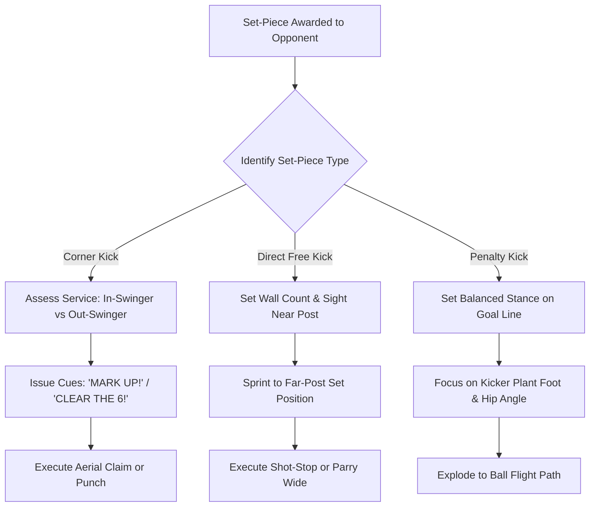

import { Card, CardGrid, Aside, Steps } from '@astrojs/starlight/components';

Set pieces represent over 30% of all goals scored in 11v11 youth soccer. At ages 12 to 14 (U13–U15), goalkeepers must transition from reactive shot-stopping to **proactive set-piece architecture**. Managing a crowded 18-yard box, building walls on full-sized goals, and commanding high airborne service requires structured protocols and fearless vocal leadership.

Organizing set-piece alignment early converts high-threat opposition restarts into controlled claims or counter-attacks.

<Aside title="11v11 Set-Piece Mandate" type="note">
A goalkeeper who commands set pieces eliminates opposition scoring chances before the kick is even taken. Organization must be complete 5 seconds before the referee blows the whistle.
</Aside>

---

## The 4 Pillars of Set-Piece Command

<CardGrid>
  <Card icon="compass" title="1. Corner Kick Positioning">
    **"Read the Curve"**
    
    Position 1–2 yards off the line for in-swingers (curling toward goal) to react to tight service; step 3–4 yards out for out-swingers (bending away) to attack service at the penalty spot.
  </Card>

  <Card icon="shield" title="2. Dynamic Wall Architecture">
    **"Sight the Near Post"**
    
    Set 2 to 5 player walls based on shot distance and angle. Always line up the outside wall player's outer hip with the near post and ball.
  </Card>

  <Card icon="eye" title="3. Penalty Kick Stance & Read">
    **"Hold & React"**
    
    Maintain a balanced set stance on the goal line. Watch the kicker's plant foot and hip angle during the final approach stride rather than guessing early.
  </Card>

  <Card icon="microphone" title="4. Zonal & Man-Marking Directives">
    **"Assign the Space"**
    
    Direct defenders to cover critical zones (near post, 6-yard line) and assign late opposition runners before the ball is played into the box.
  </Card>
</CardGrid>

---

## Set-Piece Tactical Decision Loop

Goalkeepers process set-piece situations through a structured assessment sequence:

---

## Standardized Set-Piece Field Cues

Replace wordy explanations with short, single-word directives that defenders immediately process:

| Match Phase | Field Cue | Action Required |
| :--- | :--- | :--- |
| **Unmarked Opponent** | **"MARK UP!"** | Instructs defenders to pick up loose attackers entering the box. |
| **Near-Post Protection** | **"POST COVER!"** | Directs a defender to seal the near-post area on tight corners. |
| **Clearing the 6-Yard Box** | **"CLEAR THE 6!"** | Pushes central defenders up to the 6-yard line to create room for the keeper. |
| **Free Kick Wall Setup** | **"WALL OF [X]!"** | Announces wall count immediately upon the referee's whistle. |
| **Wall Position Adjustment** | **"ONE STEP LEFT/RIGHT!"**| Aligns the wall from the near-post line of sight. |
| **Airborne Ball Claim** | **"KEEPER'S!"** | Asserts absolute ownership of the ball in flight; defenders clear a path. |
| **Defensive Clearance** | **"AWAY!"** | Orders defenders to head or kick contested loose balls out of danger. |

---

## Technical Execution Workflows

<Steps>
1. **Corner Kick Set-Up Protocol:**
   * **Identify Delivery Footedness:** Determine if a right-footed or left-footed player is taking the kick to predict in-swing vs. out-swing trajectory.
   * **Adjust Body Angle:** Stand at an open 45-degree angle facing the field so both the kicker and the entire penalty area remain in vision.
   * **Post Guarding:** Place a defender on the near post only if facing heavy in-swinging traffic or tight weather conditions.

2. **Direct Free Kick Wall Setup:**
   * **Central (18–20 Yards):** Deploy a **5-player wall** to block central low-corner strikes.
   * **Central / Half-Space (20–25 Yards):** Deploy a **4-player wall**.
   * **Wide / Angle Kicks:** Deploy a **2 to 3-player wall** to protect the near post while leaving vision open for crosses.
   * **Alignment Step:** Stand on the near post, line up the outer edge of the wall with the ball, shout adjustments, then sprint 2–3 steps toward the far post into a balanced set stance.

3. **Penalty Kick Mechanics:**
   * **Initial Setup:** Stand tall on the goal line with weight balanced on the balls of the feet.
   * **Approach Reading:** Watch the kicker's plant foot. A plant foot pointing straight indicates a central or near-side shot; an angled plant foot indicates a cross-body strike.
   * **Execution Rule:** Hold set position until the kicker makes final contact. Do not collapse early.
</Steps>

---

## Physiological & Safety Realities: Ages 12–14

<Aside title="Handling PHV Contact & Congested Box Safety" type="caution">
* **Mid-Air Contact Safety:** Growth spurts during Peak Height Velocity (PHV) temporarily affect balance in mid-air collisions. Keepers must drive the lead knee up to 90 degrees on all aerial claims to shield the chest and core.
* **Two-Handed Punching Mandate:** In congested corner kick scenarios, never attempt single-arm punches. Use a joined two-fist punch to protect shoulder joints during physical contact.
* **Landing Force Absorption:** Ensure keepers land on both feet with flexed knees to absorb ground impact and protect developing growth plates.
</Aside>

---

## Field-Ready Session: 11v11 Set-Piece Defense & Transition (20 Mins)

Integrate goalkeeper set-piece command into a full-sided functional phase-of-play session.

<Steps>
1. **Setup & Spatial Grid:**
   Set up in a 60 × 40 yard area utilizing the full 18-yard box and a main goal. Position 7 Attackers vs. 6 Defenders + Goalkeeper.

2. **Phase 1: Corner Kick Defense & Box Command (8 Mins):**
   The opposition delivers alternating in-swinging and out-swinging corner kicks. The keeper must organize defender marking (**"MARK UP!"**, **"CLEAR THE 6!"**), read ball trajectory, and execute a claim (**"KEEPER'S!"**) or punch.

3. **Phase 2: Direct Free Kick Wall Organization (7 Mins):**
   Place free kick restarts at varied locations 18–24 yards from goal. The keeper has 5 seconds to shout the wall count, align the wall from the near post, sprint to the far-post set position, and save or parry incoming strikes.

4. **Phase 3: Set-Piece Transition to Counter-Attack (5 Mins):**
   Upon catching a corner or free kick, the keeper immediately sprints to the edge of the 18-yard box and launches a fast counter-attack via an overhand throw or side-volley punt to wide targets.
</Steps>

<Aside title="Coaching Tip" type="tip">
Evaluate set-piece organization by **vocal speed and positioning timing** before the kick is taken. A well-organized defense prevents scoring chances before the ball moves.
</Aside>