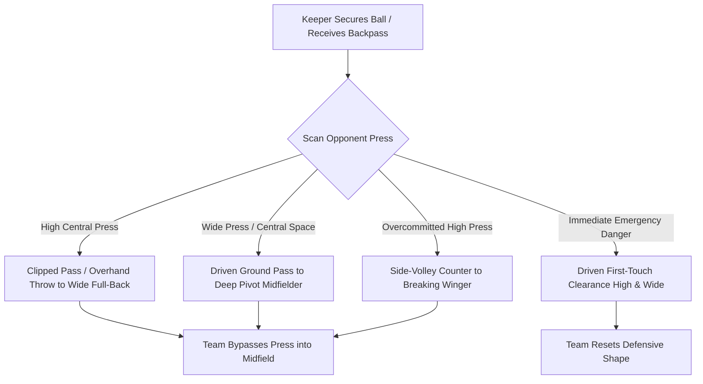

import { Card, CardGrid, Aside, Steps } from '@astrojs/starlight/components';

When a goalkeeper secures the ball or receives a backpass in **11v11 play**, defense instantly transitions into attack. At ages 12 to 14 (U13–U15), the goalkeeper operates as the **11th outfield player** and deep build-up pivot. 

Mastering driven ground passes, clipped balls over pressing lines, and low side-volleys allows the team to bypass high opponent presses and initiate lethal counter-attacks.

<Aside title="11v11 Tactical Mandate" type="note">
Distribution quality depends on scanning before receiving. Teach 12–14 keepers to **check their shoulders twice** before the ball arrives so they register open passing lanes before making first contact.
</Aside>

---

## The 4 Advanced Distribution Tools

<CardGrid>
  <Card icon="rocket" title="1. Side-Volley 'Sidewinder'">
    **"Side-Whip & Launch"**
    
    Drop the ball laterally and strike it on a horizontal plane. Generates a low-trajectory, fast-moving ball that skips over midfielder heads directly to wide wingers.
  </Card>

  <Card icon="right-arrow" title="2. Driven Diagonal Ground Ping">
    **"Punch Through the Line"**
    
    Strike the center of the ball with a locked ankle and firm follow-through. Breaks the opponent's first pressing line to hit central pivot midfielders in stride.
  </Card>

  <Card icon="approve-check" title="3. Clipped Lofted Pass">
    **"Chip the Press"**
    
    Get under the ball with a short, snappy follow-through. Loft the ball over aggressive pressing forwards to uncompressed, wide full-backs.
  </Card>

  <Card icon="star" title="4. Overhand Side-Arm Throw">
    **"Step & Drive"**
    
    Step with the non-throwing foot, bring the arm back in a wide arc, and release at shoulder height for rapid mid-range distribution to restart tempo.
  </Card>
</CardGrid>

---

## Decision-Making Flowchart

Goalkeepers process distribution options by scanning opponent pressing traps and open teammates:

---

## Field-Ready Coaching Cues

Translate complex distribution biomechanics into direct, single-word field triggers:

| Technical Concept | Field Coaching Cue | Action Required |
| :--- | :--- | :--- |
| Pre-Orientation | **"CHECK SHOULDER!"** | Scan twice over shoulders before receiving backpasses. |
| Body Shape | **"OPEN BACK FOOT!"** | Position body at an angle to see the entire field on first touch. |
| Side-Volley | **"SIDE-WHIP!"** | Strike ball horizontally out of hand for flat, fast flight. |
| Driven Pass | **"DRIVE THROUGH!"** | Lock ankle firm and follow through low toward the target. |
| Pressure Escape | **"SAFETY FIRST!"** | Under immediate physical pressure, clear high and wide into touchlines. |

---

## Tactical & Physiological Realities: Ages 12–14

<Aside title="PHV Leg Levers & Backpass Safety Angles" type="caution">
* **Peak Height Velocity (PHV) Adjustments:** Rapid leg growth at U13–U15 temporarily alters kicking plant-foot distance. Encourage keepers to re-establish a comfortable plant foot 6–8 inches beside the ball to avoid scuffing.
* **Backpass Safety Position:** On backpasses, the keeper must stand offset from the goal line (outside the goalposts). If a miskick occurs under pressure, the ball rolls out for a corner rather than into the net.
* **Backpass Rule Enforcement:** Remind keepers that deliberate foot-passes from teammates cannot be handled. They must control and distribute cleanly with their feet.
</Aside>

---

## Field-Ready Session: 11v11 Build-Out & Press-Breaking Phase (20 Mins)

Integrate goalkeeper distribution into full-sided team build-up patterns against realistic high-pressing defensive units.

<Steps>
1. **Pre-Orientation & Target Warm-Up (5 Mins):**
   Set up in a 60 × 40 yard area. The keeper receives backpasses from coaches while scanning left and right targets. On a late vocal cue, the keeper delivers a driven ground pass or side-volley to the designated target.

2. **Functional Press-Breaking Phase (10 Mins):**
   Execute a 6v4 build-out scenario: Goalkeeper + 4 Backline Defenders + 1 Deep Pivot Midfielder vs. 4 High-Pressing Attackers. The keeper acts as the deep pivot, using back-foot touch control and passing to break the 4-man press.

3. **Full Match Build-Out Integration (5 Mins):**
   Simulate live match restarts from goal kicks or keeper claims. The goalkeeper must make an immediate distribution decision within 4 seconds to catch the opponent out of balance.
</Steps>

<Aside title="Coaching Tip" type="tip">
When a 12–14 year old keeper makes a distribution error under pressure, judge the **scanning vision and decision intent** rather than just the technical outcome.
</Aside>