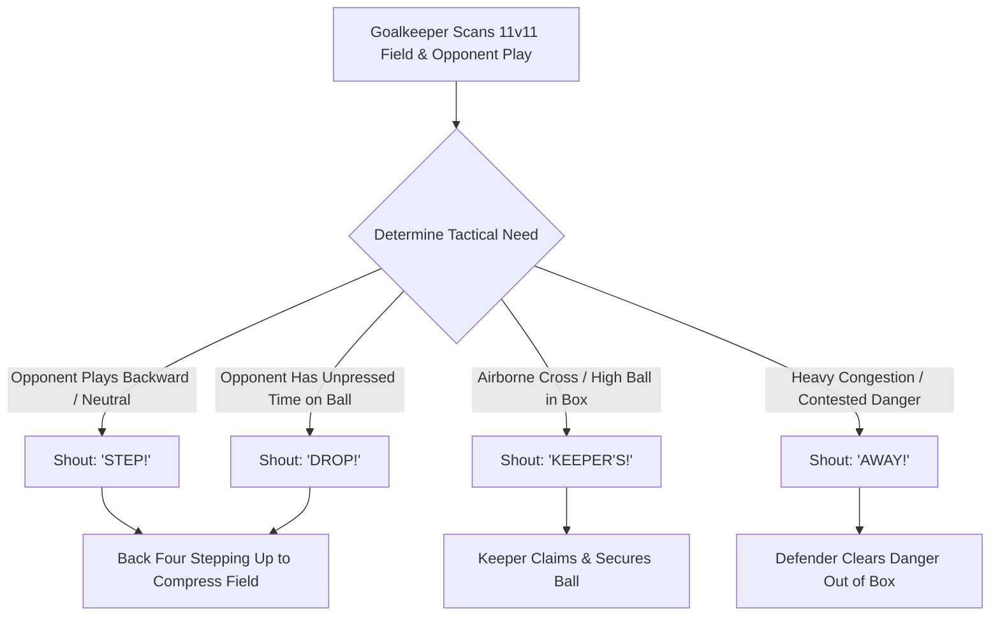

import { Card, CardGrid, Aside, Steps } from '@astrojs/starlight/components';

In **11v11 play**, the goalkeeper is the only player with a complete view of the entire pitch. At ages 12 to 14 (U13–U15), **authoritative vocal communication** is an essential tactical weapon. Clear, pre-emptive commands organize the back four, compress space, and eliminate opponent scoring threats before a shot ever occurs.

Organizing teammates early turns complex defensive scrambles into routine claims or clearances.

<Aside title="11v11 Tactical Leadership" type="note">
Communication is a technical habit, not a personality trait. Teach 12–14 year old goalkeepers to issue **single-word commands** with maximum volume and clear direction while the ball is moving.
</Aside>

---

## The 4 Pillars of 11v11 Defensive Leadership

<CardGrid>
  <Card icon="comment" title="1. Single-Word Directives">
    **"1 Word Maximum"**
    
    Eliminate long phrases. Use direct, single-word field cues like **"STEP!"**, **"DROP!"**, **"HOLD!"**, or **"SHIFT!"** that teammates instantly process during high-speed play.
  </Card>

  <Card icon="right-arrow" title="2. Steering the Back Four">
    **"Command the Line"**
    
    Act as the field general for your central defenders and full-backs. Push the line up when opponents pass backward; drop them when an unpressed opponent looks up to pass deep.
  </Card>

  <Card icon="shield" title="3. Full Goal Wall Architecture">
    **"Sight the Post"**
    
    Organize 4-player or 5-player walls on 2 goals for central free kicks. Sight alignment from the near post to eliminate near-post shooting angles before taking your set stance.
  </Card>

  <Card icon="approve-check" title="4. Decisive Box Authority">
    **"KEEPER'S!" vs. "AWAY!"**
    
    Issue decisive calls while the ball is in flight. Yell **"KEEPER'S!"** to claim crosses or loose balls, or **"AWAY!"** to instruct defenders to clear high-traffic danger instantly.
  </Card>
</CardGrid>

---

## Vocal Decision & Leadership Loop

Goalkeepers continuously monitor game phase and backline positioning to issue clear, real-time field commands:

---

## Standardized Field Communication Cues

Equip keepers with standardized, single-word vocabulary for all 11v11 match situations:

| Match Situation | Field Cue | Expected Defender Action |
| :--- | :--- | :--- |
| **Opponent Passes Backward** | **"STEP!"** | Entire back line steps up rapidly as a single unit to compress pitch depth. |
| **Opponent Unpressed with Ball** | **"DROP!"** | Back four retreats to cover deep space against through-balls. |
| **Opponent Attacker Over-Running**| **"HOLD!"** | Back line freezes position instantly to catch opponent forwards offside. |
| **Ball Moves to Wide Flank** | **"SHIFT LEFT / RIGHT!"** | Defensive unit slides laterally to maintain compact central spacing. |
| **Defender Has Open Space** | **"TIME!"** | Informs defender they are unpressed and can turn or build out cleanly. |
| **Approaching Opponent Pressure** | **"MAN ON!"** | Warns defender to execute a 1-touch pass or reset to the keeper. |
| **Goalkeeper Claiming Ball** | **"KEEPER'S!"** | Absolute command for defenders to clear a path and protect the keeper. |
| **Defensive Clearance Needed** | **"AWAY!"** | Directs defenders to head or kick dangerous loose balls out of the penalty box. |

---

## Set-Piece Protocol: Wall Setup

Organizing walls on full-sized goals requires a rapid, structured routine to protect the near post on direct free kicks:

<Aside title="Wall Count Guidelines (11v11 Play)" type="caution">
* **4–5 Player Wall:** Central direct free kicks within 20 yards of goal.
* **3–4 Player Wall:** Direct free kicks wide of the box or between 20–25 yards out.
* **2 Player Wall:** Distant or wide deep free kicks where a cross is expected.
</Aside>

<Steps>
1. **Call Wall Count Immediately**
   Yell the required wall size loudly upon the referee's whistle (**"4 PLAYERS!"** or **"5 PLAYERS!"**).

2. **Sight Alignment from Near Post**
   Stand on the near goalpost line. Look through the outside defender's hip to the ball, adjusting the wall until the near-post angle is entirely covered.

3. **Issue Alignment Directives**
   Direct wall positioning using short, loud cues: **"ONE STEP LEFT!"** or **"HOLD!"**.

4. **Sprint to Far-Post Set Stance**
   Once aligned, take 2–3 rapid steps toward the far-post area and freeze in a balanced set stance before the opponent takes the kick.
</Steps>

---

## Psychological & Social Dynamics: Ages 12–14

<Aside title="Fostering Vocal Confidence & Managing Peers" type="caution">
* **Voice Projection in Adolescence:** Vocal changes during Peak Height Velocity (PHV) can make young keepers self-conscious. Practice shouting commands from the goal line to midfield during training warm-ups.
* **Commanding Older/Larger Teammates:** Keepers must understand that backline commands are tactical instructions, not personal arguments. Validate keepers who speak up clearly, regardless of outcome.
* **Constructive Resilience:** If a defender misinterprets a call, train the keeper to re-issue a clear single-word cue on the next phase rather than debating during live play.
</Aside>

---

## Field-Ready Session: 11v11 Backline Steering & Wall Setup (20 Mins)

Integrate defensive communication into a full-sided functional phase-of-play session.

<Steps>
1. **Command Cue & Line Steering Reaction (5 Mins):**
   Position 4 defenders on the 18-yard box facing midfield. The coach moves a ball in midfield (forward, backward, laterally). The keeper reads the movement and shouts directives (**"STEP!"**, **"DROP!"**, **"SHIFT!"**). Defenders must move in sync with the calls.

2. **Rapid Wall Organization Phase (7 Mins):**
   The coach places free kicks at varied central locations 18–24 yards out. The keeper has 5 seconds to yell the wall count, sight from the near post, align the wall, sprint to the far-post set stance, and prepare for a direct strike.

3. **Phase of Play: 6v5 Backline Command & Box Defense (8 Mins):**
   Play 6 Attackers vs. 5 Defenders + Goalkeeper in a 60 × 40 yard space. The goalkeeper must vocally steer the back line, direct corner kick marking assignments, and decisively command loose balls (**"KEEPER'S!"** / **"AWAY!"**).
</Steps>

<Aside title="Coaching Tip" type="tip">
Prioritize **volume, clarity, and timing** over technical perfection. Praise a keeper who makes an early, loud call even if the tactical result requires minor adjustment later.
</Aside>