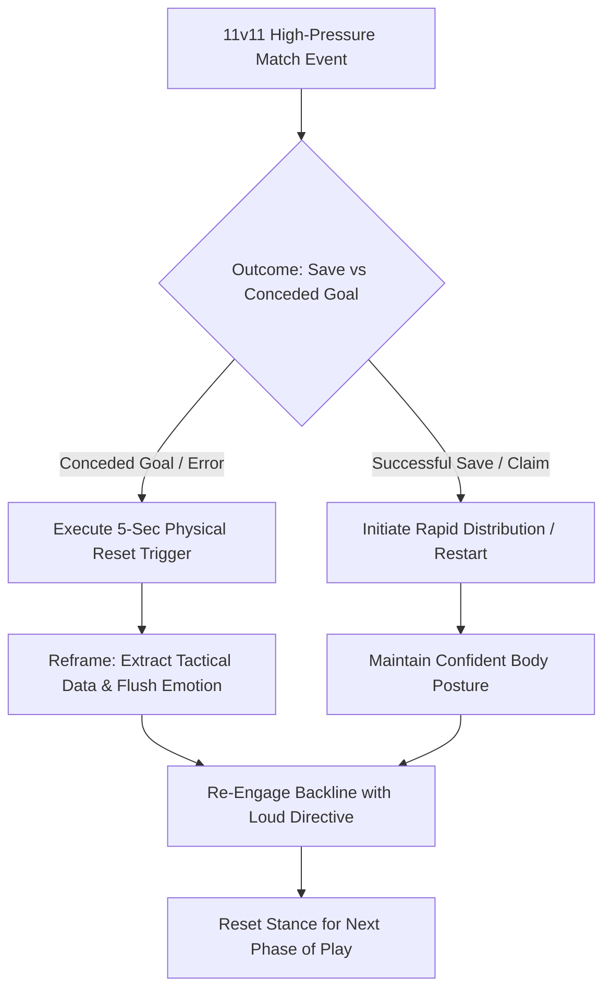

import { Card, CardGrid, Aside, Steps } from '@astrojs/starlight/components';

In **11v11 soccer**, full-time specialization at ages 12 to 14 (U13–U15) places the goalkeeper under an intense psychological spotlight. Unlike outfield players, a goalkeeper's mistake often results directly in a conceded goal. Developing mental resilience, post-error reset routines, and healthy coping mechanisms for public scrutiny is just as vital as mastering physical shot-stopping.

Building psychological resilience transforms high-stakes pressure into calm, authoritative field command.

<Aside title="11v11 Psychological Mandate" type="note">
Goalkeepers do not need to be shielded from pressure; they need structured tools to process scrutiny, recover from mistakes in real time, and lead their team with confidence.
</Aside>

---

## The 4 Pillars of Goalkeeper Mental Resilience

<CardGrid>
  <Card icon="refresh" title="1. Post-Error Reset Routine">
    **"Flush & Reset"**
    
    Execute a 5-second physical reset trigger (e.g., touching the goalpost, snapping gloves) immediately after conceding to clear negative self-talk before the center-kick restart.
  </Card>

  <Card icon="shield" title="2. Filtering Public Scrutiny">
    **"Shield the Mind"**
    
    Filter out parent commentary and opponent sideline noise by tuning exclusively to clear field directives and communication with your back four.
  </Card>

  <Card icon="rocket" title="3. Fail-Forward Mindset">
    **"Data over Emotion"**
    
    Treat conceded goals and errors as tactical data points rather than personal failures. Focus on the decision-making sequence rather than just the outcome.
  </Card>

  <Card icon="star" title="4. Unshakable Body Language">
    **"Stand Tall"**
    
    Maintain confident posture, high chest, and loud vocal leadership following a mistake. Confident keeper body language stabilizes the defensive unit's composure.
  </Card>
</CardGrid>

---

## Mental Resilience & Post-Error Reset Sequence

Goalkeepers maintain composure through high-pressure match events using a structured mental reset flow:

---

## Field-Ready Coaching Cues

Replace complex sports psychology jargon with direct, memorable field triggers:

| Psychological Concept | Field Coaching Cue | Action Required |
| :--- | :--- | :--- |
| **Error Recovery** | **"NEXT BALL!"** | Execute physical reset trigger, take one deep breath, and call backline shape. |
| **Post-Goal Reset** | **"FLUSH IT!"** | Clear emotional frustration instantly before the opponent takes the center-kick. |
| **Sideline Distraction** | **"IN THE PITCH!"** | Focus eyes and ears strictly on the 22 players inside the boundary lines. |
| **Body Language** | **"STAND TALL!"** | Keep chest up and chin high after an error to project confidence to teammates. |
| **Decision Courage** | **"TRUST YOUR READ!"** | Execute sweeper or claiming actions decisively without second-guessing mid-sprint. |

---

## Adolescent Psychology & Biological Realities: Ages 12–14

<Aside title="PHV Emotional Volatility & Team Dynamics" type="caution">
* **Peak Height Velocity (PHV) Impact:** Rapid hormonal changes and physical growth spurts at U13–U15 can increase emotional sensitivity to public criticism.
* **Managing Peer Frustration:** Outfield teammates may vent frustration after a goal. Train keepers to respond with neutral, action-oriented tactical commands (**"STEP UP!"**, **"MARK UP!"**) rather than defensive arguments.
* **The 24-Hour Debrief Rule:** Avoid analyzing major match errors immediately after the final whistle when emotions are high. Wait 24 hours before conducting a calm, constructive 1:1 tactical video review.
</Aside>

---

## Field-Ready Session: High-Scrutiny Pressure & Recovery (20 Mins)

Execute this 20-minute functional block to build goalkeeper composure and error-recovery habits under match-realistic pressure.

<Steps>
1. **Setup & Spatial Grid:**
   Set up a 60 × 40 yard area with an full size goal. Position 6 Attackers vs. 5 Defenders + Goalkeeper.

2. **Phase 1: High-Pressure Overload Attacks (8 Mins):**
   Attackers begin waves of rapid attacks with numerical advantages (3v2, 4v3). The goalkeeper is deliberately exposed to frequent 1v1s, through-balls, and high-volume shots where goals will occur.

3. **Phase 2: Enforced 5-Second Reset Protocol (7 Mins):**
   Whenever a goal is scored, the keeper MUST execute a physical reset trigger (touching the crossbar or goalpost and adjusting gloves), yell a backline organizing cue (**"STEP UP!"**), and get set for an immediate secondary ball served by the coach within 8 seconds.

4. **Phase 3: Team Support & Tactical Debrief (5 Mins):**
   Conclude with a brief team huddle emphasizing backline unity. Praise goalkeepers explicitly for proactive decision-making, loud communication, and resilient body language after conceding.
</Steps>

<Aside title="Coaching Tip" type="tip">
Praise decision courage over outcomes. If a keeper decisively sprints out to sweep a through-ball but miskicks into touch, praise the early read and decisive action rather than focusing solely on the execution flaw.
</Aside>