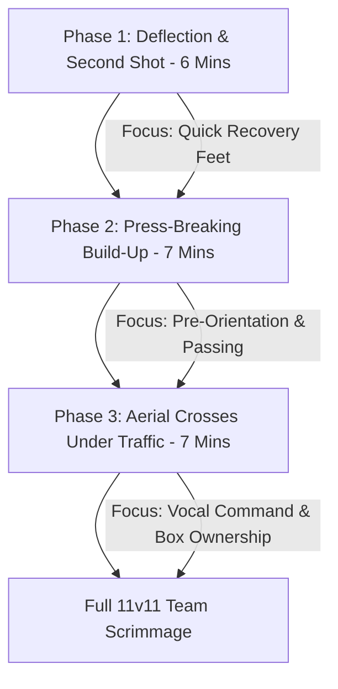

import { Card, CardGrid, Aside, Steps } from '@astrojs/starlight/components';

Isolating goalkeepers on a side pitch for an entire training session detaches them from the tactical speed of the game. The **20-Minute Keeper Block** is a game-realistic, high-tempo training sequence designed for ages 12 to 14 (U13–U15). It connects core technical mechanics with full-team 11v11 decision-making.

By starting every repetition from a realistic match restart, goalkeepers stay fully engaged with the team's tactical organization.

<Aside title="11v11 Training Philosophy" type="note">
Goalkeepers do not play in isolation. Every drill in the 20-minute block transitions immediately from a technical save or claim into a tactical distribution decision.
</Aside>

---

## The 3 Phases of the 20-Minute Block

<CardGrid>
  <Card icon="refresh" title="Phase 1: Reaction & Reset (6 Mins)">
    **"Explode to Feet"**
    
    Train rapid recovery mechanics following deflections or parried shots. The keeper must reset to a balanced set stance before the follow-up strike occurs.
  </Card>

  <Card icon="right-arrow" title="Phase 2: Build-Up Under Press (7 Mins)">
    **"Over or Through"**
    
    Simulate 5v4 build-out restarts from the goalkeeper. The keeper reads opponent pressing traps to choose between short passes to defenders or clipped balls over the press.
  </Card>

  <Card icon="shield" title="Phase 3: Crosses Under Traffic (7 Mins)">
    **"Claim or Punch"**
    
    Serve wide crosses and corner kick patterns into a crowded box with active attackers. The keeper asserts vocal authority, claims or punches, and organizes the counter-attack.
  </Card>

  <Card icon="star" title="Phase 4: Full Match Integration">
    **"Seamless Transition"**
    
    Transition directly from the 20-minute block into the main team scrimmage, carrying the vocal leadership and spatial awareness straight onto the pitch.
  </Card>
</CardGrid>

---

## Session Flow & Progression Map

The 20-minute block flows through three connected phases before integrating into full match play:

---

## Field-Ready Session Execution

Follow this structured timeline to execute the 20-minute block on a standard 60 × 40 yard grid with an full size main goal.

<Steps>
1. **Phase 1: Deflection & Second Shot Recovery (6 Mins):**
   * **Setup:** Position 1 coach and 2 strikers on the 18-yard box.
   * **Execution:** Coach strikes a shot; a deflect-pad alters the trajectory. The keeper must parry wide into safe zones, drive off the hands to regain feet instantly, and set for an immediate secondary strike from the second attacker.
   * **Focus:** Explosive hand-drive recovery and rapid set-stance re-alignment.

2. **Phase 2: Press-Breaking Build-Up Play (7 Mins):**
   * **Setup:** 5 Defenders (GK + 4 Backline) vs. 4 High-Pressing Attackers in a 60 × 40 yard area.
   * **Execution:** Every ball starts from the keeper's feet. If pressed heavily, the keeper plays short to an open full-back or clips a pass over the press to a central target. Backpasses to the keeper count as double points if successfully redistributed.
   * **Focus:** Shoulder-checking before receiving and open back-foot body shape.

3. **Phase 3: Crosses & Aerial Traffic Defense (7 Mins):**
   * **Setup:** Wingers serve wide crosses and corner kicks into the 18-yard box defended by 3 Backline Players vs. 3 Attackers.
   * **Execution:** The keeper reads ball trajectory, issues a loud vocal command (**"KEEPER'S!"** or **"AWAY!"**), claims or punches at the peak, and immediately launches a counter-distribution throw to wide targets.
   * **Focus:** Knee-drive protection and decisive early vocal communication.
</Steps>

---

## Standardized Field Cues for the Block

Keep instructions concise using these standard single-word field cues during the session:

| Drill Phase | Field Coaching Cue | Expected Action |
| :--- | :--- | :--- |
| **Second Shot Reset** | **"UP & SET!"** | Explode off the turf using hands and reset feet into balanced stance. |
| **Build-Up Scanning** | **"CHECK SHOULDER!"** | Scan the field twice before receiving a backpass from a defender. |
| **Build-Up Passing** | **"OPEN FOOT!"** | Receive on the back foot to face the entire pitch before distributing. |
| **Wide Cross Claim** | **"KEEPER'S!"** | Loud, early command asserting complete ownership of the airborne ball. |
| **Box Clearances** | **"AWAY!"** | Direct defenders to clear contested loose balls out of danger. |

---

## Physiological & Safety Realities: Ages 12–14

<Aside title="PHV Joint Loading & Collision Protocols" type="caution">
* **Second-Shot Ground Impact:** During Peak Height Velocity (PHV), rapid limb growth increases joint leverage stress. Ensure keepers absorb ground impact through the side of the thigh and torso rather than landing directly on elbows or knees.
* **Aerial Collision Safety:** In Phase 3, require keepers to drive the non-launch knee up to waist height on all airborne claims. This provides essential shielding against oncoming attackers.
* **Rotational Wrist & Ankle Care:** Use regulation Size 5 balls inflated to match specs; avoid over-inflated balls during high-volume shooting drills to protect wrist joints.
</Aside>

---

## Coaching Summary & Transition

<Aside title="Coaching Tip" type="tip">
Focus feedback on **decision speed and vocal clarity** rather than demanding technical perfection on every shot. If a keeper makes a loud, early call and acts decisively, validate the leadership mindset immediately.
</Aside>