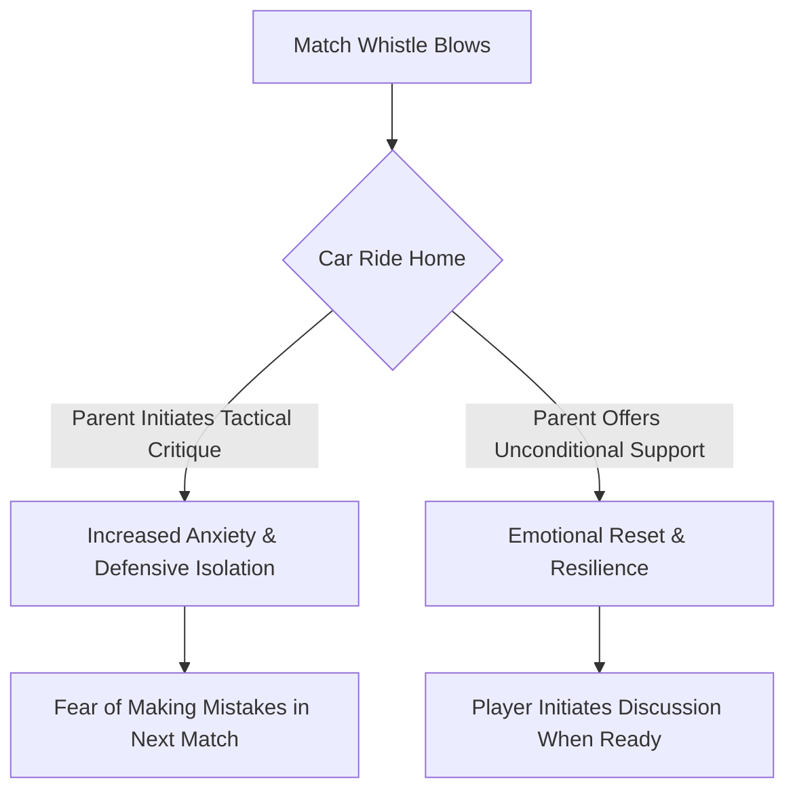

import { Card, CardGrid, Aside, Steps } from '@astrojs/starlight/components';

In **11v11 competitive play**, full-time specialization at ages 12 to 14 (U13–U15) exposes goalkeepers to intense public scrutiny. Conceding a goal sits squarely on one pair of shoulders, and young goalkeepers often carry that weight long after the final whistle. A parent's primary role is to serve as an emotional safe harbor, providing unconditional support regardless of match results or mistakes.

Being an emotional anchor builds long-term athletic resilience and protects a player's love for the game.

<Aside title="11v11 Parenting Philosophy" type="note">
Parents are a goalkeeper's emotional safe harbor, not their technical analyst. Leave tactical debriefs and error breakdowns to the coaching staff, and focus on building personal confidence and perspective.
</Aside>

---

## The 4 Pillars of Goalkeeper Parenting

<CardGrid>
  <Card icon="heart" title="1. The Decompression Zone">
    **"I Loved Watching You Play"**
    
    Transform the car ride home into an unconditional safe space. Avoid offering unsolicited coaching advice, critiquing errors, or analyzing conceded goals.
  </Card>

  <Card icon="star" title="2. The 24-Hour Rule">
    **"Pause Before Processing"**
    
    Wait 24 hours before discussing match performance. High post-match emotions block constructive reflection; time restores logic and emotional balance.
  </Card>

  <Card icon="star" title="3. Identity Protection">
    **"Separate Player from Game"**
    
    Help players understand that a conceded goal is an event in a game, not a reflection of their personal character or worth.
  </Card>

  <Card icon="star" title="4. Sideline Shielding">
    **"Positive Sideline Energy"**
    
    Protect your keeper from adult sideline anxiety. Refrain from shouting instructions (**"OUT!"**, **"CHALLENGE!"**), groaning at errors, or gesturing at conceded goals.
  </Card>
</CardGrid>

---

## The Post-Match Decompression Flow

Parents guide their child's emotional recovery using an intentional, supportive communication loop:

---

## Communication Guide: What to Say vs. What NOT to Say

Equip parents with actionable phrasing to navigate tough post-match moments in 11v11 play:

| Match Situation | Avoid Saying (High Pressure) | Try Saying (High Support) |
| :--- | :--- | :--- |
| **After Conceding a Soft Goal** | "Why didn't you stay on your line?" | "I love watching you play and compete out there." |
| **After a High-Score Loss** | "Your defenders left you completely exposed today." | "Tough game today! Where should we grab lunch?" |
| **Player Is Upset in the Car** | "It's just a game, don't worry about it." | "I can see you're frustrated. I'm here if you want to talk." |
| **Player Asks for Feedback** | "You need to work on your sweeping timing." | "What felt good out there, and what do you want to work on with Coach next practice?" |

---

## The 4-Step Post-Match Decompression Routine

Guide parents through a structured post-game transition from pitch to home:

<Steps>
1. **The Pitch-Side Greeting (First 2 Minutes):**
   Offer a warm hug, a water bottle, and a calm smile. Avoid asking "What happened on that second goal?"

2. **The Car Ride Home (Next 20 Minutes):**
   Let the player lead the conversation. If they want to listen to music or sit in silence, respect their processing style entirely.

3. **The Evening Reset (Post-Game):**
   Shift focus away from soccer. Engage in non-sport family activities to reinforce that family life remains stable regardless of wins, losses, or clean sheets.

4. **The Next-Day Check-In (24 Hours Later):**
   If the player brings up match errors the following day, listen actively and encourage them to formulate a specific question for their goalkeeper coach at the next session.
</Steps>

---

## Biological & Social Realities: Ages 12–14

<Aside title="Managing PHV Volatility & Specialization Stress" type="caution">
* **Peak Height Velocity (PHV) Hormonal Shifts:** Emotional reactions can feel amplified during growth spurts at U13–U15. A post-match burst of frustration is often a biological reaction to exhaustion rather than a lack of maturity.
* **Academy / Club Pathway Pressure:** Avoid discussing team selection, college recruiting, or league rankings in the car ride home. Keep home life centered on personal development and fun.
* **Managing Bench Rotation:** If your goalkeeper is rotating matches with another keeper, model positive support for both players. Avoid criticizing team selection in front of your child.
</Aside>

---

## Parent-Coach Alignment Charter

<Aside title="Coach-Parent Communication Protocol" type="tip">
Coaches and parents must operate as a unified team to safeguard the young goalkeeper's psychological well-being:
* **Direct All Technical Questions to Coaches:** Parents should never instruct goalkeepers on sweeping depth, diving technique, or wall positioning.
* **Observe Training Quietly:** Give goalkeepers space to make errors and learn during practice without parent intervention from the sideline.
* **Report Overwhelming Anxiety Early:** If a keeper exhibits severe pre-match anxiety or sleep issues, parents should notify the head coach privately to adjust training load or match volume.
</Aside>

<Aside title="Red Flag Warning Signs" type="danger">
If a U13–U15 goalkeeper displays these behaviors, pause competitive pressure immediately:
* Feigning injury or illness before matches to avoid playing in goal.
* Visibly freezing or withdrawing emotionally on the pitch after conceding a goal.
* Expressing feelings of letting down the entire family or team after a loss.
</Aside>