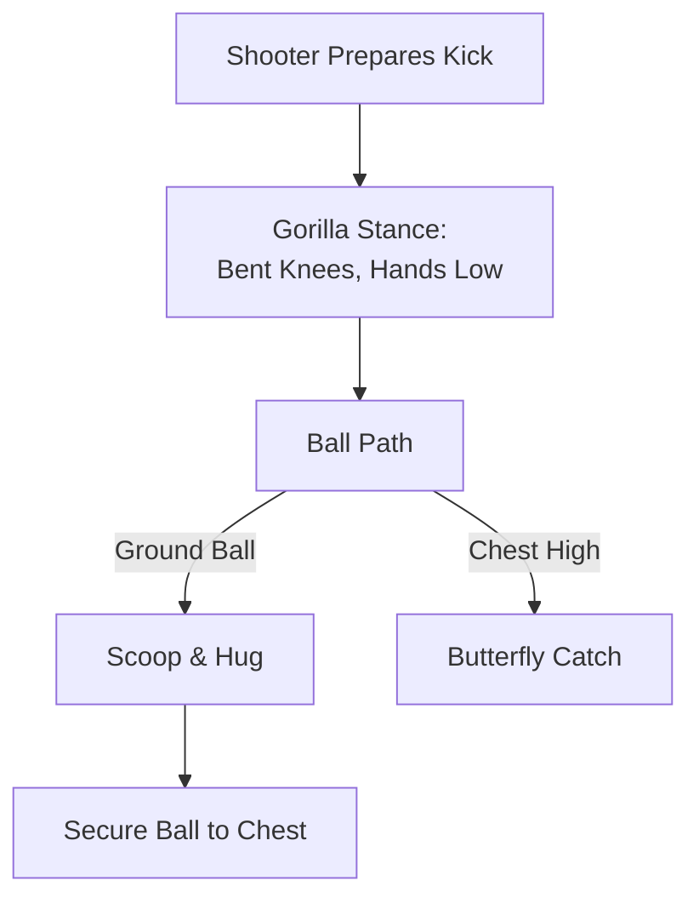

import { Card, CardGrid, Steps, Aside } from '@astrojs/starlight/components';

At ages 6–9, goalkeeping is about building physical literacy, spatial play, and confidence. Avoid early specialization, every player at this age benefits from taking turns in goal.

<Aside type="tip" title="The 100% Rotation Rule">
  At U7–U9, never assign a permanent goalkeeper. Rotate all players through goal during training and matches to build well-rounded foot skills and eliminate position fear.
</Aside>

## Core Developmental Pillars (U7–U9)

<CardGrid>
  <Card title="1. Physical Literacy & Equipment" icon="rocket">
    * **Ball Sizing:** Use **Size 3 balls only** to protect wrist joints and match hand capacity.
    * **Hand Mechanics:** Small hands cannot form a formal "W". Teach the **Butterfly Catch** instead.
    * **Multi-Sport Movement:** Build agility using tag, dodgeball, and tumbling before teaching diving.
  </Card>

  <Card title="2. Spatial & Goal Boundaries" icon="right-arrow">
    * **4v4 / 5v5 (4x6 ft - 6x12 ft):** Focus on staying centered; ignore high shots that fly over head height.
    * **7v7 (6x12 ft):** Teach the **"Rainbow Line"** (an arc 2 steps off the goal line).
    * **Active Playmaker:** Encourage keepers to step to the edge of the penalty area when their team attacks.
  </Card>
</CardGrid>

## Catching Mechanics & Field Cues

<Steps>
1. **Gorilla Stance (Set Position)**  
   Feet shoulder-width apart, knees soft, elbows bent with palms facing forward at waist height like a gorilla.

2. **Scoop & Hug (Ground Balls)**  
   Step toward the ball, bend at knees (or drop one knee to the grass), scoop pinkies underneath the ball, and hug it tight to the chest.

3. **Butterfly Catch (Chest-High Balls)**  
   Bring thumbs and index fingers close together forming a "butterfly" shape behind the ball. Absorb the soft catch toward the chest.
</Steps>

<Aside type="caution" title="Overcoming Ball Fear">
  Never force a child to face hard shots from close range. Use soft foam balls, light plastic balls, or underhand tosses when introducing catching mechanics to build trust.
</Aside>

## Integrated Grassroots Practice Flow (45 Mins)

<Steps>
1. **Phase 1: Multi-Directional Tag Warm-Up (10 Mins)**  
   All players play freeze tag. To be unfrozen, a player must catch an underhand toss from the "Goalkeeper of the Day" using **Butterfly Hands**.

2. **Phase 2: Catch & Distribute Tag (15 Mins)**  
   In pairs, Player A rolls/serves a soft ball to Player B. Player B completes a **Scoop & Hug**, yells *"MY BALL!"*, and bowls it back. Rotate roles every 60 seconds.

3. **Phase 3: Small-Sided Game Integration (20 Mins)**  
   Play 4v4 or 5v5 with rotation. Every 5 minutes, rotate the goalkeeper. Bonus point if the goalkeeper starts an attack by rolling the ball to a teammate's feet.
</Steps>

## Psychological Safety & Field Scripts

<Aside type="danger" title="The No-Blame Zone">
  Goals will happen frequently on small fields. Never react negatively to a conceded goal. Normalize goals as a standard step in learning football.
</Aside>

### Matchday Quick-Reference Script

| Situation | Avoid Saying | Actionable Field Cue |
| :--- | :--- | :--- |
| **Ball slips through hands** | *"Keep your eyes on the ball!"* | *"Great try! Show me your Butterfly Hands next time!"* |
| **Hesitating to move** | *"Get out there!"* | *"Take two steps forward! You've got this!"* |
| **Conceding a goal** | *"You have to stop those!"* | *"High five! Turn around, grab the ball, and let's play!"* |