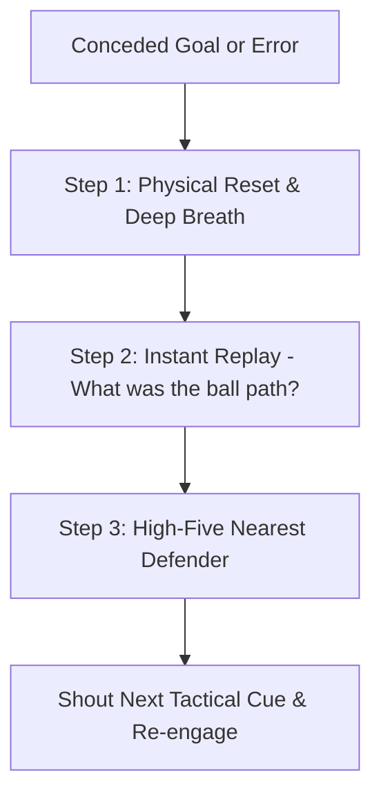

import { Card, CardGrid, Aside, Steps } from '@astrojs/starlight/components';

Before teaching diving or positioning, a coach must make the goal a place of courage rather than anxiety. Psychological safety is the prerequisite for physical brave play.

<Aside title="The Golden Rule of Youth Goalkeeping" type="tip">
  At U8–U12, every goalkeeper is an outfield player learning spatial awareness. Rotate positions regularly and celebrate aggressive decisions over perfect technical outcomes.
</Aside>

## Age-Stage Mindset Realities

<CardGrid>
  <Card icon="star" title="Overcoming Physical Fear">
    * **Primary Fear:** Getting hit by the ball or hitting the ground hard.
    * **Coaching Focus:** Use soft/foam balls for close-range drills to build trust before introducing hard match balls.
    * **Key Metric:** Celebrating brave movement toward the ball.
  </Card>

  <Card icon="heart" title="Overcoming Social Fear">
    * **Primary Fear:** Letting down teammates, coach criticism, or parent reactions.
    * **Coaching Focus:** Establish zero-blame team rules and teach the **3-Second Reset Routine**.
    * **Key Metric:** Loud communication and quick recovery after errors.
  </Card>
</CardGrid>

## The 3-Second Reset Routine ("Circuit Breaker")

When a goal is conceded, teach keepers to immediately perform this 3-step physical and mental reset to clear negative emotion before restarting play:

<Steps>
1. **Physical Reset (The Circuit Breaker)**  
   Retrieve the ball from the net, take one deep abdominal breath, and kick or roll the ball cleanly back to the center circle. *Physical movement breaks the emotional panic loop.*

2. **Instant Replay (Data, Not Drama)**  
   Ask one objective question: *"Was my stance set before the kick?"* Treat the play like neutral video footage rather than a personal failure.

3. **Defender High-Five (Re-engage the Team)**  
   Walk to the nearest defender, offer a fist-bump or high-five, and call out the next organization cue (e.g., *"Mark up early!"*).
</Steps>

## Psychological Safety Decision Flow

<Aside title="Protecting Keepers from Sideline Noise" type="danger">
  Enforce a strict team policy: **Parents and teammates never shout instructions to the goalkeeper during play.** The goalkeeper's focus must remain entirely on field cues.
</Aside>

## Field Scripts: What to Say vs. What to Avoid

| Situation | Avoid Saying (High Anxiety) | Start Saying (Actionable Field Cue) | Why It Works |
| :--- | :--- | :--- | :--- |
| **After a Conceded Goal** | *"Why didn't you dive for that?"* | *"Reset! Deep breath, fist-bump your defender!"* | Triggers the 3-Second Reset instead of dwell-time. |
| **Hesitation on a Loose Ball** | *"You have to be braver than that!"* | *"Great read! Next time, commit three fast steps early!"* | Praises decision-making while giving clear physical direction. |
| **Unlucky Deflection** | *"It's okay, not your fault!"* | *"Unlucky bounce! Show me your Gorilla Stance for the restart!"* | Refocuses attention back onto actionable set position mechanics. |