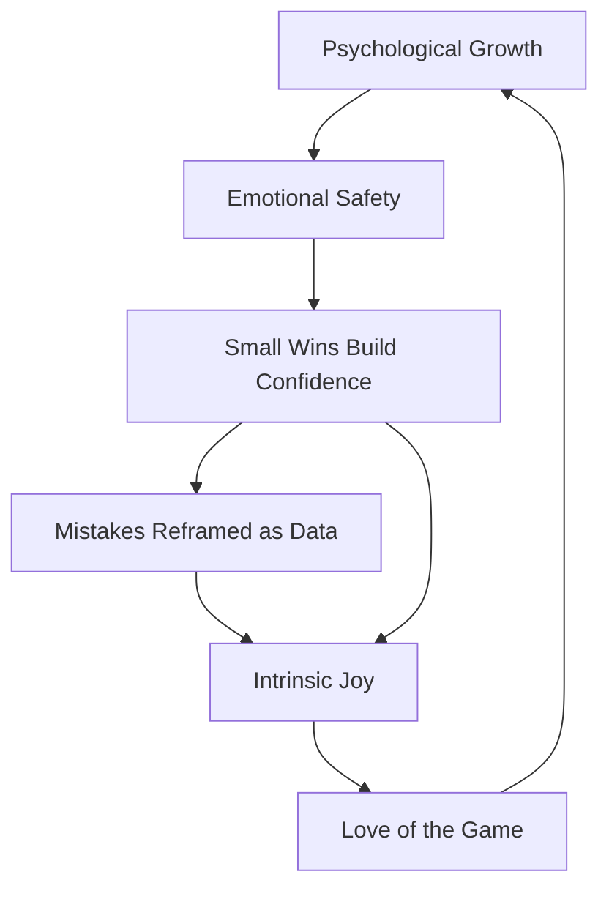

Before any skill, a young keeper's mind needs to see goalkeeping as fun, not a test. A safe, playful environment lets confidence and courage grow from within.

## Love of Movement

**Joy Over Outcome:** The only non-negotiable outcome is that kids leave every session wanting to come back. Pressure and results at this age actively work against long-term retention.

## Small Wins, Big Confidence

**Mastery Through Success:** A child's sense of self grows from repeated small successes, not lectures. Set the bar low enough to be cleared and celebrate the attempt, so every session ends with "I can do this."

## Mistakes Are Experiments

**Reframe the Miss:** Drop the ball? Miss the catch? At this age a "mistake" is data, not a verdict. Normalizing failure teaches resilience and keeps a developing ego out of the way of learning.

