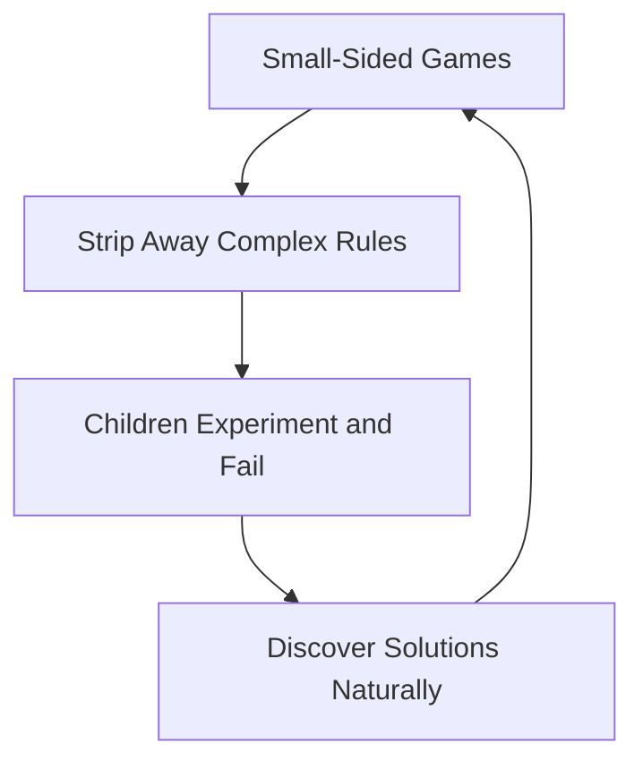

import { Aside } from '@astrojs/starlight/components';

Play is children's native language. They learn best when allowed to experiment freely, fail safely, and solve problems without adult pressure or fear of judgment.

<Aside type="caution" title="Emotional Safety First">
  **Our #1 Job:** Establishing emotional safety is the single most important responsibility at this age. A child who feels safe to miss a catch will try again; a child who feels judged will stop reaching for the ball entirely.
</Aside>

## Small-Sided Games

**Fewer Players, More Touches:** 3v3 and 4v4 formats strip away complex rules so children experiment, fail, and discover solutions naturally.

## Short & Sweet Sessions

**Attention Span Reality:** Keep activities to 10-15 minutes and rotate stations frequently to sustain energy, curiosity, and joy.

## The Play-Based Learning Loop

