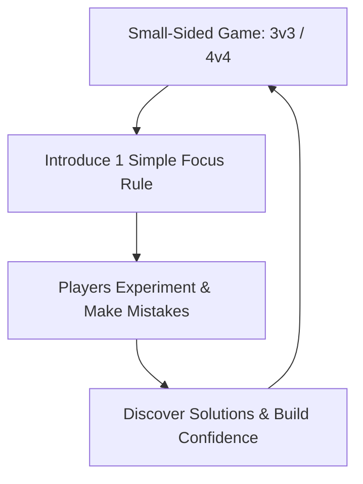

import { Aside, Card, CardGrid, Steps } from '@astrojs/starlight/components';

Play is a child’s native language. Children aged 6–9 learn best when allowed to experiment freely, make mistakes without fear, and discover solutions naturally through active play rather than lectures.

<Aside title="The Safe-to-Fail Rule" type="caution">
  Establishing emotional safety is the single most important job for a grassroots coach. A child who feels safe to miss a catch will try again; a child who feels judged will stop reaching for the ball entirely.
</Aside>

## The 4 Pillars of Emotional Safety (Ages 6–9)

<CardGrid>
  <Card icon="star" title="1. Play Over Instruction">
    * **3v3 & 4v4 Games:** Keep games small so every child gets constant touches.
    * **30-Second Rule:** Keep explanations under 30 seconds. Show, don't lecture.
    * **Trial & Discovery:** Let players solve field problems before stepping in to assist.
  </Card>

  <Card icon="refresh" title="2. Total Position Rotation">
    * **Zero Specialization:** Rotate every player into goal during training and games.
    * **Equal Playing Time:** Ensure every child gets equal outfield and goalkeeping minutes.
    * **Shared Responsibility:** Remind the team that conceding a goal is a team event, not an individual failure.
  </Card>

  <Card icon="shield" title="3. Ball-Fear Mitigation">
    * **Soft Equipment:** Use light or foam balls when introducing catching games.
    * **Underhand Serves:** Keep close-range throws gentle and predictable.
    * **Praise Bravery:** Celebrate players who move toward the ball, regardless of whether they make the save.
  </Card>

  <Card icon="heart" title="4. Sideline Protection">
    * **Parent Alignment:** Educate parents to cheer for effort, not outcomes.
    * **No Joystick Coaching:** Prohibit parents from shouting directional commands from the sideline.
    * **Coach-Only Cues:** Ensure the goalkeeper hears only one supportive voice during play.
  </Card>
</CardGrid>

## The Play-Try-Discover Engine

## Structuring a 45-Minute Play-Based Session

Keep activities short (10–15 minutes max) to align with young attention spans and keep energy high.

<Steps>
1. **Phase 1: Fun Tag & Movement Warm-Up (10 Mins)**  
   Play chaos tag or dodge-and-catch games using soft balls. Focus on spatial awareness, landing safely, and quick reactions without formal goalkeeping pressure.

2. **Phase 2: 2v2 / 3v3 Target Games (15 Mins)**  
   Set up mini-fields with small goals (4 × 6 ft). Rotate players into goal every 3 minutes. Reward bonus points when a keeper catches a shot and rolls it to a teammate.

3. **Phase 3: 4v4 Match Play with Full Rotation (20 Mins)**  
   Play a standard small-sided game. Rotate goalkeepers at every quarter break. Enforce a strict "No Blame" policy after goals are scored.
</Steps>

<Aside title="Coach's Field Rule" type="tip">
  If energy drops or frustration rises during a session, pause the drill and switch immediately to a fun tag game. Always end practice on a positive, joyful note.
</Aside>

## Language Audit: Positive Framing for U7–U9

| Situation | Avoid Saying (High Anxiety) | Start Saying (Safe-to-Fail Cues) |
| :--- | :--- | :--- |
| **Missed Catch** | *"How did you drop that?"* | *"Brave hands! Soft hands next time!"* |
| **Conceding a Goal** | *"You have to protect your net!"* | *"Unlucky! Great effort stepping out. Reset and play!"* |
| **Hesitating to Move** | *"Don't be afraid of the ball!"* | *"Show me your Gorilla Stance! You've got this!"* |