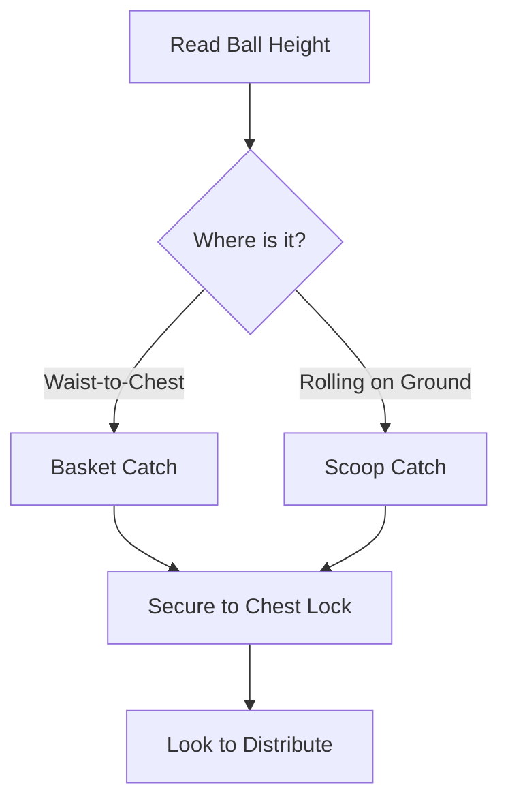

For young keepers, safe catching technique on the ground and at the waist is the entire technical curriculum. High-impact diving is deliberately deferred to protect developing joints.

## [Basket Catch](/reference-library/08-ground-handling/)

**Waist-to-Chest Shots:** Bend slightly at the waist, extend forearms forward with palms up, and cushion the ball into the belly. Cue *"cradle the baby"* and *"huddle over the ball."*

## [Scoop Catch](/reference-library/08-ground-handling/)

**Rolling Ground Balls:** Lower into a squat or trailing-knee position behind the ball, pinkies together with palms up, and funnel the ball up into a chest lock. Cue *"body behind the ball."*

## Safe Ground Saves

**Low Saves from Squat/Knees:** Teach controlled ground drops and sliding saves rather than airborne dives. Land on the side, never on elbows or knees, to protect fragile joints and build confidence.

