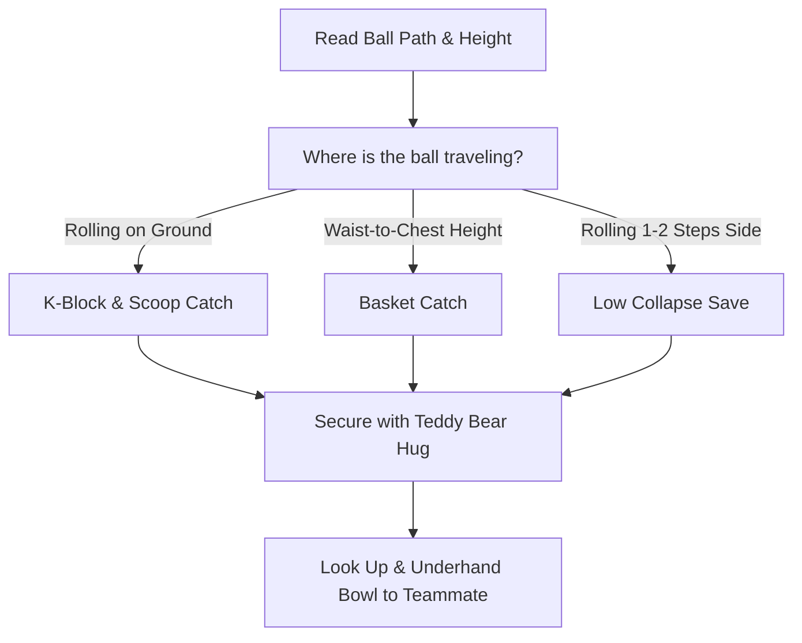

import { Aside, Card, CardGrid, Steps } from '@astrojs/starlight/components';

For young goalkeepers (Ages 6–9), ground handling forms 80% of all match saves. High-impact airborne diving is deliberately deferred to protect developing joints and build ground confidence first.

<Aside type="tip" title="Equipment & Safety First">
  Ensure young keepers drop onto natural grass or soft turf to protect elbows and hips.
</Aside>

## Core Ground Handling Techniques

<CardGrid>
  <Card title="1. Scoop Catch (Ground Balls)" icon="down-arrow">
    * **Target:** Low rolling balls directly at or near the keeper.
    * **Key Cue:** *"Pinkies touch, knees low."*
    * **Safety Net:** Lower one knee to the grass (K-Block) to create a human barrier behind the hands.
  </Card>

  <Card title="2. Basket Catch (Waist/Chest Balls)" icon="archive">
    * **Target:** Shots arriving between belly and chest height.
    * **Key Cue:** *"Cradle the baby, Teddy Bear Hug."*
    * **Mechanic:** Bend slightly at the waist, cushion the ball into the midsection, and wrap forearms around it.
  </Card>

  <Card title="3. Low Collapse Save (Low Side Balls)" icon="shield">
    * **Target:** Rolling or low shots 1–2 steps to the side.
    * **Key Cue:** *"Step, slide on your side, hands to ball."*
    * **Safety:** Land on the fleshy outer thigh and side of torso, never land directly on knee joints or elbows.
  </Card>
</CardGrid>

## Technical Mechanics Breakdown

<Steps>
1. **Gorilla Set Position**  
   Stand with feet shoulder-width apart, knees soft, hands out at waist height with palms facing forward.

2. **Step & Form the Barrier (K-Block)**  
   Step toward the path of the ball. For low shots, bend both knees deeply or drop the trailing knee near the front heel to block the space between the legs.

3. **Hands Lead First (Pinkies Together)**  
   Reach low with open palms facing the ball, pinkies touching. Scoop fingers underneath the ball as it arrives.

4. **Secure to Teddy Bear Hug**  
   In one fluid motion, pull the ball up into the chest, wrapping forearms tightly around it.
</Steps>

## Handling Decision Flow

<Aside type="caution" title="Avoid the 'Nutmeg' Trap">
  Young players often bend over at the waist with straight legs to pick up rolling balls. If they miss, the ball rolls through their legs for a goal. Always enforce **bending at the knees** and setting a leg barrier behind the hands.
</Aside>

## Integrated Ground Handling Practice Flow (45 Mins)

<Steps>
1. **Phase 1: Scoop & Bowl Relay (10 Mins)**  
   In pairs 6 yards apart: Player A rolls a low ball -> Player B performs a **K-Block Scoop**, hugs the ball, and rolls an underhand bowling pass back to Player A's feet.

2. **Phase 2: Dynamic Gate Catch (15 Mins)**  
   Set up two small gates (4 × 6 ft wide) 5 yards apart. The goalkeeper shuffles between gates. Coach rolls a soft ball through either gate → Keeper steps across, completes a **Low Collapse Save**, and pops up quickly.

3. **Phase 3: 4v4 Match Integration (20 Mins)**  
   Play a 4v4 game on a small pitch 25 × 35 ft with 4 × 6 ft goals. Rotate goalkeepers every 5 minutes. Award **2 points** whenever a goalkeeper secures a ground save and successfully bowls it to an open teammate.
</Steps>

## Common Ground Handling Errors & Quick Fixes

| Visual Error | Root Cause | Instant Field Cue |
| :--- | :--- | :--- |
| **Ball pops out of hands upon impact** | Stiff arms/hard hands reaching rigid. | *"Soft hands! Absorb the ball like a pillow!"* |
| **Ball slips through legs** | Standing tall, bending only at waist with straight legs. | *"Drop your back knee! Build the guard rail!"* |
| **Landing hard on elbow/hip bone** | Falling forward or diving straight down. | *"Slide on your side like going down a water slide!"* |