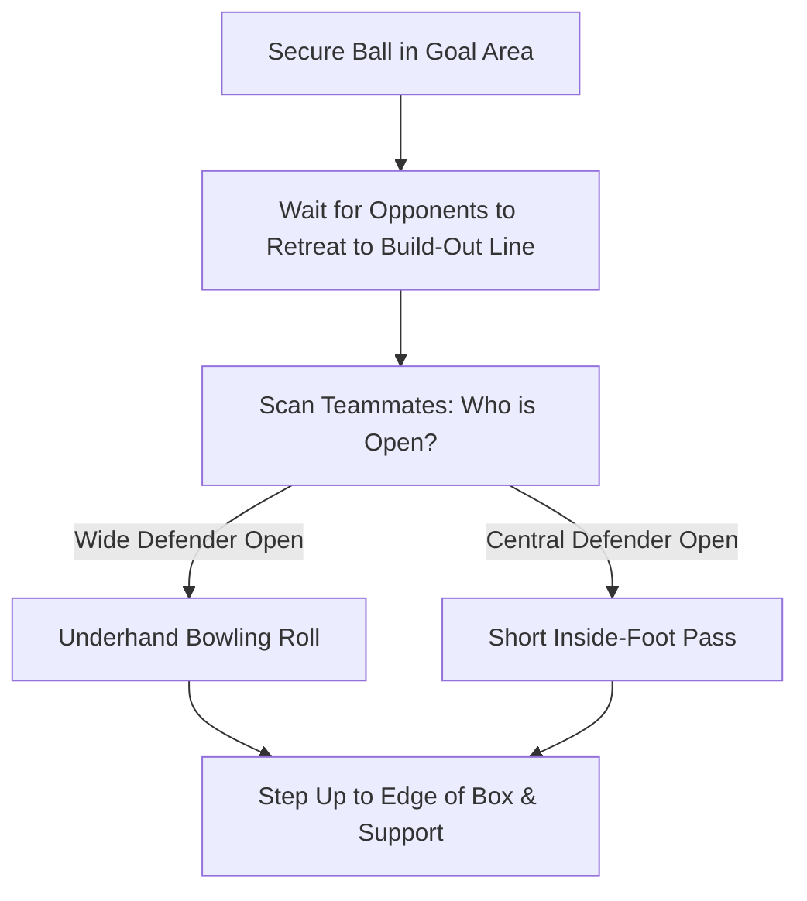

import { Aside, Card, CardGrid, Steps } from '@astrojs/starlight/components';

Young goalkeepers are the team's first attacker. At ages 6–9, distribution focuses on simple, ground-based releases that build confidence on the ball and help the team play out from the back.

<Aside type="tip" title="Build-Out Line Rule (U7–U9)">
  In standard 7v7 grassroots play, opponents must retreat behind the Build-Out Line whenever the goalkeeper has the ball. Teach young keepers to wait for opponents to fall back before making a calm roll or pass.
</Aside>

## Core Distribution Methods

<CardGrid>
  <Card title="1. Underhand Roll (Bowling)" icon="right-arrow">
    * **Target:** Wide defenders 5–10 yards away.
    * **Key Cue:** *"Step, slide, low and smooth."*
    * **Mechanic:** Cup the ball, step forward with the opposite foot, bend at the knees, and roll the ball cleanly along the grass like a bowling ball.
  </Card>

  <Card title="2. Short Inside-Foot Pass" icon="approve-check">
    * **Target:** Open defenders beside or in front of the penalty area.
    * **Key Cue:** *"Lock ankle, strike center."*
    * **Mechanic:** Place non-kicking foot beside the ball pointing at target, open hips, and strike through the middle of the ball with the inside of the boot.
  </Card>

  <Card title="3. No Punts or Sling Throws" icon="close">
    * **Rule:** Deliberately defer high punts and overhand sling throws.
    * **Why:** Young hip flexors and shoulder joints are not ready for long aerial forces. Ground passes keep the ball under control and encourage true team play.
  </Card>
</CardGrid>

## Step-by-Step Bowling Mechanics

<Steps>
1. **Secure & Hug**  
   Catch or collect the ball firmly using a **Teddy Bear Hug** or **Scoop Catch**.

2. **Scan the Field (Look Before You Release)**  
   Take two steps toward the edge of the penalty box while looking for wide-open teammates near the sidelines.

3. **Step & Bowl**  
   Hold the ball in your dominant hand, step forward with your opposite foot, drop your hips low, and roll the ball smoothly along the grass into your teammate's running path.

4. **Follow Through & Step Up**  
   Follow your roll with a step forward, pushing your body up to support the team's attack.
</Steps>

## Build-Up Decision Flow

<Aside type="caution" title="The Backpass Rule">
  If a teammate intentionally kicks the ball back to the goalkeeper, **the keeper cannot use their hands**. Teach keepers to clear backpasses using a simple first-touch side-foot pass.
</Aside>

## Integrated Build-Up Session Flow (45 Mins)

<Steps>
1. **Phase 1: Target Bowling Warm-Up (10 Mins)**  
   Pairs stand 8 yards apart with two small cones forming a 3 ft gate. Keepers take turns executing **Underhand Rolls** through the target gate to their partner's feet.

2. **Phase 2: Build-Out Escape Drill (15 Mins)**  
   Coach plays a shot -> Keeper makes a save -> Opponents retreat behind an imaginary Build-Out Line -> Keeper calls *"WIDE!"* and bowls the ball to a wide defender who dribbles past mini-cones.

3. **Phase 3: 4v4 Build-Up Match Integration (20 Mins)**  
   Play a 4v4 small-sided match with Build-Out Lines. Every attack must start with a goalkeeper roll or pass. Award **2 points** if a team successfully completes three passes starting from the keeper's distribution.
</Steps>

## Field Error Correction Table

| Visual Error | Root Cause | Instant Field Cue |
| :--- | :--- | :--- |
| **Ball bounces wildly when rolled** | Released from standing tall without bending knees. | *"Get low like a bowling ball! Touch the grass!"* |
| **Roll goes behind teammate** | Released too late or stepping with wrong foot. | *"Point your toes where you want the ball to go!"* |
| **Pass bobbles or strays off target** | Struck with toes or weak, unlocked ankle. | *"Lock your ankle, open your gate!"* |