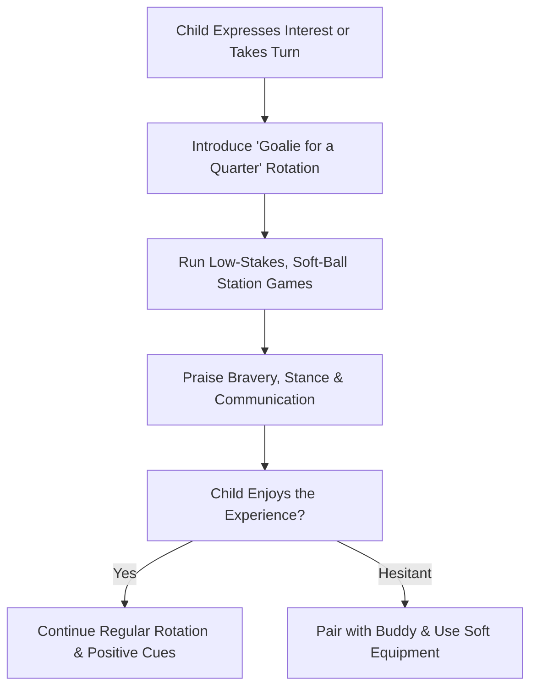

import { Aside, Card, CardGrid, Steps } from '@astrojs/starlight/components';

For players aged 6–9, goalkeeping should be an exciting adventure, not a permanent assignment. By offering low-pressure opportunities to try the position, coaches build well-rounded football literacy while discovering players who genuinely love the role.

<Aside type="tip" title="The 'Cool Captain' Jersey Rule">
  Make playing in goal desirable. Treat the goalkeeper shirt like a captain's armband, rotate it every match quarter so every child gets to wear the special jersey without feeling isolated.
</Aside>

## Core Pillars of the Rotational Model

<CardGrid>
  <Card title="1. Total 'Taste-Test' Rotation" icon="random">
    * **Equal Turns:** Every player takes a turn in goal during practices and small-sided games.
    * **No Commitments:** Never label a 6–9 year old as a "goalkeeper only."
    * **Outfield First:** Keepers must spend at least 75% of their total seasonal playing time as outfield players.
  </Card>

  <Card title="2. Safe Station Games" icon="star">
    * **Mini Keeper Wars:** Use soft balls and underhand throws across a 6 × 8 ft gate.
    * **Save & Sprint Relays:** Combine a simple ground scoop with a quick sprint to tag a teammate.
    * **Short Rotations:** Keep station work under 10 minutes to maintain high energy and focus.
  </Card>

  <Card title="3. Celebrate Bravery First" icon="heart">
    * **Reward Decision-Making:** Praise stepping toward the ball, setting early, and shouting loudly.
    * **Ignore the Scoreboard:** A brave attempt that results in a goal is still a victory in training.
    * **Squad High-Fives:** Enforce team celebrations whenever a keeper makes a brave play.
  </Card>

  <Card title="4. Supporting Reluctant Players" icon="star">
    * **Never Force It:** If a child is terrified, start them as a "support keeper" alongside a buddy in practice.
    * **Soft Balls Only:** Use lightweight or foam balls to eliminate physical fear.
    * **Gradual Exposure:** Let reluctant players start with simple bowling and passing games.
  </Card>
</CardGrid>

## Player Discovery & Growth Flow

## Structuring a Matchday Rotation (7v7 / 4v4)

<Steps>
1. **Rotation 1 (Minutes 0–10)**  
   Player A wears the goalkeeper jersey. Focus on keeping a **Gorilla Stance** and finding wide defenders on restarts.

2. **Rotation 2 (Minutes 10–20)**  
   Player B takes over in goal. Player A transitions to outfield defender.

3. **Rotation 3 (Minutes 20–30)**  
   Player C takes over in goal. Focus remains on celebrate-and-reset habits.

4. **Rotation 4 (Minutes 30–40)**  
   Player D finishes in goal. All four players receive equal outfield and goalkeeping minutes.
</Steps>

<Aside type="caution" title="Handling Parent Pressure">
  Some parents may complain if their child is placed in goal, or conversely, insist their child play goal exclusively. Remind parents that early position rotation develops superior foot skills, decision-making, and game intelligence.
</Aside>

## Station Games

| Station Name | Setup Specs | Core Rule | Coaching Focus |
| :--- | :--- | :--- | :--- |
| **Mini Keeper Wars** | Two 4 x 6 ft goals placed 8 yards apart; soft balls only. | Players score by bowling or side-foot passing into opponent's net. No high blasting allowed. | **Butterfly Catch** and **K-Block** ground scoops. |
| **Reaction Tag** | 10 x 10 ft square; 1 keeper, 1 runner. | Keeper starts facing away, turns on coach's whistle, and scoops a rolling ball before runner tags the cone. | Quick turn, low set stance, and hands leading first. |
| **Save & Bowl Relay** | 2 lines 10 yards apart. | Keeper catches a soft tossed ball, completes a **Teddy Bear Hug**, bowls it back, and sprints to line end. | Fast recovery and smooth underhand bowling mechanics. |

## Field Scripts: Fostering Curiosity & Confidence

| Situation | Avoid Saying (Dampens Interest) | Start Saying (Builds Enthusiasm) |
| :--- | :--- | :--- |
| **Player says "I'm scared of the ball"** | *"It won't hurt, don't be soft!"* | *"Let's use this squishy foam ball! Show me your Butterfly Hands!"* |
| **Player makes a brave dive but misses** | *"You have to dive faster next time!"* | *"I loved how fast you stepped to that ball! That was super brave!"* |
| **Player doesn't want to play goal today** | *"Everyone has to do it, get in net."* | *"No problem! You play outfield this half, and you can partner up with Alex next practice!"* |