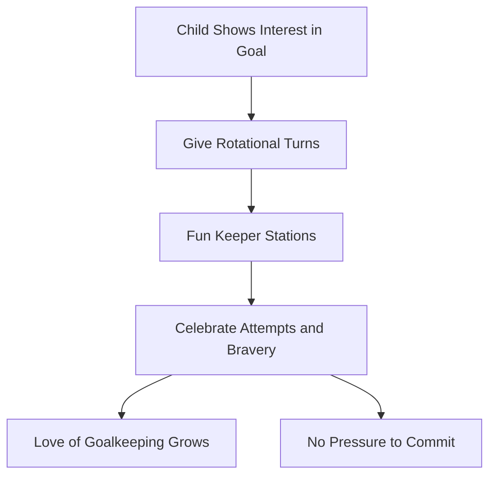

Some kids fall in love with goal immediately. Team coaches can fan that spark into a lifelong flame without ever creating a specialist.

## Rotate, Don't Specialize

**Everyone Gets a Taste:** Give every player regular turns in goal across practices and matches. A curious child gets opportunities; nobody gets trapped between the posts.

## Keeper's Corner Stations

**Fun, Social Games:** Run keeper-focused stations like "Keeper Wars," reaction circles, and save-and-sprint relays that celebrate effort over result. Keep them short and weave them back into the team game so the keeper never feels separated from the squad.

## Reward the Attempt

**Bravery First:** Praise the dive, the hands-up ready stance, and the getting-up. Kids repeat what gets celebrated.

