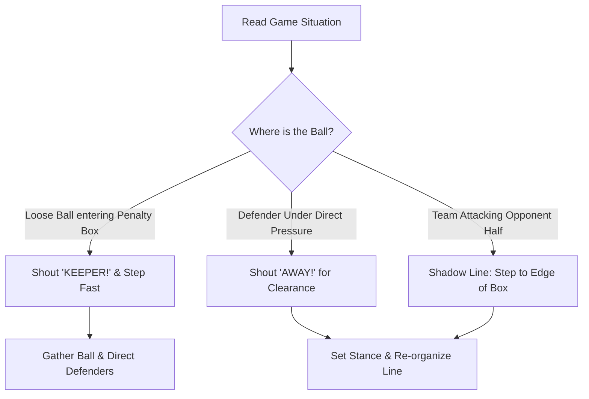

import { Aside, Card, CardGrid, Steps } from '@astrojs/starlight/components';

Leadership and bravery begin with simple habits: one loud shout and the confidence to own the space in front of the goal. At ages 6–9, goalkeepers build confidence by learning clear single-word commands and stepping forward to support their defending line.

<Aside type="danger" title="Rule Alert: Never Shout 'MINE!'">
  Teach keepers to shout **"KEEPER!"** instead of "Mine!". In many youth leagues and under FIFA Law 12, shouting "Mine!" can be penalized as unsporting behavior for distracting an opponent.
</Aside>

## Core Leadership & Positional Pillars

<CardGrid>
  <Card title="1. Single-Word Vocal Cues" icon="comment">
    * **"KEEPER!"** → Loud, single shout when committing to catch or collect a loose ball.
    * **"AWAY!"** → Clear command telling a defender to clear an urgent threat.
    * **"TIME!"** → Signals to an unpressed defender that they have space to turn and play.
  </Card>

  <Card title="2. Shadowing the Defense" icon="right-arrow">
    * **Step Up with Play:** Move to the edge of the penalty area (8–10 yards off the line) when your team attacks.
    * **Cut the Space:** Eliminate long over-the-top balls before opponents reach them.
    * **Backpedal Early:** Retreat smoothly toward the goal line as opponents cross the midfield line.
  </Card>

  <Card title="3. Owning 'The Lion's Den'" icon="star">
    * **First Step Forward:** Always make the first step toward a loose ball positive and forward.
    * **Gorilla Stance:** Set feet shoulder-width apart with hands low and open when stepping out.
    * **Zero Regrets:** Celebrate aggressive forward decisions even if the ball gets poked past.
  </Card>
</CardGrid>

## Step-by-Step Loose Ball Claiming Progression

<Steps>
1. **Read the Pass**  
   Recognize when an opponent's through-ball is kicked too hard and will enter the penalty box.

2. **Unleash the "Lion Voice"**  
   Shout **"KEEPER!"** loudly before taking your second step. This signals teammates to step aside and clears your path.

3. **Attack the Ball's Path**  
   Sprint forward aggressively to meet the ball at the earliest possible point.

4. **Secure & Set the Defense**  
   Gather the ball using a **Scoop Catch** or **Teddy Bear Hug**, stand up tall, and shout *"TIME!"* or *"SET!"* to organize defenders.
</Steps>

## Communication & Positional Decision Flow

<Aside type="caution" title="Hesitation Kills Confidence">
  If a goalkeeper starts to step out and then hesitates, they get caught in no-man's-land. Coach keepers to **commit 100% to their decision** once they take their first step.
</Aside>

## Integrated Session Workflow: Communication & Depth (45 Mins)

<Steps>
1. **Phase 1: "Lion Voice" Reaction Warm-Up (10 Mins)**  
   Players stand in a grid. Coach tosses loose balls into open space. Players must shout **"KEEPER!"** at top volume before taking two fast steps to catch and hug the ball.

2. **Phase 2: Through-Ball Sweep & Direct Drill (15 Mins)**  
   Feeder plays a through-ball into the penalty box. Goalkeeper steps off the line, shouts **"KEEPER!"**, secures the ball, and immediately shouts **"TIME!"** while rolling the ball to a wide defender.

3. **Phase 3: 4v4 Match Integration with Sweeper Line (20 Mins)**  
   Play a 4v4 small-sided match (25 × 35 ft field). Goalkeepers earn **2 bonus points** for their team every time they successfully shout a single-word command or step up to the edge of the box while their team attacks.
</Steps>

## Field Error Correction Table

| Visual Error | Root Cause | Instant Field Cue |
| :--- | :--- | :--- |
| **Quiet or late communication** | Hesitation or fear of making a mistake. | *"Lion Voice! Shout before your feet move!"* |
| **Glued to the goal line during attack** | Unaware of space behind outfield defenders. | *"Shadow your defense! Step to the edge of your box!"* |
| **Defender turns into trouble** | Goalkeeper silent on backpass or pressure. | *"Help your defender! Shout 'TIME' or 'AWAY'!"* |