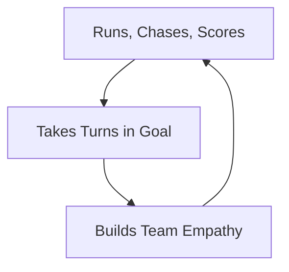

At ages 6 to 9, **no player should be a full-time goalkeeper**. Every child should be running around the field every game.

## Burnout Fast Track

**Boxed In:** Pinning a seven-year-old between the posts every week is a direct fast track to burnout. Kids need to run, chase, and score.

## Right-Sized Goals and Styles

**Grow With the Game:** 4v4 and 7v7 on child-sized goals keep the keeper a real part of play. Saving only becomes a full-time job when the 9v9 and 11v11 games arrive, and the keeper arrives with it.

## The Rotation Promise

