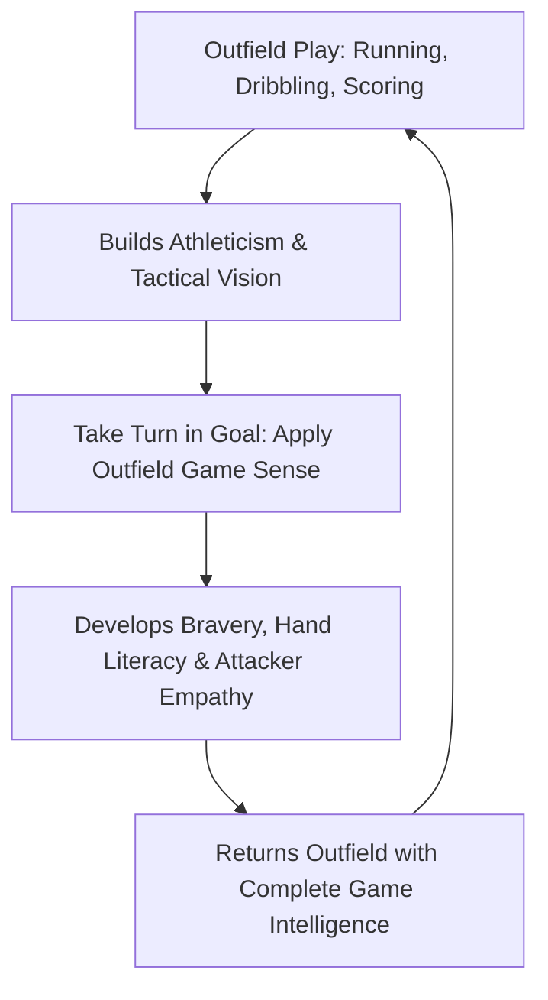

import { Aside, Card, CardGrid, Steps } from '@astrojs/starlight/components';

At ages 6 to 9, **no player should be a permanent goalkeeper**. Grounding young athletes in multi-position play is the single best way to build well-rounded footballers, prevent psychological burnout, and develop elite long-term goalkeeping potential.

<Aside type="danger" title="The Golden Rule of Youth Development">
  A 7-year-old goalkeeper is an outfield player who happens to wear a different jersey for one quarter. Never allow a child to spend an entire match or season locked between the posts.
</Aside>

## The Hidden Costs of Position Pigeonholing

<CardGrid>
  <Card title="1. Loss of Essential Touches" icon="close">
    * **The Touch Gap:** Full-time keepers get up to 80% fewer ball touches per match than outfield players.
    * **Modern Demands:** Modern goalkeepers must play like sweeper-centre-backs with their feet. Outfield play builds that foundation.
  </Card>

  <Card title="2. Psychological Burnout" icon="warning">
    * **Isolation & Pressure:** Pinning a young child in goal week after week makes every error feel like a solo failure.
    * **Loss of Joy:** Children naturally crave running, chasing, and scoring. Stationing them in net dampens enthusiasm.
  </Card>

  <Card title="3. Spatial & Tactical Blindness" icon="magnifier">
    * **Attacker Empathy:** Keepers who never play outfield cannot anticipate how strikers move or read passing lanes.
    * **Field Vision:** Outfield play teaches spatial timing and distance perception faster than standing in goal.
  </Card>

  <Card title="4. Overuse & Maturation Risks" icon="star">
    * **Repetitive Stress:** Early repetitive jumping and diving on hard grass taxes young wrist and shoulder joints.
    * **Growth Spurt Shifts:** Early-maturing kids placed in goal early often plateau when peers catch up in height later.
  </Card>
</CardGrid>

## The Multi-Position Growth Loop

<Aside type="tip" title="Right-Sized Field Dimensions">
  At 7-9 we use 12 × 6 ft goals, fields are designed for active, high-scoring play. Do not evaluate goalkeepers based on goals conceded on small fields.
</Aside>

## Implementing a Rotational Culture (Step-by-Step)

<Steps>
1. **Establish the "Goalie for a Quarter" Rule**  
   Divide every 4v4 or 7v7 match into four quarters. Assign a different player to wear the keeper jersey each quarter so every child plays outfield for at least 75% of match time.

2. **Integrate Keepers into Team Drills**  
   During the first 15–20 minutes of training, include goalkeepers in all outfield passing, keep-away, and agility warm-ups. Never send keepers to train in isolation on a side pitch.

3. **Align Parents Early**  
   Send a clear note to parents at the start of the season explaining that position rotation is mandatory for developing total football literacy and foot skills.

4. **Reward Effort, Not Positions**  
   Praise great passes, brave steps, and smart communication regardless of whether a child is playing striker or goalkeeper.
</Steps>

## Parent Communication Guide: Handling "Dedicated Keeper" Requests

| What the Parent Says | Why It Harms the Child | Recommended Coach Response |
| :--- | :--- | :--- |
| *"My child only wants to play goalkeeper."* | Prevents foot-skill development and leads to early burnout. | *"That passion is awesome! To make them a world-class keeper later, we need to build top-tier foot skills outfield today."* |
| *"My child is afraid of playing in net."* | Forced play creates trauma and loss of confidence. | *"No problem at all! We'll use soft foam balls in practice and partner them up with a buddy until they feel ready."* |
| *"Why is my child in goal when they score all our goals?"* | Teaches selfish positioning and ignores team rotation. | *"Playing in goal builds game leadership and spatial intelligence that will make them an even better scorer outfield."* |