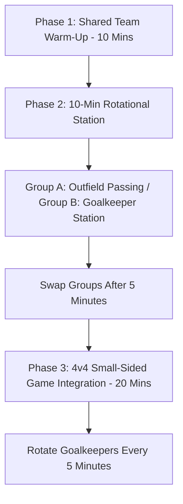

import { Aside, Card, CardGrid, Steps } from '@astrojs/starlight/components';

Goalkeeping for ages 6–9 belongs inside the team session. By running one short, 10-minute rotational station and immediately weaving players back into team play, no child is isolated or left standing between the posts alone.

<Aside type="tip" title="The 10-Minute Integration Rule">
  Never spend an entire practice on isolated goalkeeping. Run a high-energy 10-minute station during team drill transitions, then rotate players directly back into outfield team play.
</Aside>

## Core 10-Minute Station Drills

<CardGrid>
  <Card title="1. Scoop & Bowl Relay" icon="right-arrow">
    * **Setup:** Two cones 6 yards apart; pairs with a Size 3 or soft foam ball.
    * **Action:** Player A rolls a low ball -> Player B performs a **Pinkies Touch Scoop**, pulls to a **Teddy Bear Hug**, and bowls it back.
    * **Key Cue:** *"Pinkies touch the grass, slide low."*
  </Card>

  <Card title="2. Bowling Alley Battle" icon="star">
    * **Setup:** Two 4 x 6 ft mini-goals placed 8 yards apart.
    * **Action:** Bowling only! Players score by rolling smooth underhand shots into the opposite goal while defending their own with a **Gorilla Stance**.
    * **Key Cue:** *"Gorilla stance, set before the roll!"*
  </Card>

  <Card title="3. Ball-Fear Reset Protocol" icon="star">
    * **Trigger:** If a child flinches, turns away, or closes eyes when the ball approaches.
    * **Action:** Immediately switch to a lightweight foam ball and deliver gentle underhand feeds from 3 yards away.
    * **Key Cue:** *"Catch like a soft pillow!"*
  </Card>

  <Card title="4. Rapid Micro-Coaching" icon="star">
    * **Structure:** 3 minutes per drill, 1 minute of positive praise and feedback.
    * **Rule:** Maximum 15-second explanations. Show the movement, then let them play.
    * **Focus:** Praise decision-making, set stance, and loud communication over outcome.
  </Card>
</CardGrid>

## Practice Integration Flowchart

<Aside type="caution" title="Safety First: No Hard Kicks">
  Strictly prohibit players from blasting hard kicks during close-range station games. Use underhand bowling or soft side-foot passes to protect hands and build catching confidence.
</Aside>

## Step-by-Step 45-Minute Session Breakdown

<Steps>
1. **Phase 1: Shared Team Warm-Up (10 Mins)**  
   All players (including goalkeepers) participate in dynamic tag games and footwork dribbling drills. Every player gets equal touches with their feet.

2. **Phase 2: The 10-Minute Rotational Station (15 Mins Total)**  
   Split the team into two groups. Group A works on outfield 2v1 passing; Group B completes the **Scoop & Bowl Relay** and **Bowling Alley Battle**. Swap groups at the 6-minute mark.

3. **Phase 3: Small-Sided Game Integration (20 Mins)**  
   Play a 4v4 or 5v5 game with Build-Out Lines. Rotate the goalkeeper every 5 minutes so four different players wear the jersey.

4. **Phase 4: Positive Wrap-Up & High-Fives (2 Mins)**  
   Gather the squad, celebrate brave attempts, and reinforce the team-first, safe-to-fail mindset.
</Steps>

## Field Error Correction Quick Reference

| Visual Error | Root Cause | Instant Field Cue |
| :--- | :--- | :--- |
| **Child flinches or turns body away** | Fear of hard ball impact or fast pace. | *"Foam ball time! Show me soft pillow hands!"* |
| **Ball slips between legs on ground shot** | Standing tall and bending at the waist. | *"Drop your back knee! Build the wall!"* |
| **Station loses energy or becomes chaotic** | Explanation was too long or rules too complex. | *"Reset! 5-second challenge: show me Gorilla Stance!"* |