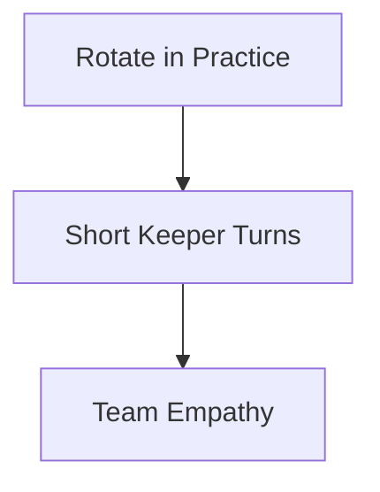
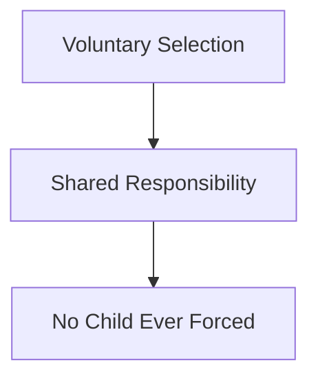

import { Aside } from '@astrojs/starlight/components';

The rule is simple: rotate the keeper's turn so everybody gets touches and nobody stays trapped between the posts.

## Rotate All Players

**Everybody Gets a Turn:** Sweep goalkeepers through the role in short, fun stations so goalkeeping stays one part of the game, not an identity.

<Aside type="note" title="Never Forced in Matches">
  **Voluntary & Shared:** Goalkeeping in matches is up for grabs week to week, a shared responsibility no child is ever pushed into.
</Aside>

