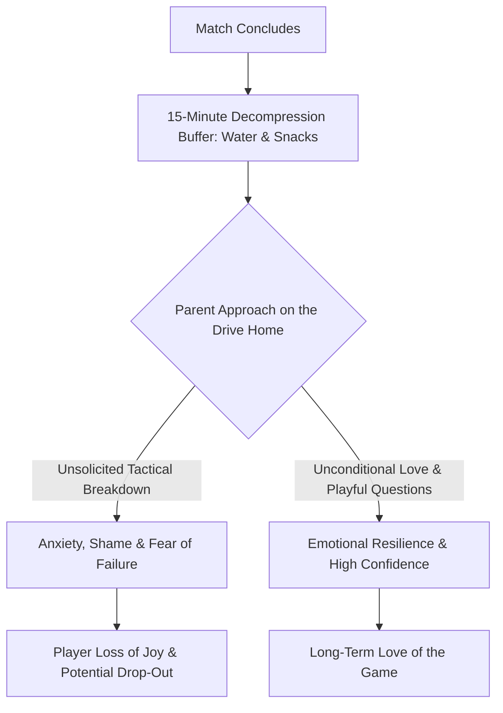

import { Aside, Card, CardGrid, Steps } from '@astrojs/starlight/components';

For a youth goalkeeper aged 6–9, the scoreboard matters far less than the emotional environment in the car on the way home. Parents play a pivotal role in protecting their child's passion, confidence, and long-term love for the game.

<Aside type="tip" title="The Golden Car-Ride Rule">
  The six most important words a parent can say after a match are: **"I loved watching you play today."** Avoid unsolicited tactical analysis, critical breakdowns, or post-match interrogations.
</Aside>

## Core Pillars of Parent Support

<CardGrid>
  <Card title="1. The Safe Drive Home" icon="heart">
    * **Zero Tactical Debriefs:** Let your child decompress. Do not analyze conceded goals in the car.
    * **Follow Their Lead:** If they want to talk about the match, listen. If they want to talk about snacks or video games, shift focus immediately.
    * **Unconditional Approval:** Ensure your enthusiasm and affection remain identical regardless of whether they saved five shots or conceded five goals.
  </Card>

  <Card title="2. Positive Sideline Behavior" icon="star">
    * **Cheer, Don't Direct:** Never shout instructions like *"GET OUT!"* or *"STAY ON YOUR LINE!"*, it creates cognitive overload for young minds.
    * **Shield Against Criticism:** Ignore negative comments from other spectators. Never join in criticizing referees, coaches, or players.
    * **Applaud All Effort:** Celebrate brave steps out, quick resets, and communication from both teams' goalkeepers.
  </Card>

  <Card title="3. Reframing Conceded Goals" icon="random">
    * **Treat Goals as Data:** Goals are a natural, expected part of learning football. Normalize them as learning moments rather than disasters.
    * **Focus on Micro-Wins:** Praise effort metrics like *"Great Gorilla Stance!"* or *"I loved how loud your Lion Voice was!"*
    * **Avoid External Blame:** Resist blaming outfield defenders or referee calls. Focus purely on effort and fun.
  </Card>

  <Card title="4. Champion Multi-Sport Play" icon="rocket">
    * **Prevent Early Burnout:** Encourage gymnastics, swimming, basketball, or tag games outside of organized soccer.
    * **Cross-Athletic Growth:** Multi-sport movement builds spatial awareness, landing mechanics, and agility faster than year-round soccer alone.
    * **Free Unstructured Play:** Let children play pickup games where there are no coaches, referees, or formal scorekeeping.
  </Card>
</CardGrid>

## The Post-Match Emotional Pathway

<Aside type="caution" title="The 15-Minute Decompression Buffer">
  Immediately after the final whistle, young players experience emotional fatigue. Give them at least 15 minutes with food, water, and quiet before asking any match-related questions.
</Aside>

## Step-by-Step Guide for Matchday Parents

<Steps>
1. **Pre-Match Preparation**  
   Help your child pack their bag and water bottle. Remind them: *"Have fun, be brave, and try your best!"*

2. **During the Match**  
   Stand quietly or offer positive encouragement. Let the coach provide tactical instructions. Enjoy watching your child experiment and learn.

3. **Immediately After the Whistle**  
   Give a high-five or hug, offer a healthy snack, and avoid asking *"Why did you..."* or *"How many goals went in?"*

4. **On the Drive Home**  
   Use open-ended, joy-focused prompts like *"What was the most fun part of the game today?"* or let them listen to their favorite music.
</Steps>

## Parent Field Script Reference

| What the Child Says / Does | Avoid Saying (Drives Anxiety) | Recommended Parent Response |
| :--- | :--- | :--- |
| **"I let in three goals today..."** | *"Yeah, you should have stayed on your line on that second one."* | *"Goals happen to every team! I loved watching how brave you were stepping out!"* |
| **Player is quiet and sad in the car** | *"Why are you upset? You need to learn to lose."* | *"Here is your snack and drink. Take a break! I love watching you play no matter what."* |
| **"I don't want to play goalie next week."** | *"You can't give up! You're our best keeper!"* | *"That is totally fine! Rotations are part of the fun. You can try outfield next game."* |