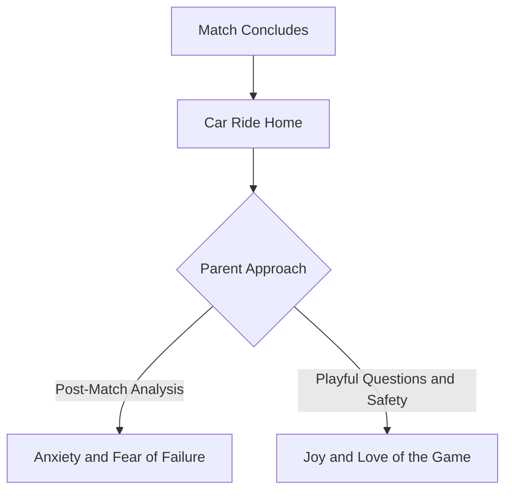

At this age the scoreboard is meaningless, but the car ride home is everything. Parents need coaching too.

## Emotional Safety on the Drive Home

**No Tactical Breakdowns:** Young keepers shouldn't face post-match analysis. Parents should offer hugs, snacks, and questions about what was fun.

## Celebrate Effort Over Result

**Reframe the Conceded Goal:** A goal conceded at this age is a learning moment and a chance to try again next time, not a failure to be unpacked on the drive home.

## Champion Multi-Sport Play

**Keep It Fun:** Encourage pickup games, other sports, and plenty of unstructured play. Long-term love beats early specialization.

## The Support Loop

