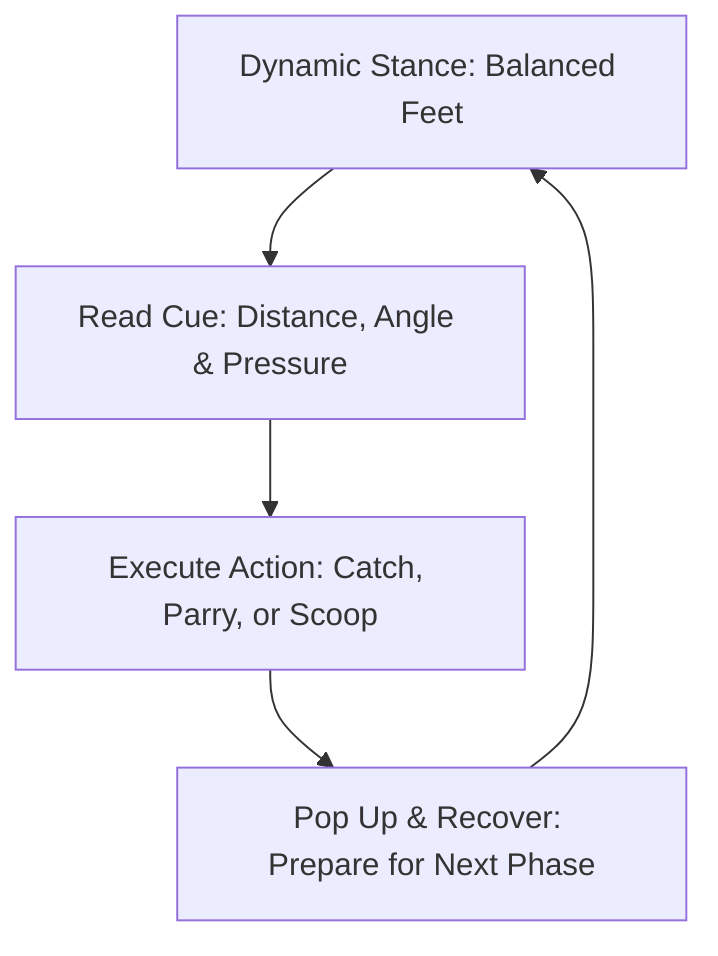

import { Card, CardGrid, Aside, Steps } from '@astrojs/starlight/components';

Coaching players ages 9 to 12 follows the guidelines of the **International Goalkeepers Conference (IGCC)**. This approach replaces static, single-file line drills with **game-realistic, scenario-based training** designed to build proactive playmakers rather than isolated shot-stoppers.

<Aside type="note" title="Grassroots Shift">
Avoid isolated "target practice" drills. Every rep must present a dynamic picture featuring a ball, target, decision, and recovery action.
</Aside>

---

## Core Pillars of the IGCC Method

<CardGrid>
  <Card title="1. Constraint-Based Design" icon="random">
    **"Change the Picture"**
    
    Add realistic match friction, deflections, screen vision, or tracking backpass pressure, forcing players to scan and adapt dynamically.
  </Card>

  <Card title="2. Dynamic Stance & Set Timing" icon="star">
    **"Set Before the Strike"**
    
    Train keepers to freeze in a balanced set position the moment the attacker's foot strikes the ball, regardless of positioning height.
  </Card>

  <Card title="3. Immediate Recovery Habits" icon="random">
    **"Pop Up & Set"**
    
    Ground contact is only step one. Players must bounce up using strong core/leg drive to handle second-chance rebounds or loose balls.
  </Card>

  <Card title="4. Outfield Build-Up Role" icon="puzzle">
    **"The 9th Outfield Player"**
    
    Integrate goalkeepers directly into team possession patterns, using footwork to receive under pressure and switch play.
  </Card>
</CardGrid>

---

## Action-Decision Cycle

In match scenarios, goalkeepers constantly process information through a continuous perceptual loop:

---

## Translating Methodology into Field Cues

Replace academic terms with simple, action-oriented coaching triggers during training reps:

| Sports Science Concept | Grassroots Coaching Cue | Field Execution Target |
| :--- | :--- | :--- |
| Constraint Manipulation | **"Read the Screen!"** | Scan through defender traffic to locate ball release. |
| Perceptual Affordance | **"Catch or Push!"** | Make early calls based on ball speed and hand positioning. |
| Recovery Biomechanics | **"Pop Up!"** | Drive off the non-landing knee to regain feet immediately. |
| Tactical Communication | **"Keeper's!" / "Away!"** | Call out decisions loudly before physical contact with the ball. |

---

## Physiological Reality: Ages 9–12

<Aside type="caution" title="Managing Growth & Depth Perception">
* **Visual Maturation:** Depth perception for judging high, floating shots on **6.5 × 18 ft goals** is still developing. Focus on positioning cues rather than punishing misjudged flight paths.
* **Peak Height Velocity (PHV):** Sudden growth spurts temporarily reduce coordination and agility. Adjust footwork expectations for players experiencing rapid growth.
</Aside>

---

## Field-Ready Session: Constraint-Based 9v9 Integration

Execute this 20-minute drill block during team training to embed game realism.

<Steps>
1. **Setup & Spatial Constraints**
   Set up a 30 × 25 yard grid using a **6.5 × 18 ft goal**. Position 3 attackers vs. 2 defenders, with the goalkeeper protecting the goal.

2. **Phase 1: Traffic & Screened Shots (7 Mins)**
   Attackers complete 2 mandatory passes before shooting. Defenders actively run across the line of vision to create realistic shot-screening constraints.

3. **Phase 2: Transition & Second-Shot Recovery (8 Mins)**
   If the keeper saves or parries, they must immediately distribute via an underhand bowl to a wide target cone while managing a pressing attacker.

4. **Phase 3: Full Build-Up Application (5 Mins)**
   If the keeper holds the catch, defenders open wide to receive a short distribution and break out past the midfield line.
</Steps>

<Aside type="tip" title="Coaching Tip">
Focus feedback on **decision quality and set-position timing**, not just whether the ball stayed out of the net.
</Aside>