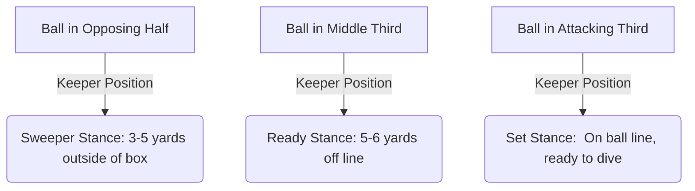

import { Card, CardGrid, Aside, Steps } from '@astrojs/starlight/components';

At ages 9 to 12 (U10–U12), players enter a crucial developmental window as they transition to **9v9 play**. The objective shifts from pure play to establishing fundamental goalkeeping mechanics, spatial awareness, and team integration.

<Aside type="note" title="Grassroots Focus">
Keep session instruction short. At this age, players learn through **action and quick feedback loops** rather than long lectures.
</Aside>

---

## The 4 Pillars of U9–U12 Growth

<CardGrid>
  <Card title="1. Physical & Biomechanical" icon="star">
    **Growth Velocity & Landing Safety**
    
    Early growth spurts alter center of gravity and coordination. Focus on soft landings on the outer thigh and lateral torso, never landing on open elbows or hip bones.
  </Card>

  <Card title="2. Cognitive & Spatial Awareness" icon="compass">
    **Goal Size Adaptation**
    
    Transitioning to 6.5 × 18 ft goals requires new positioning instincts. Binocular vision and depth perception are still maturing, making high floating shots difficult to judge.
  </Card>

  <Card title="3. Tactical Integration" icon="right-arrow">
    **The Sweeper-Keeper Role**
    
    Move from line-standing to active team involvement. The goalkeeper acts as the 9th outfield player, serving as a primary pivot in build-up play.
  </Card>

  <Card title="4. Psychological Resilience" icon="heart">
    **Normalizing Mistakes**
    
    Larger goals mean more goals conceded. Frame every conceded goal as a shared tactical learning point rather than an individual failure.
  </Card>
</CardGrid>

---

## Key Tactical & Physical Adaptations

### Goal Dimensions & Spatial Rules

Transitioning to 9v9 introduces expanded field spaces and larger goals (**6.5 × 18 ft**).

<Aside type="caution" title="Depth Perception Watchout">
Players under age 12 often struggle with tracking long aerial balls due to ongoing visual development. Avoid scolding misjudged high balls; instead, coach early decision-making (**"Catch"** vs. **"Parry"**).
</Aside>

---

## Field-Ready Coaching Cues

Replace complex tactical jargon with clear, single-word verbal triggers:

| Jargon Concept | Field Coaching Cue | Action Required |
| :--- | :--- | :--- |
| Set Position | **"Set!"** | Feet shoulder-width, knees flexed, hands at waist height. |
| Ball Handling | **"W-Shape!"** | Thumbs together, fingers soft for catches above chest. |
| Ground Landing | **"Collapse!"** | Bend lead knee, step toward ball path, land on side. |
| Field Communication | **"Keeper's!" / "Away!"** | Loud, decisive call before touching the ball. |
| Build-Up Support | **"Open Up!"** | Drop to the side of the box to offer a passing angle. |

---

## 9v9 Build-Up Session Integration

Integrate goalkeeping development into overall team practice rather than isolating players on the sideline.

<Steps>
1. **Warm-Up Integration (10 Mins)**
   Include the goalkeeper in outfield passing diamonds. Require them to receive backpasses with their weak foot and open up their body angle.

2. **Shot Stopping to Distribution (15 Mins)**
   Set up a 3v2 transition drill. The keeper makes a save or collects a cross and immediately initiates an attack via an underhand bowl or side-arm throw.

3. **Small-Sided 9v9 Match Application (20 Mins)**
   Enforce a rule where all build-ups must touch the goalkeeper's feet before crossing the midfield line.
</Steps>

<Aside title="Building Confidence" type="tip">
Praise successful communication, positive positioning, and clean distribution choices, not just goal-line saves.
</Aside>