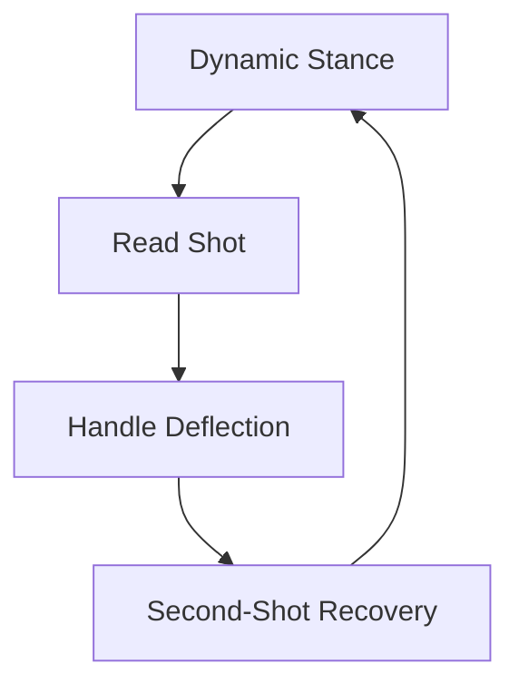

Coaching at this stage aligns with guidelines set by the **International Goalkeepers Conference (IGCC)**, replacing static line-drill coaching with **game-realistic, scenario-based training** to develop active playmakers rather than isolated shot-stoppers.

## International Standards (IGCC)

**International Goalkeepers Conference:** Establishes global guidelines embedding technical mechanics directly into tactical play, training proactive playmakers instead of static target practice.

## Constraint-Based Variability

Introduces match-like pressure (deflections, restricted vision, press) so players learn to read game cues and make independent decisions under pressure.

## Reaction & Recovery Focus

Prioritizes resetting to a dynamic stance immediately after a save, making fast second-shot recoveries an automatic physical habit.

## The Dynamic Vision

