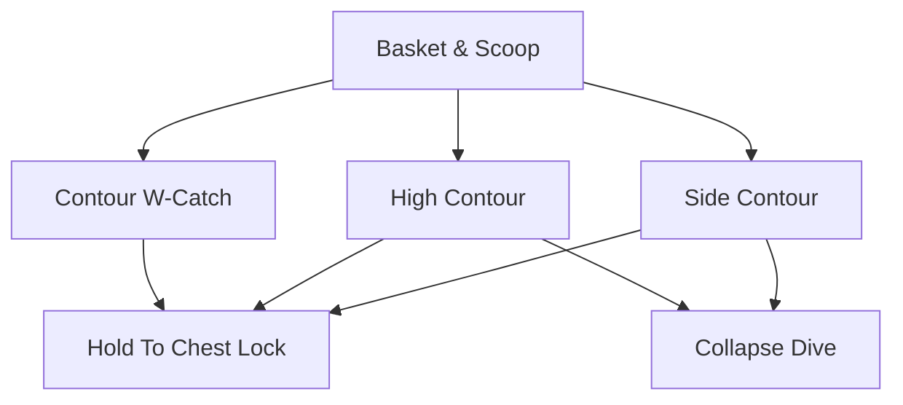

Before a keeper can react to match pace, they must own a correct, repeatable catching shape. This is the bridge between the baseline catches of the 6–9 ages and the reaction saves of the 9–12 window.

## [Contour Catch (W-Catch)](/reference-library/05-contour-catch/)

**Make the W:** Thumbs and index fingers nearly touch, fingers spread wide behind the ball at chest-to-head height. Cue *"make the W."* This becomes the default catch shape.

## High & Side Contour

**Extend the Shape:** [High contour](/reference-library/07-high-contour/) catches balls above head height; [side contour](/reference-library/06-side-contour/) catches balls driven wide of the body. In both, hands stay ahead of the torso and fold into a chest lock.

## [Collapse Dives](/reference-library/10-low-collapse-dives/)

**First Ground Dives:** Coach controlled collapse dives to reach off shots, landing on the outer thigh, hip, and torso, never on the elbows or knees.

