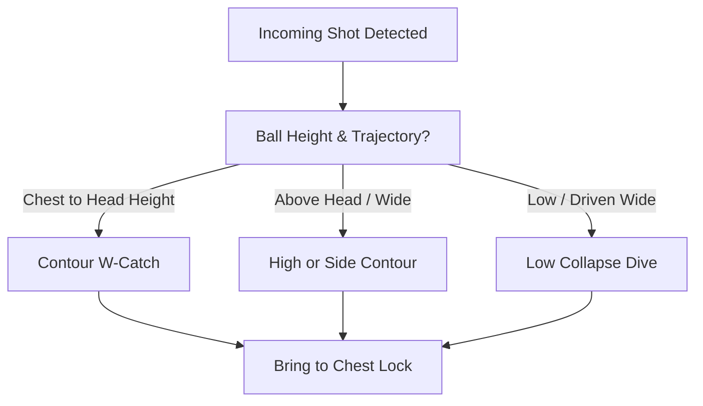

import { Card, CardGrid, Aside, Steps } from '@astrojs/starlight/components';

At ages 9 to 12 (U10–U12), goalkeepers transition from soft, low-velocity serves to handling faster shots. Establishing repeatable, biomechanically safe catching habits is critical to building shot-stopping confidence and preventing finger or joint injuries.

<Aside type="note" title="Grassroots Focus">
Always prioritize hand shape and eye-tracking over raw reaction speed. A clean catch creates immediate control and allows the team to initiate build-up play.
</Aside>

---

## The 4 Core Catching Mechanics

<CardGrid>
  <Card title="1. The W-Catch (Chest to Head)" icon="star">
    **"W-Hands!"**
    
    Position hands at ball height with thumbs nearly touching and fingers spread wide behind the upper equator of the ball. Keep wrists firm but flexible to absorb impact.
  </Card>

  <Card title="2. High & Side Contour" icon="open-book">
    **"Extend & Soft Elbows"**
    
    For balls driven wide or above the head, extend hands in front of the body line. Never catch behind the head or behind the body.
  </Card>

  <Card title="3. The Chest Lock (Secure)" icon="approve-check">
    **"Hug the Ball!"**
    
    Immediately pull caught balls into the body. Fold forearms and elbows over the ball to protect it from incoming attacker pressure.
  </Card>

  <Card title="4. Low Collapse Dive" icon="down-arrow">
    **"Step, Soft Side, Slide"**
    
    Step diagonally toward low driven shots. Collapse the lower leg to bring the body down safely onto the outer thigh and lateral torso.
  </Card>
</CardGrid>

---

## Mechanical Decision Tree

Goalkeepers must quickly evaluate ball trajectory, speed, and body position to select the correct catching shape:

---

## Field-Ready Coaching Cues

Replace technical sports science jargon with immediate, action-oriented field triggers:

| Technical Concept | Field Cue | Action Required |
| :--- | :--- | :--- |
| Hand Shape | **"W-Hands!"** | Thumbs 1 inch apart, fingers wrapped behind ball equator. |
| Secure Ball | **"Hug the Ball!"** | Pull ball directly to chest lock before taking a step. |
| Communication Call | **"Keeper!"** | Shout early and decisively before hand contact is made. |
| Landing Safety | **"Land Soft!"** | Absorb ground contact on outer thigh and lat, not elbows/hips. |

---

## Mechanical Safety & Injury Prevention

<Aside type="danger" title="Safety Warning: Preventing Joint & Impact Injuries">
* **Fingers:** Never allow thumbs to cross or point directly toward the ball. This causes jammed or dislocated thumbs.
* **Elbows:** Avoid landing directly on extended elbows or knees. Ground impact on joints leads to acute bursitis or fractures.
* **Hips:** Teach keepers to land on the muscular **outer thigh and latissimus dorsi (side torso)** rather than the hip bone.
</Aside>

---

## Dynamic Training Progression (15 Mins)

Integrate these catching mechanics into match-realistic drills rather than static line drills.

<Steps>
1. **Stationary Contour Warm-Up (3 Mins)**
   Pairs standing 5 yards apart. Alternating contour catches with focus on flexed elbows and immediate chest lock.

2. **Angle Service (5 Mins)**
   Coach or teammate serves balls from 10–12 yards at varying heights. Goalkeeper must execute a set position, and secure the catch.

3. **Collapse & Distribution Transition (7 Mins)**
   Server hits low driven balls to wide angles. Goalkeeper executes a low collapse dive, bounces back to their feet, and immediately distributes via an underhand bowl or sling throw to a wide target cone.
</Steps>

<Aside type="tip" title="Coaching Tip">
If a shot is too high or hard to secure cleanly, encourage the goalkeeper to parry wide of the goalposts using firm palms rather than risking a spilled catch in front of the net.
</Aside>