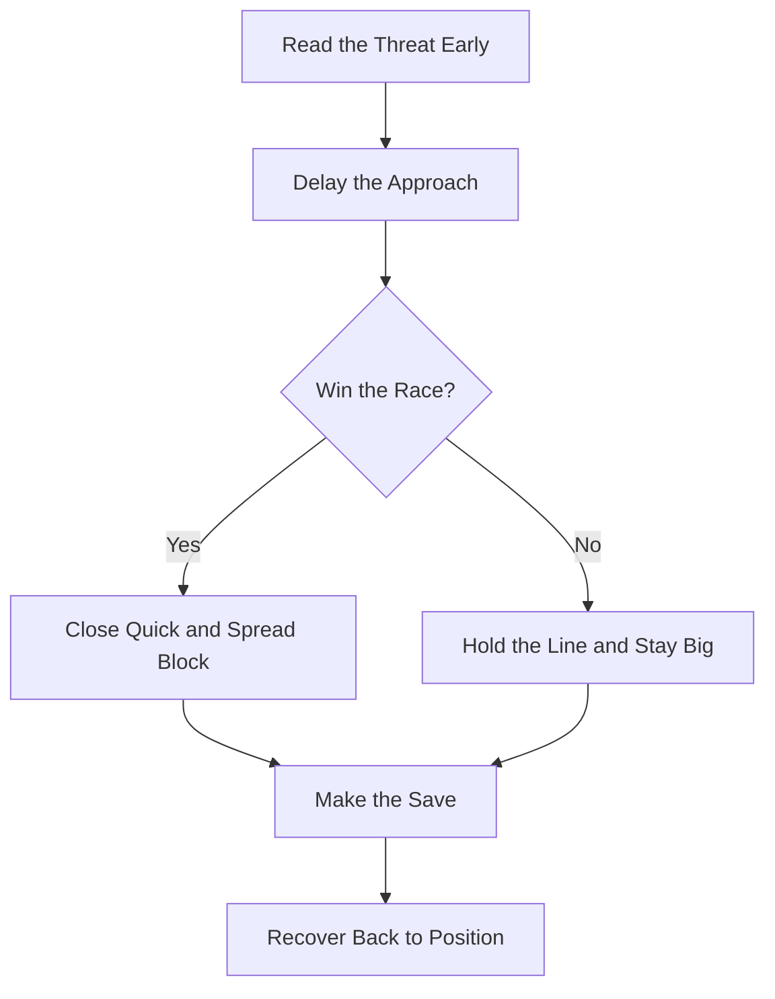

In a one-v-one, the keeper delays and stays as big and as late as possible, forcing the attacker to commit before the close-down begins.

## [1v1 Closing](/reference-library/16-breakaway/)

**Stay Big, Stay Late:** Delay the approach and stay as big and as late as possible, making the attacker commit before closing quick and spreading your block.

## Pick the Moment

**When to Come, When to Hold:** Come out only when you can win the race to the ball. If the attacker already has it at their feet, hold the line, stay patient, and make the save. Patience is part of the one-v-one, not the opposite of it.

## The 1v1 Sequence

